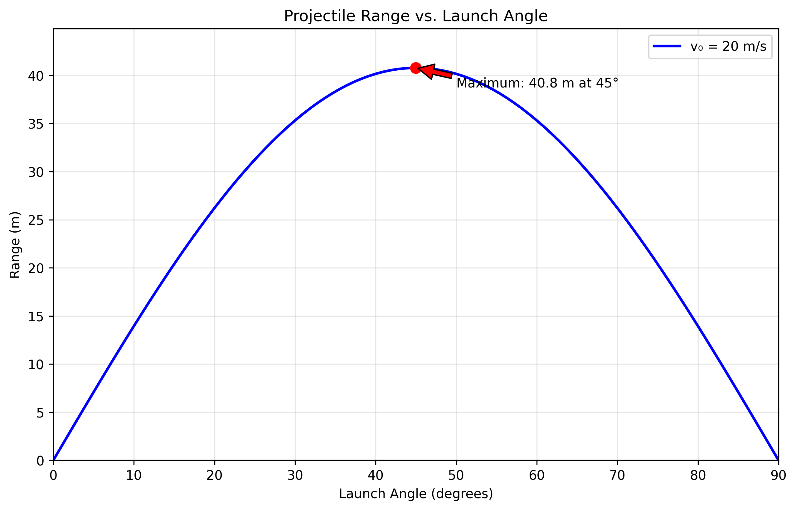
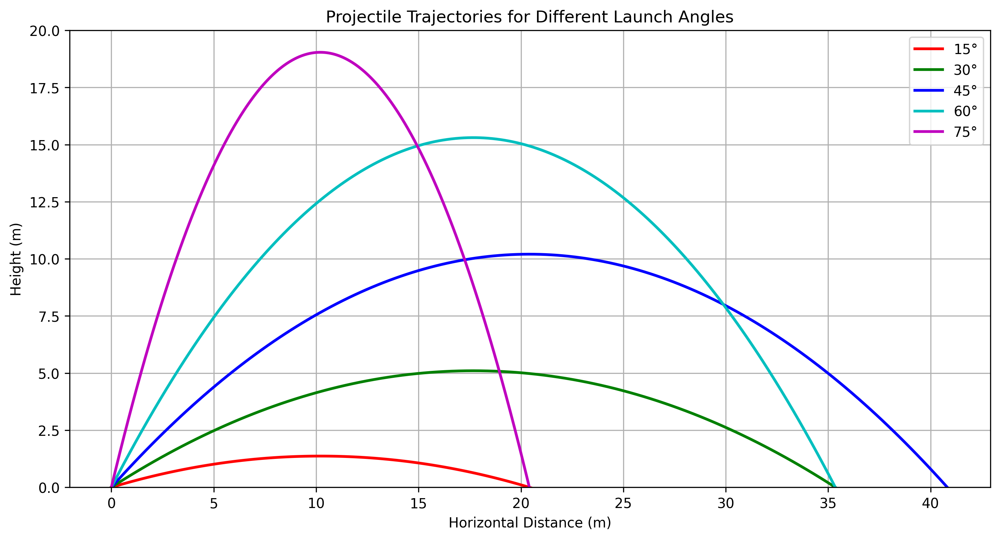
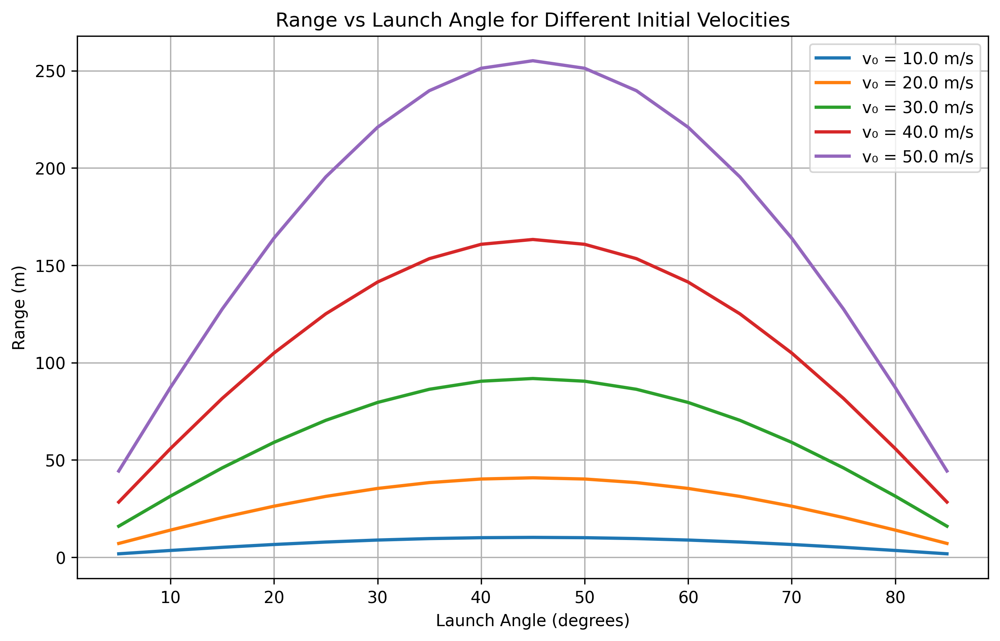
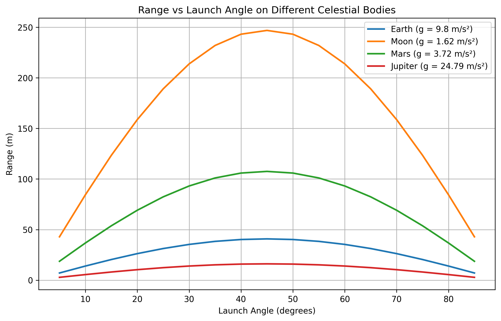

# Problem 1

Investigating the Range as a Function of the Angle of Projection

## 1. Theoretical Foundation

### Governing Equations of Motion

Projectile motion can be analyzed using Newton's laws of motion. Assuming no air
resistance, the motion can be decomposed into horizontal and vertical
components:

#### Equations of Motion:

-   Horizontal motion: $$ x(t) = v_0 \cos(\theta) t $$
-   Vertical motion: $$ y(t) = v_0 \sin(\theta) t - \frac{1}{2} g t^2 $$

where:

-   $v_0$ is the initial velocity,
-   $\theta$ is the launch angle,
-   $g$ is the acceleration due to gravity,
-   $t$ is the time.

### Time of Flight:

Setting \( y(t) = 0 \) to find the total flight time: $$ t_f = \frac{2 v_0
\sin(\theta)}{g} $$

### Range Formula:

The horizontal range $R$ is given by:

$$ R = v_0 \cos(\theta) t_f = \frac{v_0^2 \sin(2\theta)}{g} $$

This equation shows that the range is maximized at $\theta = 45°$, assuming other parameters remain constant.

**Mathematical proof for maximum range:**
Taking the derivative with respect to $\theta$:
$$ \frac{dR}{d\theta} = \frac{v_0^2}{g} \cdot 2\cos(2\theta) = 0 $$

This gives $\cos(2\theta) = 0$, which means $2\theta = 90°$, therefore $\theta = 45°$.

---

## 2. Analysis of the Range

### Influence of Initial Conditions

-   **Initial velocity (\( v_0 \))**: Increasing \( v_0 \) increases the range
    quadratically.
-   **Gravitational acceleration (\( g \))**: Higher \( g \) reduces the range,
    as the projectile falls more quickly.
-   **Launch angle (\( \theta \))**: The range follows a symmetric pattern,
    peaking at \( 45^\circ \).

### Graphical Representation

The relationship between launch angle and range can be visualized using the theoretical formula. The simulation shows the characteristic parabolic relationship with maximum range at 45°.

**Key observations:**
- Range increases from 0° to 45°
- Range decreases from 45° to 90°  
- Symmetric angles (e.g., 30° and 60°) produce equal ranges
- At 45°, $\sin(2\theta) = \sin(90°) = 1$, giving maximum range

**Additional Analysis Plots:**

The following visualizations provide deeper insights into projectile motion:

1. **Range vs Angle for Different Velocities:** Shows how initial velocity affects the range-angle relationship
   
2. **Trajectories for Different Angles:** Displays actual flight paths for various launch angles

3. **Effect of Gravity:** Compares projectile motion on different celestial bodies

---

## 3. Practical Applications

-   **Sports**: Understanding projectile motion helps in optimizing the throwing
    angles in sports like basketball, soccer, and javelin.
-   **Engineering**: Used in ballistics, military applications, and designing
    trajectories for rockets and missiles.
-   **Astrophysics**: Used to model celestial body trajectories and space
    exploration missions.

---

## 4. Implementation

A numerical simulation can further analyze cases involving air resistance.
Incorporating drag force leads to differential equations that require numerical
methods (e.g., Runge-Kutta) to solve.

### Example: Adding Air Resistance

Real projectile motion includes air resistance, which significantly affects the trajectory. The drag force is proportional to velocity squared:

$$\vec{F}_d = -k|\vec{v}|\vec{v}$$

This leads to coupled differential equations:
$$m \frac{d^2 x}{dt^2} = -k v_x \sqrt{v_x^2 + v_y^2}$$
$$m \frac{d^2 y}{dt^2} = -mg - k v_y \sqrt{v_x^2 + v_y^2}$$

**Effects of air resistance:**
- Reduces maximum range
- Optimal angle becomes less than 45°
- Trajectory becomes asymmetric (steeper descent)
- Range no longer quadratic in initial velocity

These equations require numerical methods (Runge-Kutta) for solution, as implemented in our simulation code.

---

## 5. Limitations and Further Considerations

-   **Air resistance**: Causes asymmetry and reduces range.
-   **Uneven terrain**: Requires solving for complex boundary conditions.
-   **Wind effects**: Affects trajectory unpredictably.

Future work could involve incorporating machine learning techniques to predict
projectile trajectories in complex environments.

---

## Conclusion

Projectile motion demonstrates rich mathematical and physical insights. While
the idealized model provides a good approximation, real-world adaptations
require numerical solutions to account for non-ideal conditions.
