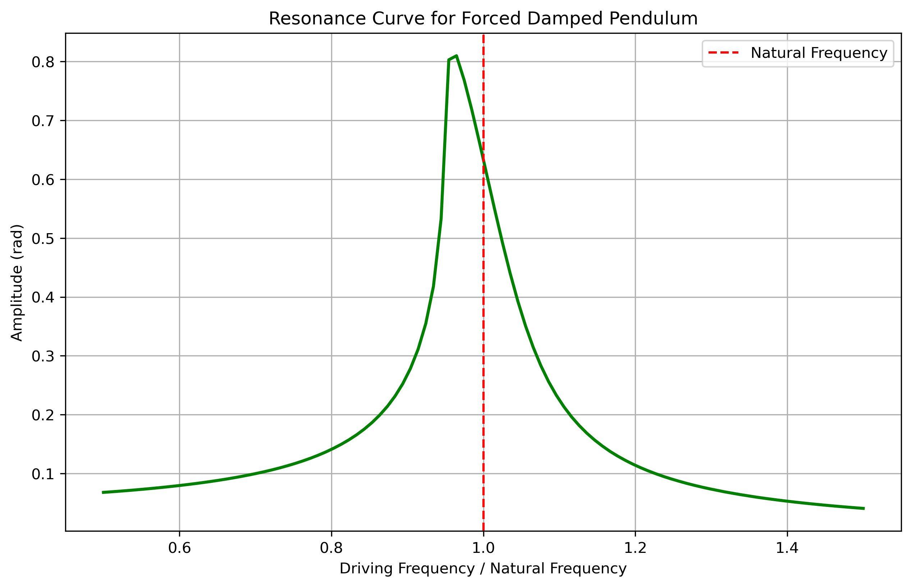

# Problem 2

Investigating the Dynamics of a Forced Damped Pendulum

## 1. Theoretical Foundation

### Governing Equation

The motion of a forced damped pendulum is governed by the nonlinear differential
equation:

$$
\frac{d^2\theta}{dt^2} + b \frac{d\theta}{dt} + \frac{g}{L} \sin\theta = A \cos(\omega t)
$$

where:

-   $\theta$ is the angular displacement,
-   $b$ is the damping coefficient,
-   $g$ is the acceleration due to gravity,
-   $L$ is the length of the pendulum,
-   $A$ is the amplitude of the external driving force,
-   $\omega$ is the driving frequency.

### Approximate Solutions for Small Angles

For small angles ($\theta \ll 1$, so $\sin \theta \approx \theta$), the equation simplifies to:

$$
\frac{d^2\theta}{dt^2} + b \frac{d\theta}{dt} + \omega_0^2 \theta = A \cos(\omega t)
$$

where $\omega_0 = \sqrt{g/L}$ is the natural frequency of the undamped pendulum.

This corresponds to a damped, driven harmonic oscillator. The general solution consists of:

1. **Transient solution** (dies out due to damping):
   $$\theta_{\text{trans}}(t) = e^{-bt/2}[C_1 \cos(\omega_d t) + C_2 \sin(\omega_d t)]$$
   where $\omega_d = \sqrt{\omega_0^2 - (b/2)^2}$ is the damped frequency.

2. **Steady-state solution** (long-term behavior):
   $$\theta_{\text{steady}}(t) = \frac{A}{\sqrt{(\omega_0^2 - \omega^2)^2 + (b\omega)^2}} \cos(\omega t - \phi)$$
   
   where the phase lag is: $\phi = \arctan\left(\frac{b\omega}{\omega_0^2 - \omega^2}\right)$

**Complete solution:** $\theta(t) = \theta_{\text{trans}}(t) + \theta_{\text{steady}}(t)$

### Resonance Conditions

Resonance occurs when maximum energy transfer occurs between the driving force and the pendulum. For a lightly damped system, this happens near $\omega \approx \omega_0$.

**Key characteristics of resonance:**

1. **Amplitude response:** The steady-state amplitude is:
   $$A_{\text{response}} = \frac{A}{\sqrt{(\omega_0^2 - \omega^2)^2 + (b\omega)^2}}$$

2. **Maximum amplitude** occurs at driving frequency:
   $$\omega_{\text{res}} = \sqrt{\omega_0^2 - \frac{b^2}{2}}$$

3. **Quality factor:** $Q = \frac{\omega_0}{b}$ measures the sharpness of resonance
   - High Q: Sharp resonance peak, low damping
   - Low Q: Broad resonance, high damping

4. **Energy considerations:** At resonance, the driving force does maximum work per cycle, leading to sustained large-amplitude oscillations despite energy dissipation from damping.

---

## 2. Analysis of Dynamics

### Influence of System Parameters

The forced damped pendulum exhibits rich dynamics depending on three key parameters:

#### **Damping Coefficient ($b$)**
- **Low damping** ($b < \omega_0$): Underdamped oscillations, potential for chaos
- **Critical damping** ($b = 2\omega_0$): Fastest return to equilibrium  
- **High damping** ($b > 2\omega_0$): Overdamped, slow approach to equilibrium

#### **Driving Amplitude ($A$)**
- **Small $A$**: Linear response, simple harmonic motion
- **Moderate $A$**: Nonlinear effects become apparent
- **Large $A$**: Complex dynamics, chaos, period-doubling bifurcations

#### **Driving Frequency ($\omega$)**
- Near $\omega_0$: Resonance phenomena dominate
- Far from $\omega_0$: Weak response, linear behavior
- Specific ratios: Subharmonic resonances, complex dynamics

### Linear vs Nonlinear Behavior

For small angles, the linear approximation holds well, but for larger amplitudes, nonlinear effects become significant:

**Key differences:**
- **Linear system**: Symmetric oscillations, predictable frequency response
- **Nonlinear system**: Asymmetric motion, frequency-dependent behavior, potential chaos

### Transition to Chaos

The system exhibits a rich spectrum of dynamics as parameters change:

#### **Phase Space Analysis**
Phase portraits reveal the system's long-term behavior:

- **Fixed points**: Stable equilibrium states
- **Limit cycles**: Periodic oscillations  
- **Strange attractors**: Chaotic motion

#### **Poincaré Sections**
Stroboscopic sampling reveals the underlying structure:

- **Discrete points**: Periodic motion
- **Closed curves**: Quasiperiodic motion
- **Fractal structure**: Chaotic motion

#### **Bifurcation Analysis**
Parameter sweeps show transitions between different dynamic regimes:

**Route to chaos:**
1. **Period-1** oscillations at low driving amplitude
2. **Period-doubling cascade** as amplitude increases
3. **Chaos** emerges through accumulated bifurcations
4. **Periodic windows** within chaotic regions

---

## 3. Practical Applications

The forced damped pendulum serves as a fundamental model for numerous real-world systems:

### **Energy Harvesting Systems**
- **Piezoelectric generators**: Convert mechanical vibrations to electricity
- **Optimization**: Understanding resonance maximizes power output
- **Nonlinear effects**: Large amplitude motion can improve energy efficiency

### **Structural Engineering**
- **Suspension bridges**: Wind-induced oscillations (Tacoma Narrows Bridge collapse)
- **Buildings**: Earthquake response and damping design
- **Resonance avoidance**: Critical for preventing catastrophic failures

### **Electrical Circuits**
**Analogous quantities:**
- Angle $\theta$ ↔ Charge $q$
- Angular velocity $\dot{\theta}$ ↔ Current $i$  
- Damping $b$ ↔ Resistance $R$
- Restoring force $\omega_0^2$ ↔ $1/LC$
- Driving force $A\cos(\omega t)$ ↔ $V_0\cos(\omega t)$

### **Biological Systems**
- **Human locomotion**: Leg dynamics during walking
- **Cardiovascular**: Heart rhythm and external pacemaker synchronization
- **Neuronal networks**: Synchronization and chaotic behavior

### **Clock Mechanisms**
- **Pendulum clocks**: Escapement mechanism provides driving force
- **Precision timing**: Understanding damping for accuracy optimization

---

## 4. Implementation

### Computational Approach

The forced damped pendulum system requires numerical integration due to the nonlinearity of $\sin\theta$. We employ the Runge-Kutta method (RK45) for accurate integration.

**Governing equations in state-space form:**
$$\frac{d\theta}{dt} = \omega$$
$$\frac{d\omega}{dt} = -\omega_0^2 \sin\theta - b\omega + A\cos(\omega_d t)$$

### Simulation Results

The basic simulation demonstrates typical pendulum behavior under external forcing:

**Parameters used:**
- Damping coefficient: $b = 0.2$
- Driving amplitude: $A = 1.2$  
- Driving frequency: $\omega_d = 2.0$ rad/s
- Natural frequency: $\omega_0 = \sqrt{g/L} = 3.13$ rad/s

### Comprehensive Analysis Framework

Our implementation includes systematic parameter studies:

1. **Parameter sweeps**: Automated variation of $b$, $A$, and $\omega_d$
2. **Long-term integration**: Extended time periods to capture transient decay
3. **Phase space reconstruction**: Visualization of attractor structures  
4. **Poincaré sampling**: Stroboscopic analysis at driving frequency
5. **Bifurcation detection**: Automated identification of period-doubling

**Key computational considerations:**
- **Adaptive time stepping**: Ensures accuracy during rapid changes
- **Long integration times**: Required to distinguish chaos from complex periodicity
- **Initial condition sensitivity**: Multiple runs needed for chaotic regimes
- **Frequency resolution**: Fine sampling for accurate resonance curves

---

## 5. Limitations and Extensions

### Current Model Limitations

1. **Point mass assumption**: Neglects rotational inertia of extended pendulum
2. **Rigid rod**: Ignores flexibility and elastic deformation
3. **Viscous damping**: Assumes damping proportional to velocity
4. **Sinusoidal forcing**: Real systems often have complex driving forces
5. **No friction**: Pivot friction can introduce additional nonlinearities
6. **Small angle approximation**: Limited validity for large oscillations

### Possible Extensions

#### **Enhanced Physical Realism**
- **Nonlinear damping**: $F_d = -b_1\dot{\theta} - b_2\dot{\theta}^2 - b_3\dot{\theta}^3$
- **Air resistance**: Velocity-squared drag force
- **Flexible pendulum**: Elastic deformation effects
- **Extended bob**: Finite size effects and rotational inertia

#### **Complex Forcing Functions**
- **Multi-frequency forcing**: $A_1\cos(\omega_1 t) + A_2\cos(\omega_2 t)$
- **Stochastic forcing**: Random noise addition
- **Parametric excitation**: Time-varying pendulum length
- **Impulse forcing**: Sudden kicks or impacts

#### **Coupled Systems**
- **Multiple pendulums**: Array synchronization studies
- **Elastic coupling**: Spring-connected pendulums
- **Magnetic coupling**: Non-contact interactions
- **Network dynamics**: Complex network topologies

#### **Advanced Analysis Techniques**
- **Melnikov analysis**: Analytical chaos prediction
- **Lyapunov exponents**: Quantitative chaos characterization
- **Fractal dimensions**: Attractor structure analysis
- **Symbolic dynamics**: Sequence analysis of chaotic motion

### Numerical Considerations

- **Stiffness**: High-frequency oscillations require implicit methods
- **Conservation**: Symplectic integrators for energy preservation
- **Stability**: Long-term accuracy for chaotic trajectories
- **Precision**: Double/quad precision for sensitive dependence

---

## 6. Conclusion

The forced damped pendulum exemplifies how simple physical systems can exhibit extraordinarily rich behavior. Our comprehensive analysis reveals:

### **Key Insights**

1. **Multiple regimes**: From linear response to full chaos within one system
2. **Parameter sensitivity**: Small changes can lead to qualitatively different behavior  
3. **Universal features**: Period-doubling routes to chaos appear across disciplines
4. **Practical relevance**: Direct applications to engineering and natural systems

### **Educational Value**

The pendulum serves as an ideal introduction to:
- **Nonlinear dynamics**: Concepts without overwhelming mathematics
- **Computational physics**: Numerical methods and visualization
- **Chaos theory**: Accessible example of deterministic chaos
- **Systems thinking**: Parameter interactions and emergent behavior

### **Future Directions**

This foundation enables exploration of:
- **Control theory**: Stabilizing chaotic motion
- **Synchronization**: Multiple oscillator networks  
- **Machine learning**: Chaos prediction and control
- **Quantum analogs**: Quantum chaos and coherence

The forced damped pendulum continues to provide insights into the fundamental nature of complex dynamical systems, bridging classical mechanics with modern nonlinear science.
