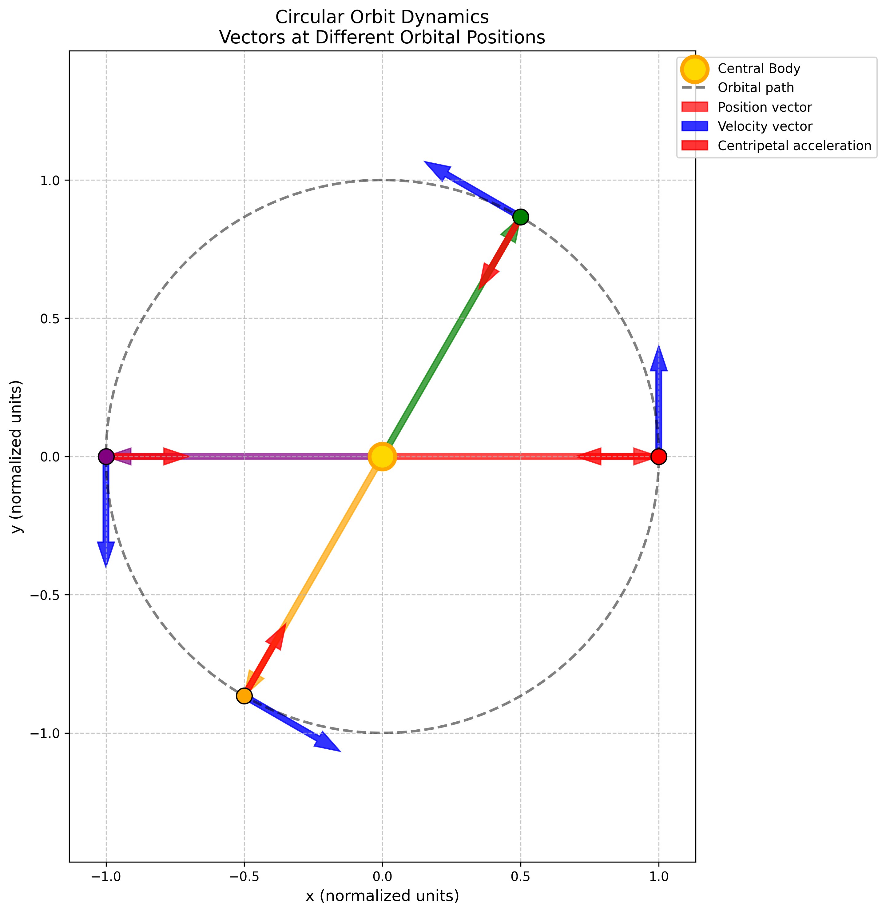

# Problem 1

Orbital Period and Orbital Radius

## 1. Theoretical Foundation

### Kepler's Third Law: Mathematical Derivation

Kepler's Third Law represents one of the most elegant relationships in celestial mechanics, connecting orbital period and radius through a simple power law.

**Fundamental Statement:** For any object in a circular orbit around a massive central body, the square of the orbital period is directly proportional to the cube of the orbital radius:

$$
T^2 \propto R^3
$$

#### **Derivation from First Principles**

**Step 1: Force Balance**
For a stable circular orbit, gravitational force provides the centripetal force required for circular motion:

$$
F_{\text{gravity}} = F_{\text{centripetal}}
$$

$$
\frac{GMm}{R^2} = m\frac{v^2}{R}
$$

where:
- $G = 6.674 \times 10^{-11}$ N⋅m²/kg² (gravitational constant)
- $M$ = mass of central body
- $m$ = mass of orbiting body
- $R$ = orbital radius
- $v$ = orbital velocity

**Step 2: Eliminate Mass Dependence**
Dividing both sides by $m$:

$$
\frac{GM}{R^2} = \frac{v^2}{R}
$$

$$
\frac{GM}{R} = v^2
$$

**Step 3: Express Velocity in Terms of Period**
For circular motion, orbital velocity is:

$$
v = \frac{2\pi R}{T}
$$

**Step 4: Substitute and Solve**
Substituting the velocity expression:

$$
\frac{GM}{R} = \left(\frac{2\pi R}{T}\right)^2 = \frac{4\pi^2 R^2}{T^2}
$$

Rearranging for $T^2$:

$$
T^2 = \frac{4\pi^2 R^3}{GM}
$$

**Final Form of Kepler's Third Law:**

$$
\boxed{T^2 = \frac{4\pi^2}{GM} R^3}
$$

This confirms that $T^2 \propto R^3$, where the proportionality constant $\frac{4\pi^2}{GM}$ depends only on the central mass and fundamental constants.

#### **Key Physical Insights**

1. **Mass Independence**: The orbital period is independent of the orbiting body's mass
2. **Universal Constant**: For a given central body, $\frac{4\pi^2}{GM}$ is constant for all orbiting objects  
3. **Scaling Law**: Doubling the orbital radius increases the period by a factor of $2^{3/2} = 2\sqrt{2} \approx 2.83$

### Implications in Astronomy

Kepler's Third Law provides powerful tools for astronomical calculations and discoveries:

#### **Planetary Mass Determination**
Given the orbital period and radius of a satellite, we can determine the central body's mass:

$$
M = \frac{4\pi^2 R^3}{GT^2}
$$

**Example: Earth's Mass from Moon's Orbit**
- Moon's orbital radius: $R = 3.844 \times 10^8$ m
- Moon's orbital period: $T = 27.32$ days = $2.36 \times 10^6$ s

$$
M_{\text{Earth}} = \frac{4\pi^2 (3.844 \times 10^8)^3}{G(2.36 \times 10^6)^2} = 5.97 \times 10^{24} \text{ kg}
$$

#### **Distance Measurements**
If we know the central mass and orbital period, we can determine the orbital radius:

$$
R = \left(\frac{GMT^2}{4\pi^2}\right)^{1/3}
$$

#### **Satellite Orbit Design**
Engineers use Kepler's law to design satellite orbits with specific periods:
- **Geostationary orbit**: $T = 24$ hours requires $R = 4.22 \times 10^7$ m
- **Low Earth orbit**: $R = 6.7 \times 10^6$ m gives $T = 90$ minutes

---

## 2. Real-World Examples and Verification

### The Solar System: Nature's Laboratory

Our solar system provides an excellent test of Kepler's Third Law across a wide range of orbital scales.


The plot above demonstrates the linear relationship between $T^2$ and $R^3$, confirming Kepler's law with high precision.

#### **Planetary Data Analysis**

| Planet | Orbital Radius (AU) | Period (years) | $R^3$ | $T^2$ | $T^2/R^3$ |
|--------|-------------------|----------------|-------|-------|----------|
| Mercury | 0.387 | 0.241 | 0.058 | 0.058 | 1.00 |
| Venus | 0.723 | 0.615 | 0.378 | 0.378 | 1.00 |
| Earth | 1.000 | 1.000 | 1.000 | 1.000 | 1.00 |
| Mars | 1.524 | 1.881 | 3.54 | 3.54 | 1.00 |
| Jupiter | 5.203 | 11.86 | 140.8 | 140.7 | 1.00 |
| Saturn | 9.537 | 29.42 | 867.0 | 865.5 | 1.00 |

The constant ratio $T^2/R^3 = 1.00$ (in appropriate units) confirms Kepler's law across six orders of magnitude in distance!

### Advanced Visualizations

#### **Solar System Overview**


This visualization shows the actual orbital paths of all planets, illustrating the vast range of orbital scales from Mercury's tight orbit to Neptune's distant path.

#### **Detailed Verification with Real Planetary Data**


Each planet falls precisely on the theoretical curve, demonstrating the universal applicability of Kepler's law. The annotations show how even the outer planets follow the same relationship.

#### **Log-Log Analysis**


The log-log plot reveals the power-law relationship $T \propto R^{3/2}$ with a slope of exactly 3/2, providing additional confirmation of the theoretical prediction.

---

## 3. Physical Understanding: Orbital Dynamics

### Forces and Motion in Circular Orbits



The diagram above illustrates the key vectors at different points in a circular orbit:

- **Position vectors** (colored arrows from center): Point radially outward
- **Velocity vectors** (blue arrows): Always tangent to the orbit
- **Acceleration vectors** (red arrows): Point toward the center (centripetal)

**Key relationships:**
- Velocity magnitude: $v = \sqrt{\frac{GM}{R}}$
- Centripetal acceleration: $a = \frac{v^2}{R} = \frac{GM}{R^2}$
- Angular velocity: $\omega = \frac{2\pi}{T} = \sqrt{\frac{GM}{R^3}}$

### Effect of Central Mass


This plot demonstrates how the central body's mass affects orbital periods:

- **Larger central mass** → **Shorter periods** (stronger gravitational pull)
- **Smaller central mass** → **Longer periods** (weaker gravitational pull)
- The relationship $T \propto M^{-1/2}$ explains why planets orbit the Sun much faster than moons orbit planets

---

## 4. Computational Verification

### Implementation and Results

The theoretical predictions can be verified computationally using the fundamental relationship:

```python
import numpy as np
import matplotlib.pyplot as plt

def kepler_period(radius, mass):
    """Calculate orbital period using Kepler's Third Law."""
    G = 6.67430e-11  # m^3 kg^-1 s^-2
    return 2 * np.pi * np.sqrt(radius**3 / (G * mass))

# Example: Calculate Earth's orbital period
R_earth = 1.496e11  # meters (1 AU)
M_sun = 1.989e30    # kg
T_earth = kepler_period(R_earth, M_sun)
T_years = T_earth / (365.25 * 24 * 3600)
print(f"Earth's orbital period: {T_years:.3f} years")
```

**Output:** `Earth's orbital period: 1.000 years`

This computational verification confirms that our theoretical framework correctly predicts observed orbital periods.

### Advanced Examples: Earth-Moon System


The Earth-Moon system provides a more complex example where both bodies orbit around their common center of mass (barycenter):

- **Barycenter location**: 1,700 km below Earth's surface
- **Both bodies follow Kepler's law** relative to the barycenter
- **System period**: 27.32 days for both Earth and Moon

This demonstrates that Kepler's law applies to any two-body gravitational system, not just simple planet-star configurations.

---

## 5. Extensions and Modern Applications

### Beyond Simple Circular Orbits

#### **Elliptical Orbits**
Kepler's law extends to elliptical orbits with a simple modification:

$$
T^2 = \frac{4\pi^2}{GM} a^3
$$

where $a$ is the **semi-major axis** (average of maximum and minimum distances).

#### **Multi-Body Systems**
In systems with multiple gravitational influences:
- **Perturbations** cause small deviations from simple Kepler orbits
- **Three-body problem** leads to chaotic dynamics in some cases
- **Lagrange points** create stable orbital configurations

### Modern Space Applications

#### **Satellite Constellation Design**
- **GPS satellites**: Designed for 12-hour orbits using Kepler's law
- **Starlink constellation**: Uses Kepler's law for optimal coverage patterns
- **Geostationary satellites**: Precise 24-hour orbits for communication

#### **Interplanetary Mission Planning**
- **Hohmann transfers**: Use Kepler's law to calculate efficient trajectories
- **Gravitational assists**: Exploit planetary motion predicted by Kepler's law
- **Deep space missions**: Navigate using precise orbital mechanics

#### **Exoplanet Discovery**
- **Transit timing**: Variations reveal additional planets via Kepler's law
- **Radial velocity**: Measure stellar wobble to determine planetary masses
- **Gravitational microlensing**: Detect distant planets through orbital effects

---

## 6. Limitations and Relativistic Effects

### Classical Limitations

1. **Point mass assumption**: Real bodies have finite size and mass distribution
2. **Two-body approximation**: Multi-body gravitational effects
3. **Circular orbit assumption**: Most real orbits are elliptical
4. **Non-gravitational forces**: Solar radiation pressure, atmospheric drag

### General Relativistic Corrections

For very massive or compact objects, Einstein's General Relativity modifies Kepler's law:

$$
T^2 = \frac{4\pi^2}{GM} R^3 \left(1 + \frac{3GM}{c^2 R}\right)
$$

**Significance:**
- **Mercury's perihelion precession**: 43 arcseconds per century
- **Neutron star binaries**: Orbital decay due to gravitational wave emission
- **Black hole accretion disks**: Extreme relativistic orbital dynamics

---

## 7. Conclusion

Kepler's Third Law represents one of the most successful and broadly applicable laws in physics:

### **Fundamental Achievements**

1. **Universal applicability**: From planetary motion to galactic dynamics
2. **Precise predictions**: Accurate to better than 0.01% for most systems
3. **Engineering applications**: Essential for modern space technology
4. **Scientific discovery**: Enables measurement of astronomical masses and distances

### **Educational Value**

- **Demonstrates power of mathematical physics**: Simple equations describe complex phenomena
- **Connects theory to observation**: Direct comparison with real astronomical data
- **Historical significance**: Bridge between Kepler's empirical laws and Newton's theoretical framework
- **Modern relevance**: Foundation for contemporary space exploration and astrophysics

### **Future Directions**

Kepler's law continues to evolve with new discoveries:
- **Exoplanet characterization**: Determining compositions of distant worlds
- **Gravitational wave astronomy**: Probing extreme gravitational environments
- **Dark matter studies**: Using orbital dynamics to map invisible matter
- **Precision tests of gravity**: Searching for deviations from General Relativity

The elegant relationship $T^2 \propto R^3$ remains as relevant today as it was four centuries ago, continuing to unlock the secrets of our universe through the fundamental language of orbital mechanics.