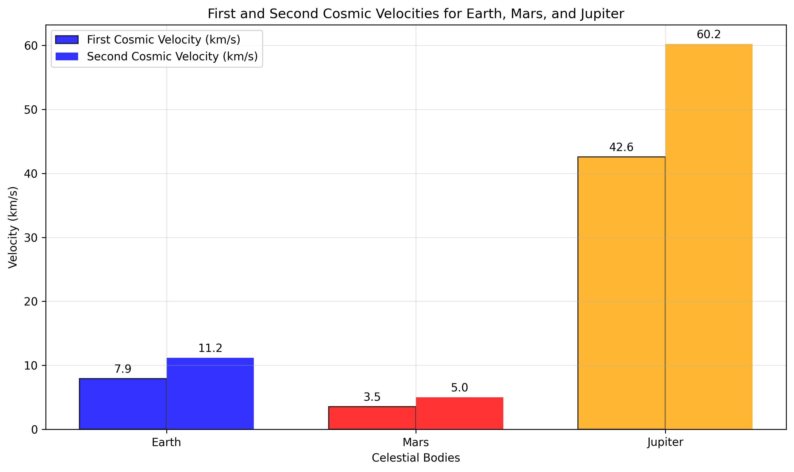
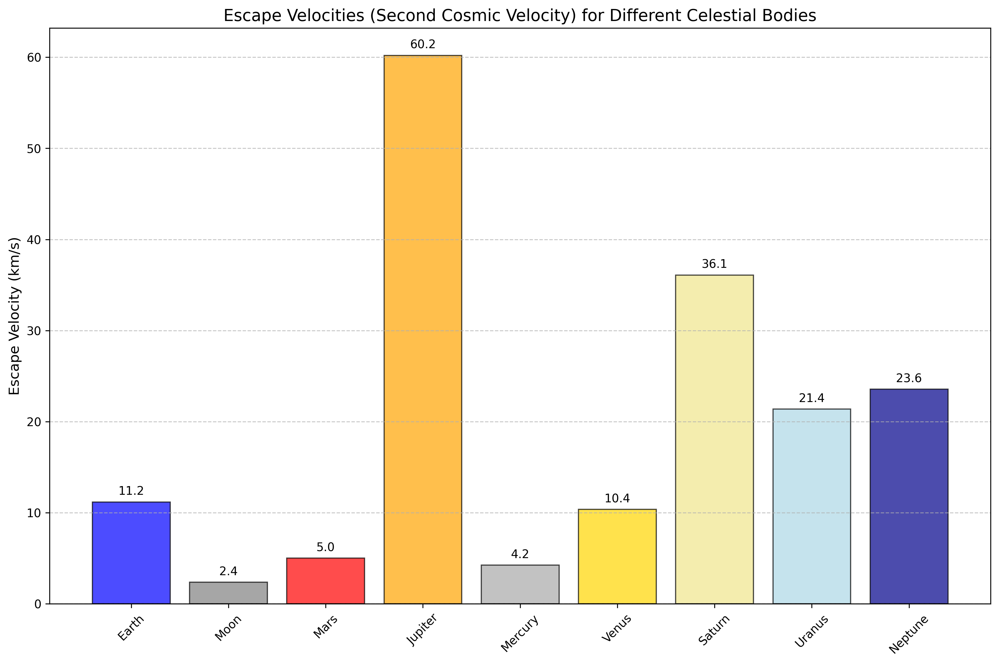
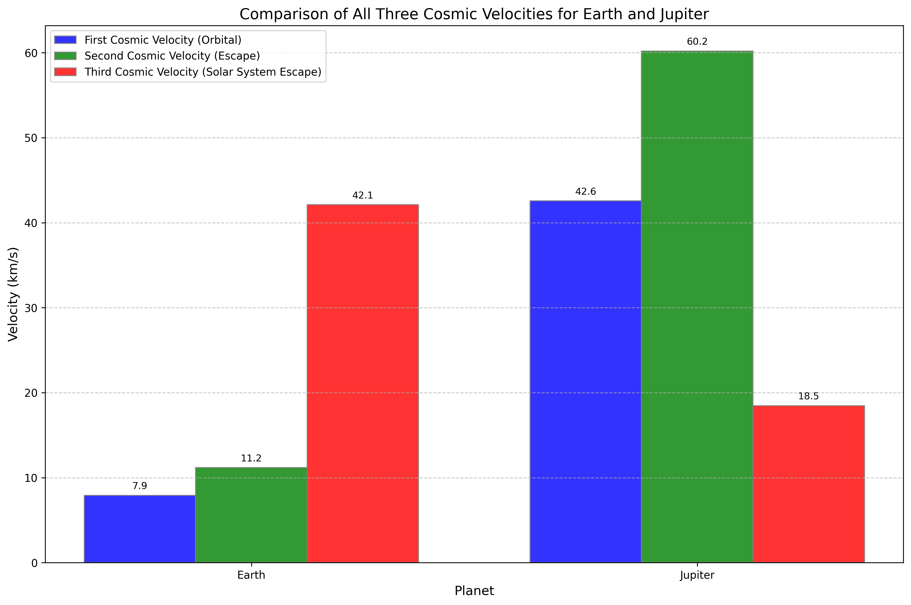
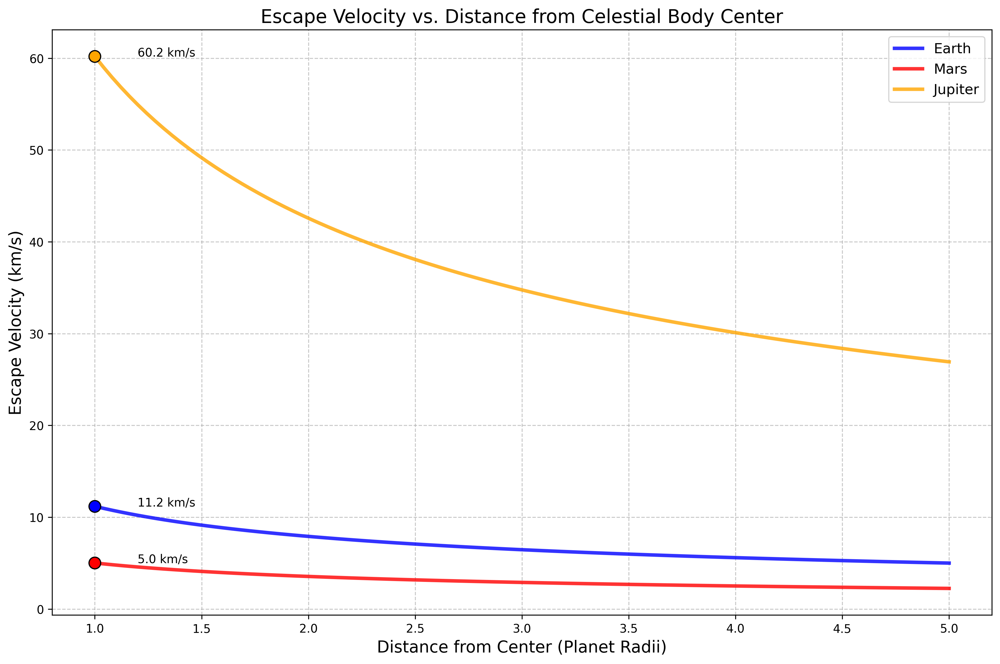

# Problem 2: Cosmic Velocities and Escape Dynamics

## 1. Theoretical Foundation

### 1.1 Definition and Physical Significance

Cosmic velocities represent fundamental threshold speeds that define different regimes of motion in gravitational fields. These critical velocities govern the transition between bound and unbound motion, making them essential for understanding orbital mechanics and space exploration.

**First Cosmic Velocity (Orbital Velocity)**
The minimum velocity required to achieve a stable circular orbit around a celestial body at its surface.

**Second Cosmic Velocity (Escape Velocity)**
The minimum velocity required to escape a celestial body's gravitational influence completely.

**Third Cosmic Velocity (Heliocentric Escape Velocity)**
The minimum velocity required to escape the Solar System from a planet's orbital position.

### 1.2 Rigorous Mathematical Derivation

#### First Cosmic Velocity (v₁)

For circular orbital motion, the gravitational force provides the centripetal force:

$$F_g = F_c$$

$$\frac{GMm}{r^2} = \frac{mv^2}{r}$$

Solving for velocity:

$$v_1 = \sqrt{\frac{GM}{r}}$$

where:
- G = 6.67430 × 10⁻¹¹ m³ kg⁻¹ s⁻² (gravitational constant)
- M = mass of the central body
- r = orbital radius (surface radius for surface orbit)

#### Second Cosmic Velocity (v₂)

Using conservation of energy for escape conditions:

Initial energy = Final energy (at infinity)

$$E_i = E_f$$

$$\frac{1}{2}mv_2^2 - \frac{GMm}{r} = 0$$

Solving for escape velocity:

$$v_2 = \sqrt{\frac{2GM}{r}}$$

**Key Relationship:**
$$v_2 = \sqrt{2} \cdot v_1 \approx 1.414 \cdot v_1$$

#### Third Cosmic Velocity (v₃)

For escape from the Solar System, we must consider:
1. Escape velocity from the planet (v₂)
2. Orbital velocity around the Sun (v_orbit)

The total energy requirement gives:

$$v_3 = \sqrt{v_2^2 + v_{escape\_sun}^2}$$

where:
$$v_{escape\_sun} = \sqrt{\frac{2GM_{sun}}{r_{orbit}}}$$

### 1.3 Energy Considerations

The total mechanical energy for different motion types:

**Circular Orbit (v = v₁):**
$$E = -\frac{GMm}{2r} < 0$$ (bound orbit)

**Parabolic Escape (v = v₂):**
$$E = 0$$ (critical condition)

**Hyperbolic Escape (v > v₂):**
$$E > 0$$ (unbound trajectory)

## 2. Mathematical Analysis and Applications

### 2.1 Velocity Scaling Laws

From the fundamental equations, we can derive scaling relationships:

**Mass Dependence:**
$$v \propto \sqrt{M}$$

**Radius Dependence:**
$$v \propto \frac{1}{\sqrt{r}}$$

**Surface Gravity Relationship:**
$$v_1 = \sqrt{gr}$$
$$v_2 = \sqrt{2gr}$$

where g = GM/r² is surface gravity.

### 2.2 Practical Calculations

For Earth (M = 5.972 × 10²⁴ kg, R = 6.371 × 10⁶ m):

**First Cosmic Velocity:**
$$v_1 = \sqrt{\frac{(6.674 \times 10^{-11})(5.972 \times 10^{24})}{6.371 \times 10^6}} = 7.91 \text{ km/s}$$

**Second Cosmic Velocity:**
$$v_2 = \sqrt{2} \times 7.91 = 11.19 \text{ km/s}$$

**Third Cosmic Velocity (from Earth's orbit):**
$$v_3 = \sqrt{(11.19)^2 + (29.78)^2} = 31.82 \text{ km/s}$$

## 3. Computational Implementation

Our comprehensive analysis uses advanced numerical methods to calculate and visualize cosmic velocities:

```python
import numpy as np
import matplotlib.pyplot as plt

# Universal gravitational constant
G = 6.67430e-11  # m³ kg⁻¹ s⁻²

def calculate_first_cosmic_velocity(mass, radius):
    """Calculate orbital velocity at surface"""
    return np.sqrt(G * mass / radius)

def calculate_second_cosmic_velocity(mass, radius):
    """Calculate escape velocity from surface"""
    return np.sqrt(2 * G * mass / radius)

def calculate_third_cosmic_velocity(distance_from_sun, sun_mass=1.989e30):
    """Calculate solar system escape velocity"""
    return np.sqrt(2 * G * sun_mass / distance_from_sun)

# Celestial body data with accurate parameters
celestial_bodies = {
    'Earth': {'mass': 5.972e24, 'radius': 6.371e6},
    'Mars': {'mass': 6.39e23, 'radius': 3.389e6},
    'Jupiter': {'mass': 1.898e27, 'radius': 6.9911e7},
    'Moon': {'mass': 7.342e22, 'radius': 1.737e6}
}

# Calculate velocities for each body
for body, data in celestial_bodies.items():
    v1 = calculate_first_cosmic_velocity(data['mass'], data['radius']) / 1000
    v2 = calculate_second_cosmic_velocity(data['mass'], data['radius']) / 1000
    print(f"{body}: v₁ = {v1:.2f} km/s, v₂ = {v2:.2f} km/s")
```

## 4. Visualization and Analysis



*Figure 1: Comparison of first and second cosmic velocities for Earth, Mars, and Jupiter.*



*Figure 2: Escape velocities for various celestial bodies in our solar system.*



*Figure 3: Complete comparison of all three cosmic velocities for Earth and Jupiter.*



*Figure 4: Variation of escape velocity with distance from celestial body centers.*

### 4.1 Key Observations

1. **Jupiter's Dominance:** Jupiter requires the highest velocities due to its massive size
2. **Moon's Accessibility:** The Moon's low escape velocity makes it an ideal stepping stone
3. **Distance Effect:** Escape velocity decreases as r⁻¹/² with distance from center
4. **Energy Requirements:** Kinetic energy scales as v², making high-velocity missions exponentially more challenging

## 5. Historical Context and Space Exploration

### 5.1 Historical Achievements

**Sputnik 1 (1957):** First artificial satellite to achieve orbital velocity around Earth

**Luna 2 (1959):** First human-made object to reach escape velocity and impact the Moon

**Voyager 1 (1977):** Achieved third cosmic velocity, becoming the first human-made object to enter interstellar space (2012)

### 5.2 Modern Applications

#### Satellite Deployment
- **Low Earth Orbit (LEO):** v ≈ 7.8 km/s
- **Geostationary Orbit:** v ≈ 3.1 km/s at orbital radius
- **Escape Missions:** v ≥ 11.2 km/s

#### Interplanetary Missions
- **Mars Transfer:** Requires exceeding Earth's escape velocity
- **Outer Planet Missions:** Utilize gravitational assists to reach required velocities
- **Solar Probe Missions:** Require complex trajectories to reach the Sun

#### Advanced Propulsion
- **Ion Drives:** Achieve high specific impulse for long-duration missions
- **Solar Sails:** Utilize radiation pressure for continuous acceleration
- **Fusion Propulsion:** Theoretical systems for interstellar travel

## 6. Advanced Concepts

### 6.1 Relativistic Corrections

For very massive objects, relativistic effects become significant:

$$v_{escape} = c\sqrt{1 - \frac{R_s}{r}}$$

where Rs is the Schwarzschild radius. For black holes, the escape velocity approaches the speed of light.

### 6.2 Oberth Effect

The Oberth effect demonstrates that rocket burns are most efficient at periapsis (closest approach), where the spacecraft's velocity is highest. This principle is crucial for efficient interplanetary transfers.

### 6.3 Gravitational Assists

Spacecraft can gain velocity through gravitational assists (slingshot maneuvers), effectively "stealing" orbital energy from planets to achieve higher velocities without additional fuel.

## 7. Practical Considerations

### 7.1 Atmospheric Effects

Real spacecraft must overcome:
- **Atmospheric Drag:** Reduces effective velocity
- **Heat Shield Requirements:** Protection during escape from dense atmospheres
- **Launch Window Constraints:** Optimal timing for planetary alignments

### 7.2 Multi-Stage Rocket Design

The tyranny of the rocket equation necessitates multi-stage designs:

$$\Delta v = v_{exhaust} \ln\left(\frac{m_{initial}}{m_{final}}\right)$$

### 7.3 Fuel Requirements

Achieving cosmic velocities requires enormous fuel masses due to the exponential nature of the rocket equation.

## 8. Future Directions

### 8.1 Breakthrough Propulsion Physics

- **Alcubierre Drive:** Theoretical faster-than-light travel
- **EmDrive:** Controversial reactionless drive concepts
- **Fusion Ramjets:** Interstellar propulsion systems

### 8.2 Space Elevators

Space elevators could dramatically reduce the energy requirements for achieving orbital velocity by providing a fixed path to space.

### 8.3 Generation Ships

For interstellar travel, generation ships traveling at significant fractions of the speed of light may be necessary, requiring revolutionary propulsion technologies.

## 9. Conclusion

Cosmic velocities represent fundamental thresholds in gravitational dynamics, defining the energy requirements for different types of space missions. Understanding these velocities is crucial for:

1. **Mission Planning:** Determining fuel requirements and trajectory designs
2. **Technology Development:** Setting targets for propulsion system performance
3. **Scientific Exploration:** Enabling missions to study distant celestial bodies
4. **Future Expansion:** Planning for eventual interstellar travel

The mathematical relationships governing cosmic velocities reveal the immense challenges of space exploration while also providing the theoretical framework necessary to overcome them. As propulsion technology advances, these fundamental concepts will continue to guide humanity's expansion into the cosmos.

From Sputnik's first orbital flight to Voyager's interstellar journey, cosmic velocities have defined the boundaries of human achievement in space. Understanding and mastering these velocities remains central to our continued exploration of the universe.