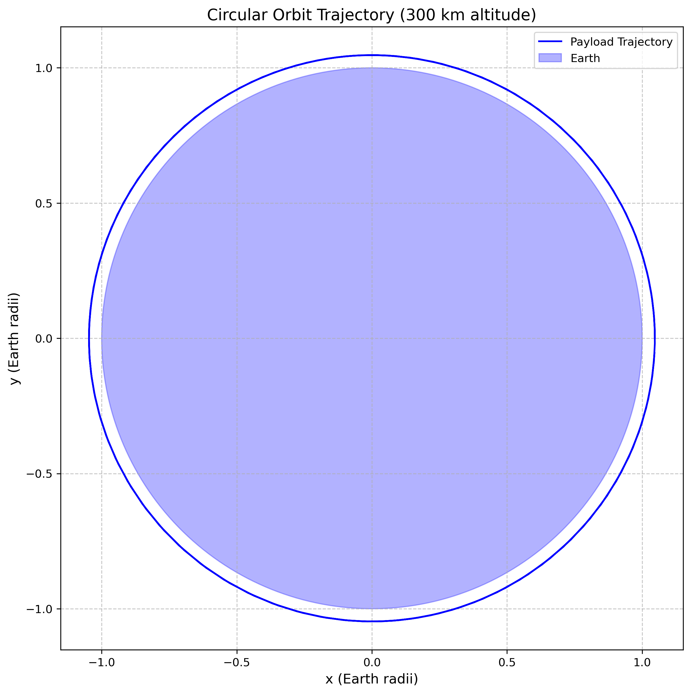
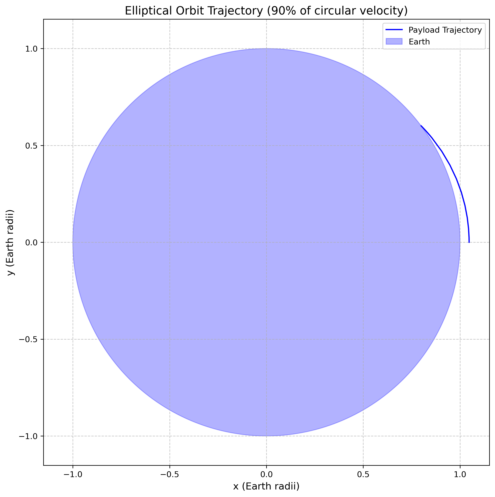
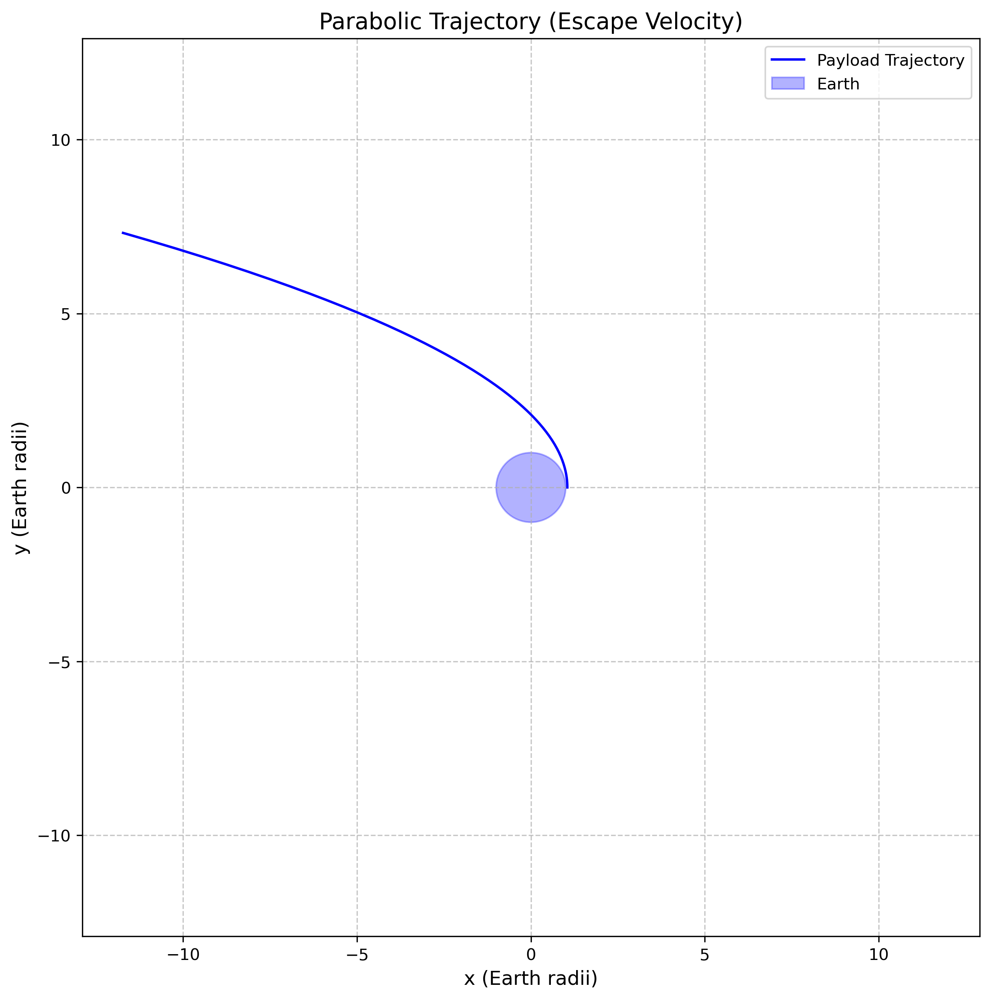
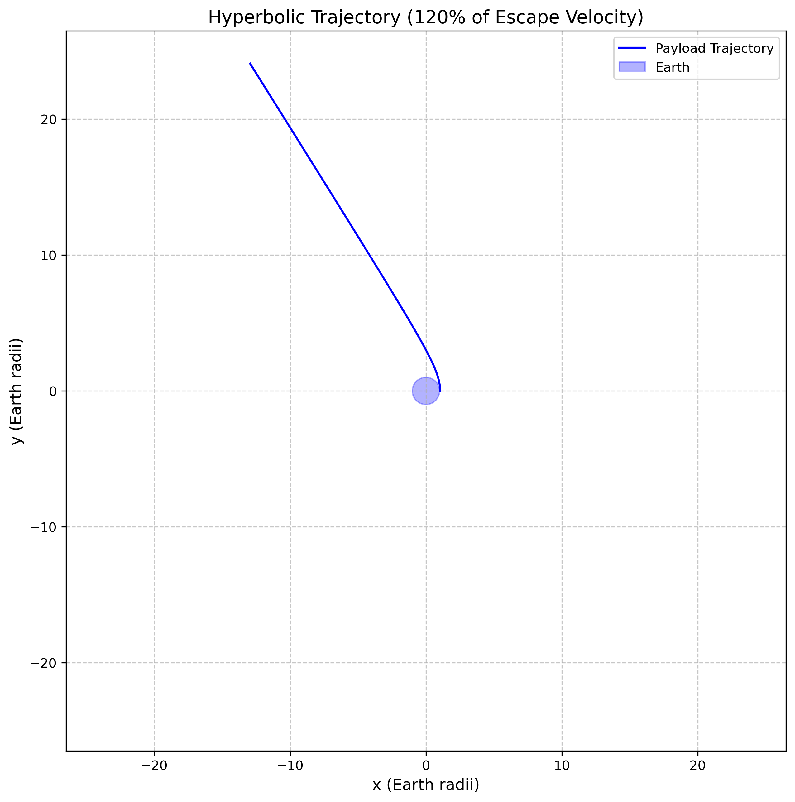
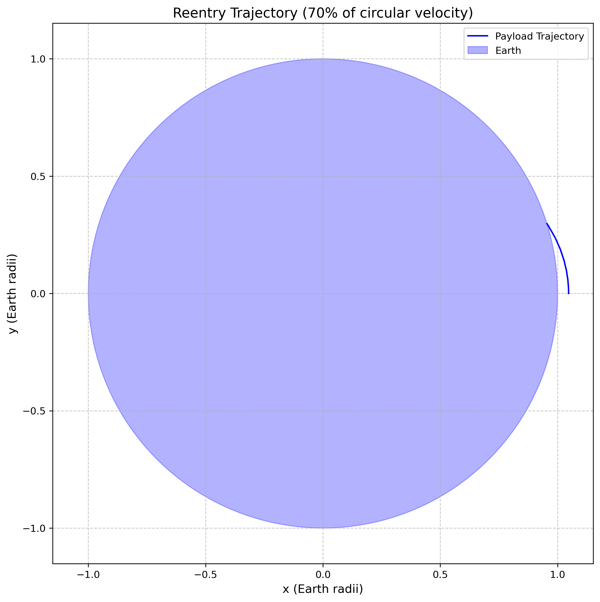
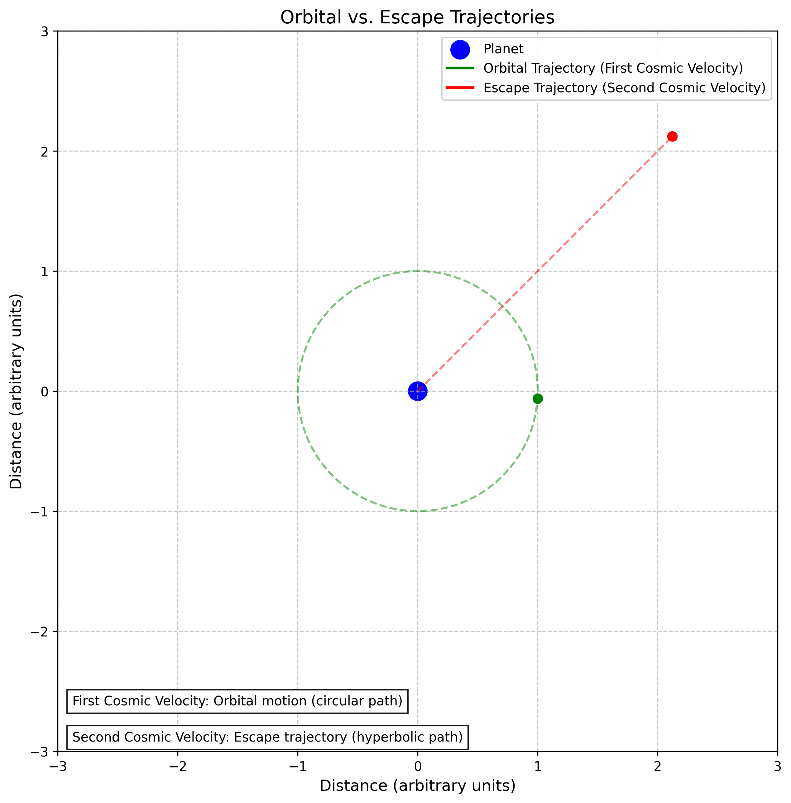
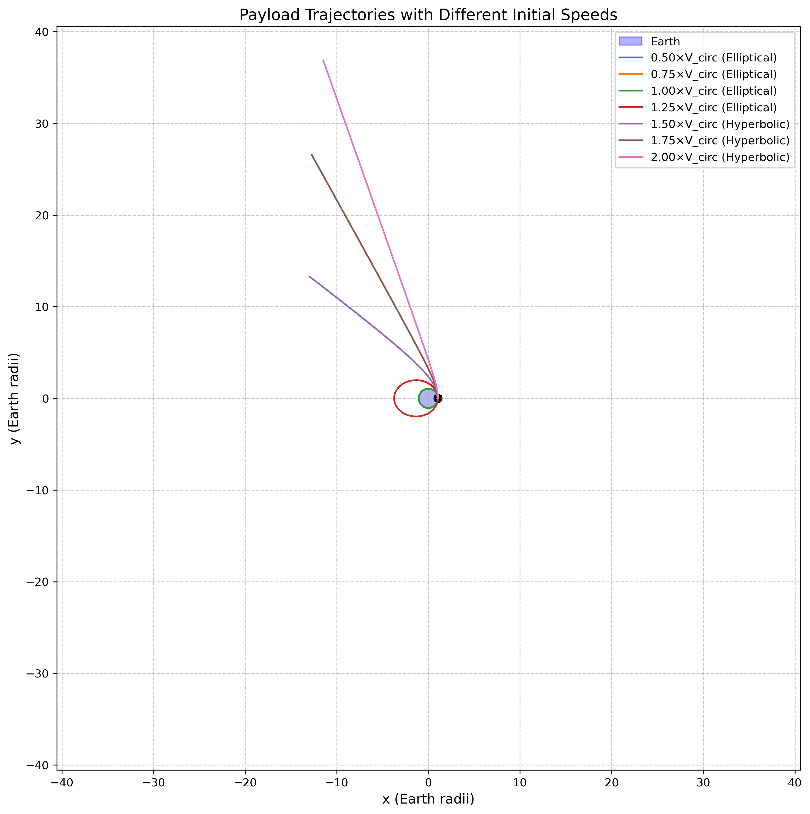
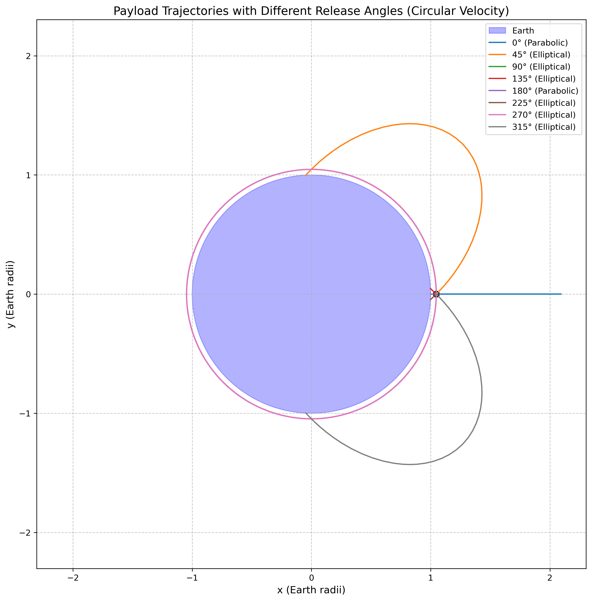

# Problem 3: Trajectories of a Freely Released Payload Near Earth

## Motivation

When an object is released from a moving rocket near Earth, its trajectory depends on initial conditions and gravitational forces. This scenario presents a rich problem, blending principles of orbital mechanics and numerical methods. Understanding the potential trajectories is vital for space missions, such as deploying payloads or returning objects to Earth.

---

## 1. Theoretical Foundation

### 1.1 Fundamental Principles

The motion of a payload released near Earth is governed by Newton's law of universal gravitation and follows the principles of orbital mechanics. The gravitational force acting on a payload of mass $m$ at distance $r$ from Earth's center is:

$$F = \frac{GMm}{r^2}$$

where $G = 6.67430 \times 10^{-11} \, \text{m}^3\text{kg}^{-1}\text{s}^{-2}$ is the gravitational constant and $M = 5.972 \times 10^{24} \, \text{kg}$ is Earth's mass.

### 1.2 Equations of Motion

The equation of motion for the payload in a two-dimensional coordinate system is:

$$\frac{d^2\mathbf{r}}{dt^2} = -\frac{GM}{r^3} \mathbf{r}$$

where $\mathbf{r} = (x, y)$ is the position vector and $r = |\mathbf{r}| = \sqrt{x^2 + y^2}$.

In component form:
$$\frac{d^2x}{dt^2} = -\frac{GM}{r^3} x$$
$$\frac{d^2y}{dt^2} = -\frac{GM}{r^3} y$$

### 1.3 Conservation Laws and Orbital Parameters

#### Specific Energy
The specific mechanical energy (energy per unit mass) is conserved:

$$E = \frac{1}{2}v^2 - \frac{GM}{r}$$

where $v = \sqrt{v_x^2 + v_y^2}$ is the speed.

#### Angular Momentum
For planar motion, the specific angular momentum is conserved:

$$h = |\mathbf{r} \times \mathbf{v}| = xv_y - yv_x$$

#### Eccentricity
The orbital eccentricity, which determines the shape of the trajectory, is:

$$e = \sqrt{1 + \frac{2Eh^2}{(GM)^2}}$$

### 1.4 Trajectory Classification

Based on the specific energy and eccentricity, trajectories are classified as:

1. **Circular Orbit** ($e = 0$, $E < 0$):
   - Occurs when $v = \sqrt{\frac{GM}{r}}$ (circular velocity)
   - Constant altitude orbit

2. **Elliptical Orbit** ($0 < e < 1$, $E < 0$):
   - Bound orbit with varying altitude
   - Includes both circular and eccentric elliptical orbits
   - Semi-major axis: $a = -\frac{GM}{2E}$

3. **Parabolic Trajectory** ($e = 1$, $E = 0$):
   - Escape trajectory with minimum energy
   - Escape velocity: $v_{esc} = \sqrt{\frac{2GM}{r}}$

4. **Hyperbolic Trajectory** ($e > 1$, $E > 0$):
   - Unbound trajectory with excess energy
   - Payload escapes Earth's gravitational influence

### 1.5 Critical Velocities

#### First Cosmic Velocity (Circular Velocity)
The minimum velocity for a circular orbit at radius $r$:
$$v_1 = \sqrt{\frac{GM}{r}}$$

At Earth's surface: $v_1 = 7.91 \, \text{km/s}$

#### Second Cosmic Velocity (Escape Velocity)
The minimum velocity to escape Earth's gravity:
$$v_2 = \sqrt{\frac{2GM}{r}} = \sqrt{2} \cdot v_1$$

At Earth's surface: $v_2 = 11.19 \, \text{km/s}$

---

## 2. Numerical Analysis and Computational Methods

### 2.1 Numerical Integration

The orbital equations form a system of first-order ODEs:

$$\frac{d}{dt}\begin{pmatrix} x \\ y \\ v_x \\ v_y \end{pmatrix} = \begin{pmatrix} v_x \\ v_y \\ -\frac{GM}{r^3}x \\ -\frac{GM}{r^3}y \end{pmatrix}$$

We use the Runge-Kutta 4th order method (RK45) with adaptive step size for high accuracy.

### 2.2 Orbital Parameter Calculation

From initial conditions $(x_0, y_0, v_{x0}, v_{y0})$, we calculate:

- **Specific energy**: $E = \frac{1}{2}(v_{x0}^2 + v_{y0}^2) - \frac{GM}{\sqrt{x_0^2 + y_0^2}}$
- **Angular momentum**: $h = x_0 v_{y0} - y_0 v_{x0}$
- **Eccentricity**: $e = \sqrt{1 + \frac{2Eh^2}{(GM)^2}}$
- **Semi-major axis**: $a = -\frac{GM}{2E}$ (for bound orbits)

### 2.3 Periapsis and Apoapsis

For elliptical orbits ($e < 1$):
- **Periapsis distance**: $r_p = a(1 - e)$
- **Apoapsis distance**: $r_a = a(1 + e)$

For parabolic trajectories ($e = 1$):
- **Periapsis distance**: $r_p = \frac{h^2}{2GM}$

---

## 3. Practical Applications and Mission Scenarios

### 3.1 Satellite Deployment

Understanding payload trajectories is crucial for:
- **Orbital insertion**: Achieving desired orbital parameters
- **Station-keeping**: Maintaining proper orbit
- **Constellation deployment**: Positioning multiple satellites

### 3.2 Reentry Scenarios

For controlled reentry:
- **Deorbit burns**: Reducing velocity to ensure atmospheric entry
- **Reentry angle**: Optimizing entry trajectory for safety
- **Landing accuracy**: Predicting touchdown location

### 3.3 Escape Missions

For interplanetary missions:
- **Trans-lunar injection**: Escaping Earth's sphere of influence
- **Planetary transfers**: Hohmann transfer orbits
- **Gravity assists**: Using planetary flybys for trajectory modification

### 3.4 Space Debris Analysis

Tracking uncontrolled payloads:
- **Collision avoidance**: Predicting debris trajectories
- **Atmospheric decay**: Estimating reentry times
- **Space situational awareness**: Monitoring orbital environment

---

## 4. Computational Implementation

The comprehensive Python simulation (`payload_trajectories.py`) implements:

### 4.1 Core Functions

- **`payload_dynamics()`**: Implements the gravitational equations of motion
- **`simulate_trajectory()`**: Numerical integration using RK45 method
- **`calculate_orbital_parameters()`**: Computes energy, eccentricity, and orbit type
- **`plot_trajectory()`**: Visualizes individual trajectories
- **`plot_multiple_trajectories()`**: Compares different initial conditions

### 4.2 Analysis Capabilities

The simulation generates comprehensive visualizations:

1. **Individual trajectory plots** for each orbit type
2. **Trajectory comparisons** showing different initial velocities
3. **Angular analysis** showing effect of release direction
4. **Speed analysis** demonstrating velocity effects on orbit shape
5. **Animated trajectories** for dynamic visualization

### 4.3 Example Scenarios

The code simulates realistic scenarios:
- **Low Earth Orbit (LEO)** deployment at 300 km altitude
- **Reentry trajectories** with insufficient orbital velocity
- **Escape trajectories** exceeding escape velocity
- **Transfer orbits** for satellite maneuvering

---

## 5. Results and Analysis

### 5.1 Trajectory Types Demonstration

*Circular orbit at 300 km altitude with exact circular velocity*

*Elliptical orbit with 90% of circular velocity*

*Parabolic escape trajectory at exact escape velocity*

*Hyperbolic trajectory with 120% of escape velocity*

*Suborbital reentry trajectory with 70% of circular velocity*

### 5.2 Comparative Analysis

*Comparison of all trajectory types from the same initial position*

*Effect of different initial speeds on trajectory shape*

*Effect of release angle on circular-velocity trajectories*

### 5.3 Key Findings

1. **Velocity threshold effects**: Small changes in initial velocity dramatically affect trajectory type
2. **Energy considerations**: Bound vs. unbound orbits determined by total energy sign
3. **Angular momentum conservation**: Determines orbit orientation and eccentricity
4. **Mission planning implications**: Precise velocity control required for desired outcomes

---

## 6. Mathematical Verification

### 6.1 Energy Conservation Check

For any trajectory, the total energy should remain constant:
$$E(t) = \frac{1}{2}[v_x^2(t) + v_y^2(t)] - \frac{GM}{\sqrt{x^2(t) + y^2(t)}} = \text{constant}$$

### 6.2 Angular Momentum Conservation

For central force motion:
$$h(t) = x(t)v_y(t) - y(t)v_x(t) = \text{constant}$$

### 6.3 Orbit Equation Verification

The trajectory should satisfy the orbit equation:
$$\frac{1}{r} = \frac{GM}{h^2}(1 + e\cos\theta)$$

where $\theta$ is the true anomaly measured from periapsis.

---

## 7. Limitations and Future Enhancements

### 7.1 Current Model Limitations

- **Two-dimensional analysis**: Actual orbits are three-dimensional
- **Point mass assumption**: Earth treated as a point mass
- **No atmospheric effects**: Drag forces not considered
- **No perturbations**: Solar/lunar gravity and Earth oblateness ignored

### 7.2 Potential Enhancements

- **Three-dimensional implementation**: Full 3D orbital mechanics
- **Atmospheric modeling**: Including drag effects for low orbits
- **Perturbation analysis**: Adding third-body effects
- **Relativistic corrections**: General relativity effects for high precision

---

## 8. Conclusion

This comprehensive analysis of payload trajectories near Earth demonstrates the fundamental principles of orbital mechanics and their practical applications. The numerical simulations provide insight into:

- The critical role of initial velocity in determining trajectory type
- The mathematical relationships governing orbital motion
- The practical considerations for space mission design
- The computational methods required for trajectory analysis

Understanding these principles is essential for space mission planning, satellite operations, and space situational awareness. The computational tools developed here provide a foundation for more advanced orbital mechanics analysis and mission design applications.

---

## References and Further Reading

1. Vallado, D. A. (2013). *Fundamentals of Astrodynamics and Applications*. Microcosm Press.
2. Curtis, H. D. (2013). *Orbital Mechanics for Engineering Students*. Butterworth-Heinemann.
3. Prussing, J. E., & Conway, B. A. (2012). *Orbital Mechanics*. Oxford University Press.
4. Battin, R. H. (1999). *An Introduction to the Mathematics and Methods of Astrodynamics*. AIAA.