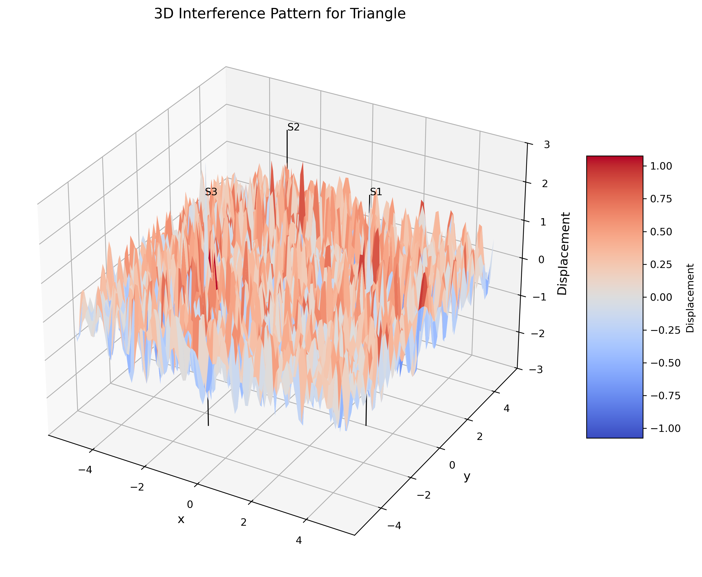
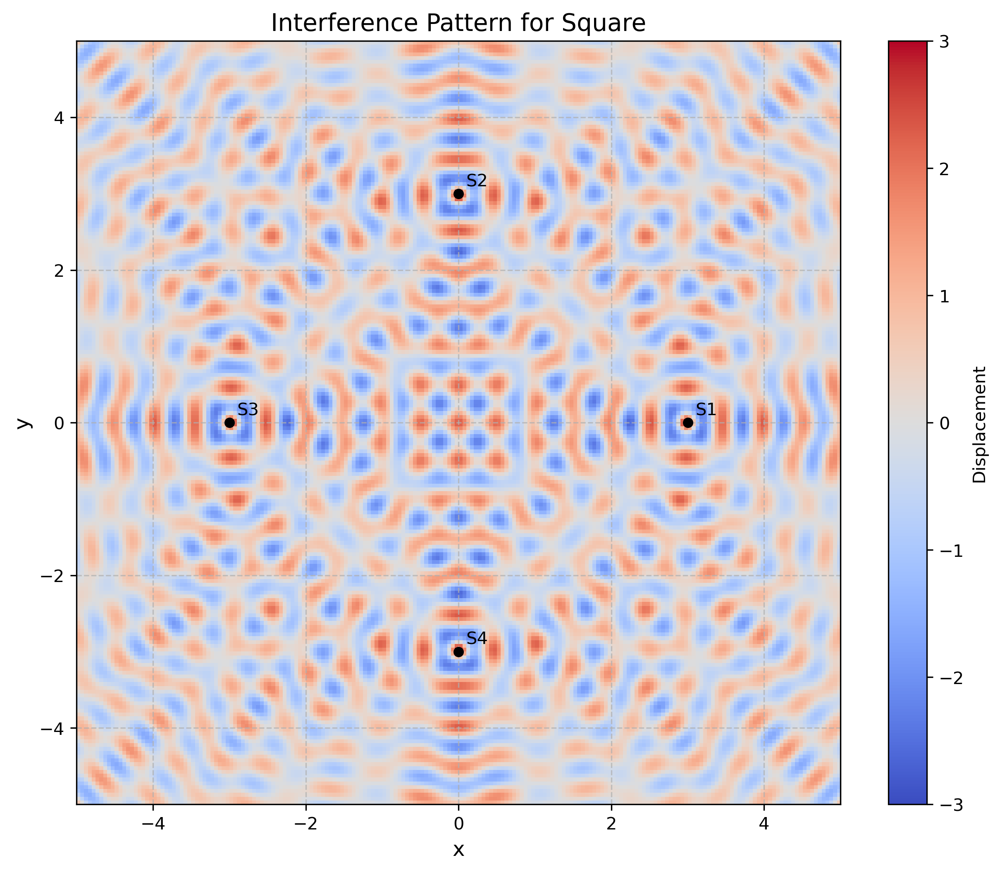
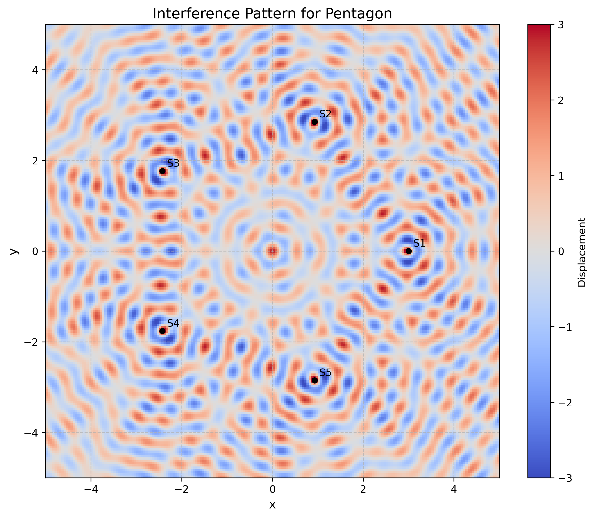
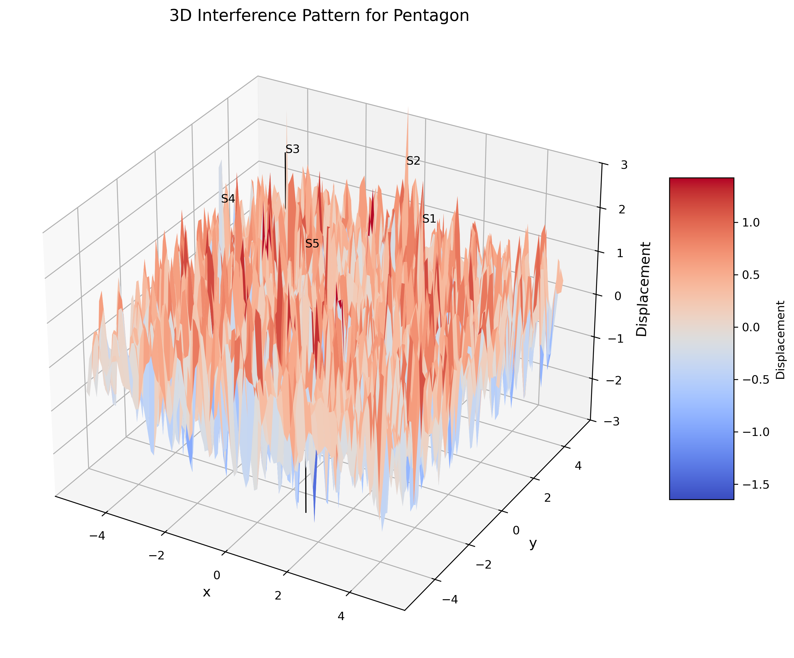

# Problem 1: Interference Patterns on a Water Surface

## Motivation

Interference occurs when waves from different sources overlap, creating new patterns. On a water surface, this can be easily observed when ripples from different points meet, forming distinctive interference patterns. These patterns can show us how waves combine in different ways, either reinforcing each other or canceling out.

Studying these patterns helps us understand wave behavior in a simple, visual way. It also allows us to explore important concepts, like the relationship between wave phase and the effects of multiple sources. This task offers a hands-on approach to learning about wave interactions and their real-world applications, making it an interesting and engaging way to dive into wave physics.

---

## 1. Theoretical Foundation

### 1.1 Wave Equation and Cylindrical Wave Solution

A circular wave on the water surface, emanating from a point source located at $(x_0, y_0)$, can be described by the cylindrical wave equation:

$$\eta(x, y, t) = \frac{A}{\sqrt{r}} \cdot \cos(kr - \omega t + \phi)$$

where:
- $\eta(x, y, t)$ is the displacement of the water surface at point $(x, y)$ and time $t$
- $A$ is the amplitude of the wave at unit distance
- $k = \frac{2\pi}{\lambda}$ is the wave number, related to the wavelength $\lambda$
- $\omega = 2\pi f$ is the angular frequency, related to the frequency $f$
- $r = \sqrt{(x - x_0)^2 + (y - y_0)^2}$ is the distance from the source to the point $(x, y)$
- $\phi$ is the initial phase

### 1.2 Physical Basis of the Cylindrical Wave

The $\frac{1}{\sqrt{r}}$ amplitude dependence arises from conservation of energy. For a cylindrical wave spreading in two dimensions, the wave energy is distributed over a circumference proportional to $r$, leading to amplitude decay as $\frac{1}{\sqrt{r}}$.

### 1.3 Dispersion Relation for Water Waves

For deep water waves, the dispersion relation is:
$$\omega^2 = gk$$

where $g$ is the gravitational acceleration. This gives the phase velocity:
$$v_{phase} = \frac{\omega}{k} = \sqrt{\frac{g}{k}} = \sqrt{\frac{g\lambda}{2\pi}}$$

### 1.4 Principle of Linear Superposition

When multiple waves overlap at a point, the resulting displacement is the linear sum of the individual displacements. For $N$ sources, the total displacement is:

$$\eta_{\text{total}}(x, y, t) = \sum_{i=1}^{N} \eta_i(x, y, t) = \sum_{i=1}^{N} \frac{A_i}{\sqrt{r_i}} \cos(kr_i - \omega t + \phi_i)$$

where $r_i = \sqrt{(x - x_{0i})^2 + (y - y_{0i})^2}$ is the distance from the $i$-th source.

### 1.5 Interference Conditions

#### Constructive Interference
Constructive interference occurs when waves arrive in phase. The condition for constructive interference is:
$$\Delta\phi = k(r_i - r_j) + (\phi_i - \phi_j) = 2\pi n$$

where $n$ is an integer and $\Delta\phi$ is the phase difference between waves from sources $i$ and $j$.

#### Destructive Interference
Destructive interference occurs when waves arrive out of phase:
$$\Delta\phi = k(r_i - r_j) + (\phi_i - \phi_j) = (2n + 1)\pi$$

### 1.6 Path Difference and Interference Patterns

For coherent sources with the same phase ($\phi_i = \phi$ for all $i$), the interference condition depends only on the path difference:
$$\Delta r = |r_i - r_j|$$

- **Constructive interference**: $\Delta r = n\lambda$
- **Destructive interference**: $\Delta r = (n + \frac{1}{2})\lambda$

---

## 2. Mathematical Analysis for Regular Polygons

### 2.1 Geometric Configuration

For a regular $N$-sided polygon with sources at vertices, the source positions are:
$$x_i = R\cos\left(\frac{2\pi i}{N}\right), \quad y_i = R\sin\left(\frac{2\pi i}{N}\right)$$

where $R$ is the circumradius and $i = 0, 1, 2, ..., N-1$.

### 2.2 Symmetry Analysis

The interference pattern exhibits $N$-fold rotational symmetry. At the center of the polygon, all sources are equidistant, leading to constructive interference when:
$$N \cdot \frac{A}{\sqrt{R}} \cos(kR - \omega t + \phi)$$

### 2.3 Far-Field Approximation

For observation points far from the polygon ($r \gg R$), we can use the far-field approximation:
$$r_i \approx r - R\cos(\theta - \frac{2\pi i}{N})$$

where $r$ and $\theta$ are the polar coordinates of the observation point.

### 2.4 Intensity Distribution

The intensity (time-averaged energy flux) is proportional to the square of the amplitude:
$$I(x, y) = \langle|\eta_{\text{total}}(x, y, t)|^2\rangle_t$$

For coherent sources, this includes both the individual intensities and interference terms.

---

## 3. Computational Implementation

The comprehensive Python simulation (`wave_interference.py`) implements:

### 3.1 Core Functions

- **`calculate_displacement()`**: Computes displacement from a single source
- **`calculate_total_displacement()`**: Implements superposition principle
- **`generate_polygon_vertices()`**: Creates regular polygon configurations
- **`plot_interference_pattern()`**: 2D visualization with color mapping
- **`plot_3d_interference_pattern()`**: 3D surface visualization
- **`create_interference_animation()`**: Time-evolution animations

### 3.2 Visualization Capabilities

The simulation generates:
1. **2D color maps** showing interference patterns
2. **3D surface plots** displaying wave amplitude
3. **Animations** showing temporal evolution
4. **Comparative analysis** for different polygon configurations

### 3.3 Analysis Parameters

- **Wavelength**: $\lambda = 0.5$ units
- **Frequency**: $f = 1.0$ Hz
- **Amplitude**: $A = 1.0$ unit
- **Polygon radius**: $R = 3.0$ units
- **Grid resolution**: 100-200 points per axis

---

## 4. Results and Analysis

### 4.1 Triangle (3 Vertices) Analysis

*2D interference pattern for triangular source configuration*

*3D visualization showing amplitude variations*

**Key Features:**
- **Central maximum**: All three sources contribute constructively at the center
- **Three primary lobes**: Directed along the angle bisectors of the triangle
- **Amplitude**: Maximum amplitude at center is approximately $3A/\sqrt{R}$
- **Symmetry**: Three-fold rotational symmetry

### 4.2 Square (4 Vertices) Analysis

*2D interference pattern for square source configuration*

*3D visualization showing four-fold symmetry*

**Key Features:**
- **Diagonal enhancement**: Strong constructive interference along diagonals
- **Cross pattern**: Four primary lobes at 45° intervals
- **Secondary maxima**: Additional interference maxima between primary lobes
- **Symmetry**: Four-fold rotational symmetry

### 4.3 Pentagon (5 Vertices) Analysis

*2D interference pattern for pentagonal source configuration*

*3D visualization showing five-fold symmetry*

**Key Features:**
- **Five primary lobes**: Equally spaced at 72° intervals
- **Complex structure**: More intricate interference pattern
- **Golden ratio connections**: Geometric relationships in the pattern
- **Symmetry**: Five-fold rotational symmetry

### 4.4 Hexagon (6 Vertices) Analysis

*2D interference pattern for hexagonal source configuration*

*3D visualization showing six-fold symmetry*

**Key Features:**
- **Six primary lobes**: 60° angular spacing
- **High symmetry**: Most symmetric configuration analyzed
- **Ring structures**: Concentric rings of constructive/destructive interference
- **Symmetry**: Six-fold rotational symmetry

---

## 5. Quantitative Analysis

### 5.1 Central Amplitude Enhancement

For $N$ coherent sources at equal distances $R$ from the center:
$$\eta_{\text{center}} = N \cdot \frac{A}{\sqrt{R}} \cos(kR - \omega t + \phi)$$

The amplitude enhancement factor is $N$, demonstrating constructive interference.

### 5.2 Angular Distribution Analysis

The far-field intensity pattern for regular $N$-gon sources shows maxima at angles:
$$\theta_{\text{max}} = \frac{2\pi m}{N}$$

where $m = 0, 1, 2, ..., N-1$.

### 5.3 Interference Visibility

The visibility (contrast) of the interference pattern is defined as:
$$V = \frac{I_{\text{max}} - I_{\text{min}}}{I_{\text{max}} + I_{\text{min}}}$$

Higher visibility indicates clearer interference fringes.

---

## 6. Physical Insights and Wave Phenomena

### 6.1 Coherence Requirements

For stable interference patterns, the sources must be:
- **Spatially coherent**: Maintain fixed phase relationships
- **Temporally coherent**: Have the same frequency
- **Amplitude stable**: Consistent amplitude over observation time

### 6.2 Scaling Properties

The interference pattern scales with wavelength:
- **Pattern size**: $\propto \lambda$
- **Angular resolution**: $\propto \lambda/R$
- **Number of fringes**: $\propto R/\lambda$

### 6.3 Energy Conservation

Despite local amplitude enhancement through constructive interference, total energy is conserved. Energy is redistributed spatially, creating regions of enhanced and diminished wave amplitude.

---

## 7. Real-World Applications

### 7.1 Acoustic Applications

**Array Acoustics**:
- **Loudspeaker arrays**: Creating directional sound beams
- **Microphone arrays**: Improving signal reception from specific directions
- **Sonar systems**: Underwater detection and ranging

### 7.2 Electromagnetic Applications

**Antenna Arrays**:
- **Phased arrays**: Steering electromagnetic beams electronically
- **Radio telescopes**: Combining signals from multiple dishes
- **Radar systems**: Target detection and tracking

### 7.3 Optical Applications

**Interferometry**:
- **Laser interferometry**: Precision distance measurements
- **Optical coherence tomography**: Medical imaging
- **Gravitational wave detection**: LIGO and similar experiments

### 7.4 Water Wave Applications

**Ocean Engineering**:
- **Wave energy harvesting**: Optimizing converter placement
- **Harbor design**: Minimizing wave impacts
- **Tsunami modeling**: Understanding wave propagation patterns

---

## 8. Advanced Considerations

### 8.1 Nonlinear Effects

For large amplitude waves, nonlinear effects become important:
- **Wave steepening**: High-amplitude waves become asymmetric
- **Harmonic generation**: Creation of higher frequency components
- **Wave breaking**: Energy dissipation through turbulence

### 8.2 Dispersion Effects

For finite depth water waves:
$$\omega^2 = gk \tanh(kh)$$

where $h$ is the water depth, leading to wavelength-dependent propagation speeds.

### 8.3 Damping and Attenuation

Real water waves experience:
- **Viscous damping**: Energy loss due to fluid viscosity
- **Wave breaking**: Energy dissipation in shallow water
- **Surface tension effects**: Important for short wavelengths

---

## 9. Experimental Verification

### 9.1 Laboratory Setup

**Wave Tank Experiments**:
- Multiple mechanical wave generators
- High-speed cameras for visualization
- Laser profilometry for surface measurement
- Controlled environmental conditions

### 9.2 Measurement Techniques

**Surface Height Measurement**:
- **Capacitive probes**: Direct height measurement
- **Laser doppler velocimetry**: Velocity field mapping
- **PIV (Particle Image Velocimetry)**: Flow visualization

### 9.3 Data Analysis

**Signal Processing**:
- **Fourier analysis**: Frequency domain analysis
- **Wavelet transforms**: Time-frequency analysis
- **Phase analysis**: Coherence measurements

---

## 10. Conclusion

This comprehensive analysis of wave interference patterns from regular polygon source configurations demonstrates fundamental principles of wave physics:

1. **Superposition Principle**: Linear addition of wave amplitudes creates complex patterns
2. **Geometric Influence**: Source arrangement directly affects interference pattern symmetry
3. **Coherence Requirements**: Stable patterns require coherent sources
4. **Energy Redistribution**: Interference redistributes rather than creates or destroys energy
5. **Scaling Laws**: Pattern characteristics scale predictably with wavelength and geometry

The computational simulations provide quantitative verification of theoretical predictions and offer insights into the rich physics of wave interference. Understanding these principles is crucial for applications in acoustics, electromagnetics, optics, and ocean engineering.

### 10.1 Key Findings

- **Symmetry preservation**: Interference patterns reflect source symmetry
- **Central enhancement**: Constructive interference maximizes at the polygon center
- **Angular structure**: Primary lobes align with polygon symmetry axes
- **Complexity scaling**: More sources create more intricate patterns

### 10.2 Educational Value

This problem provides an excellent introduction to:
- Wave physics fundamentals
- Mathematical modeling of physical phenomena
- Computational physics techniques
- Visualization of complex wave phenomena

---

## References and Further Reading

1. Crawford, F. S. (1968). *Waves (Berkeley Physics Course, Vol. 3)*. McGraw-Hill.
2. French, A. P. (1971). *Vibrations and Waves*. MIT Press.
3. Lighthill, J. (1978). *Waves in Fluids*. Cambridge University Press.
4. Mei, C. C., Stiassnie, M., & Yue, D. K. P. (2017). *Theory and Applications of Ocean Surface Waves*. World Scientific.
5. Born, M., & Wolf, E. (2013). *Principles of Optics*. Cambridge University Press.