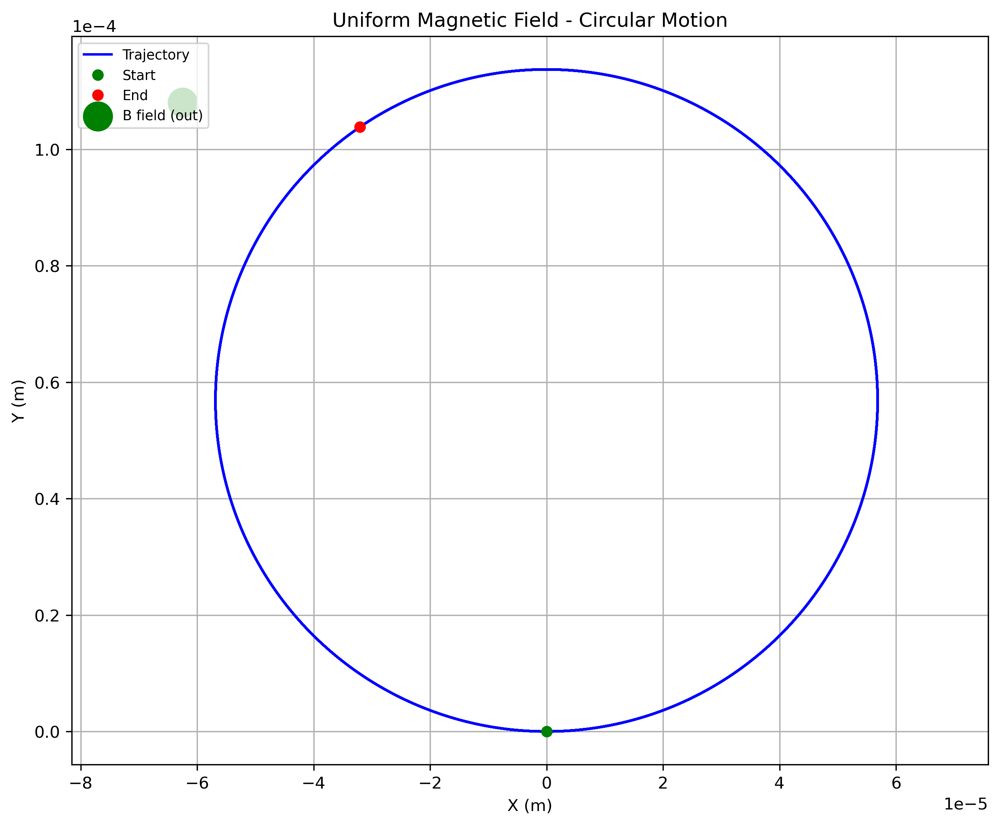
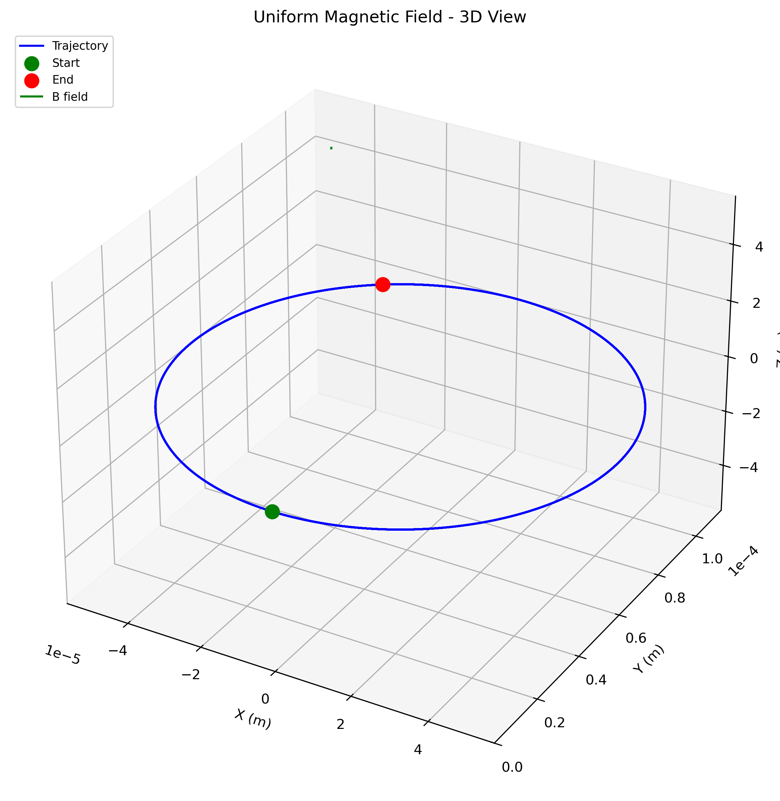
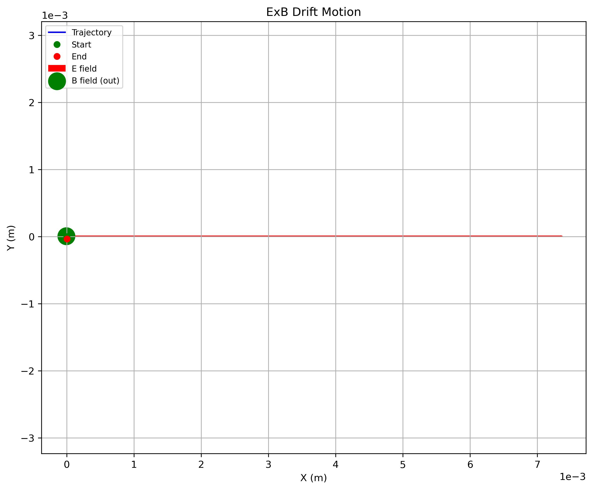
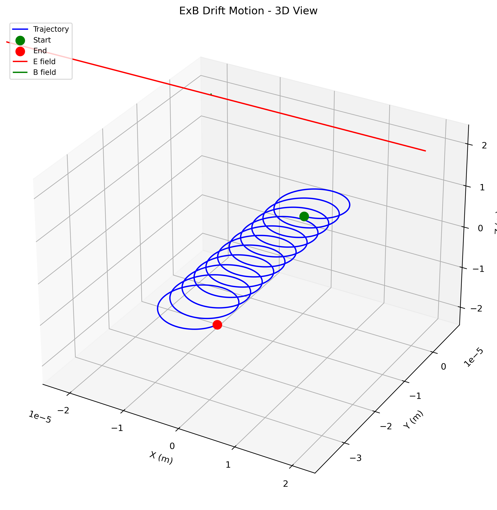
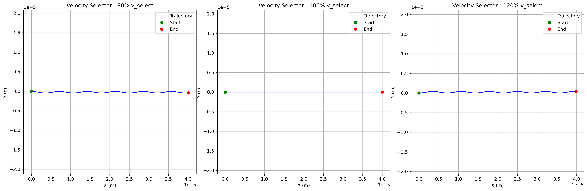
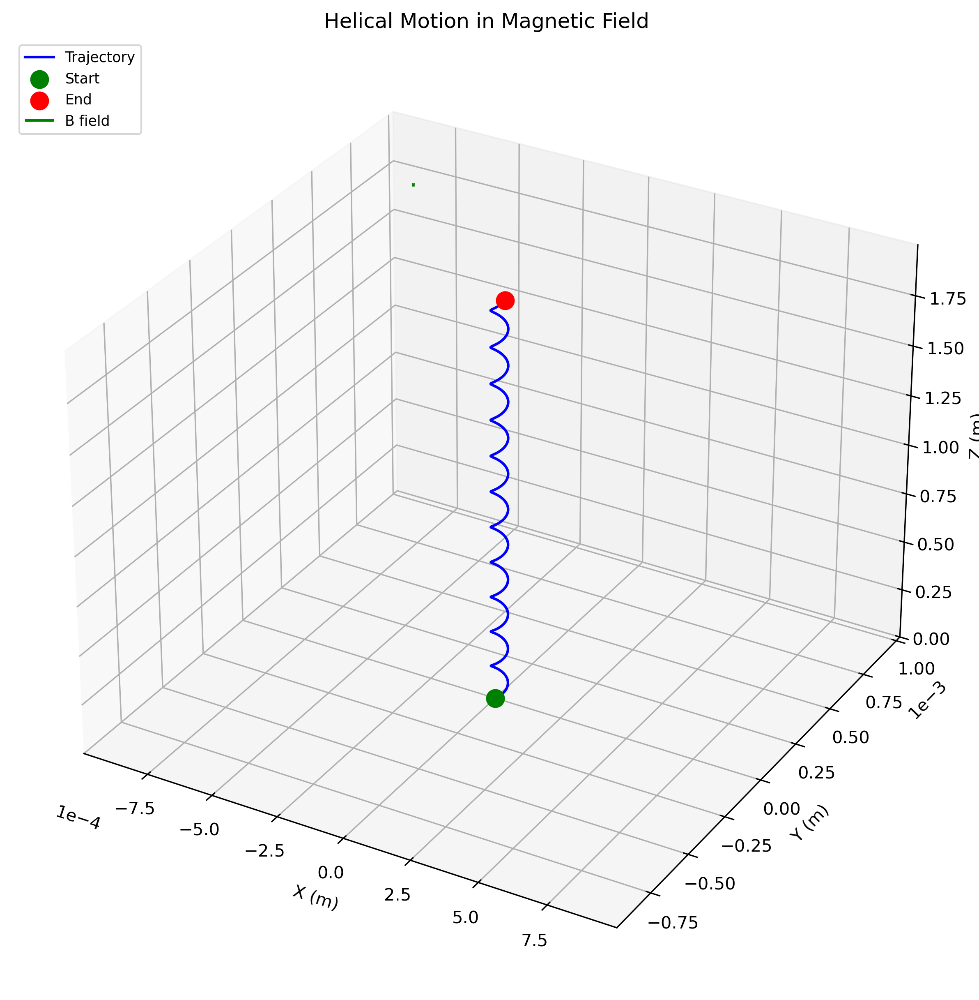
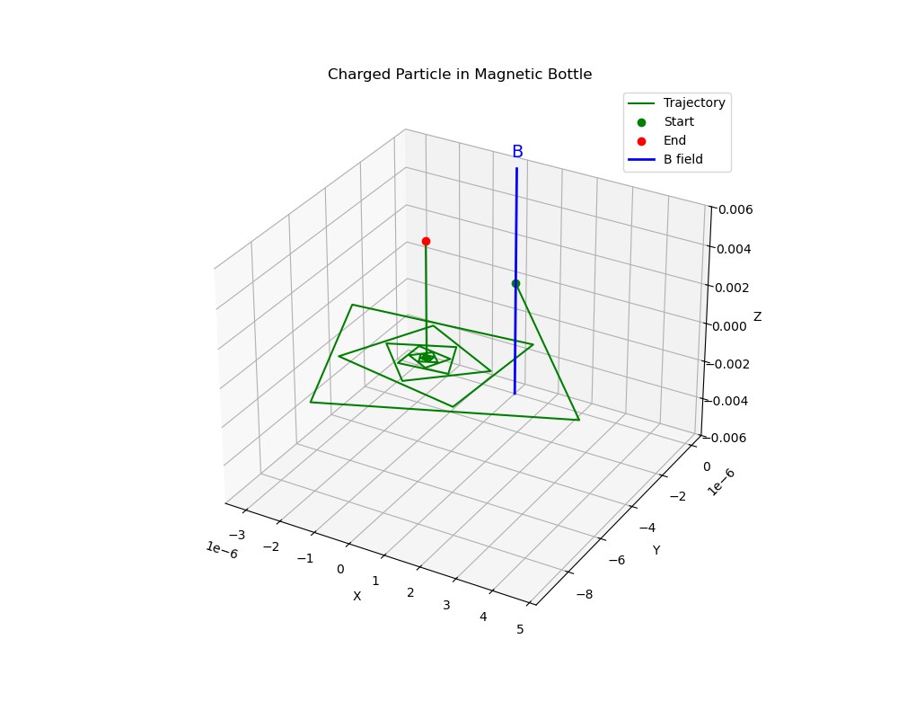
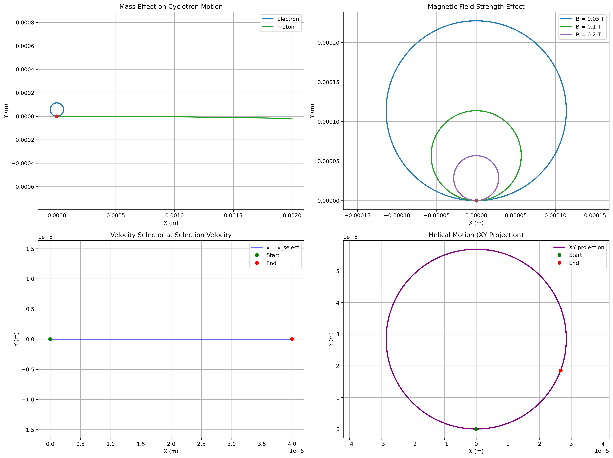
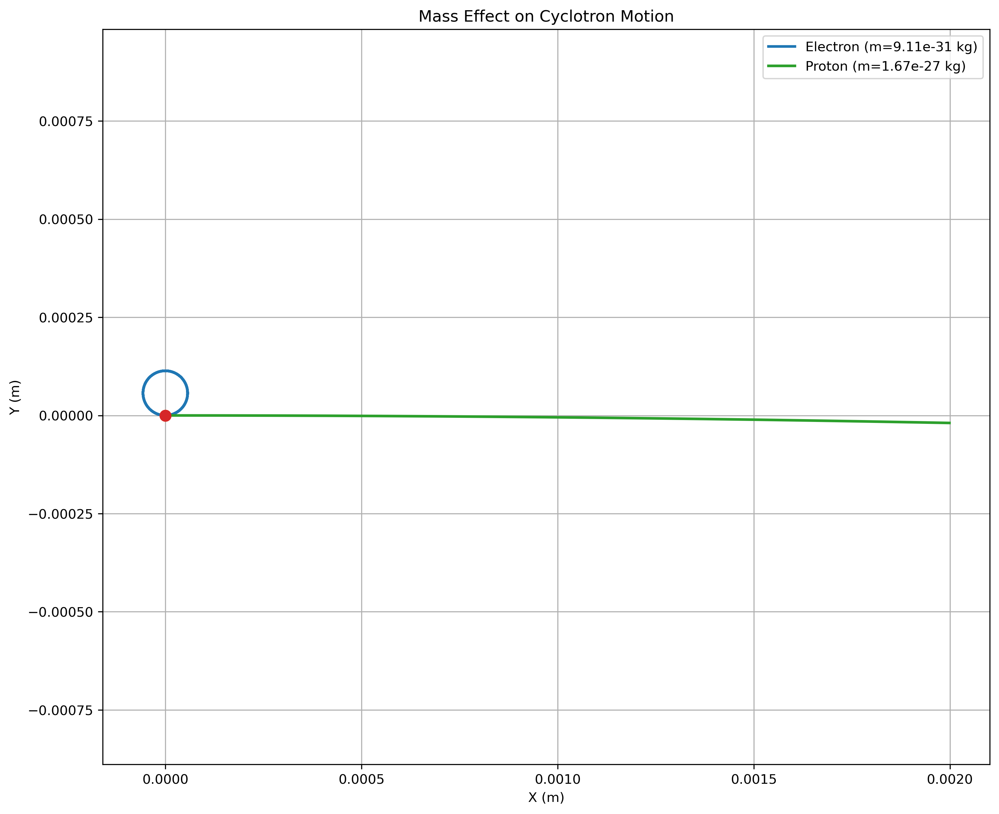
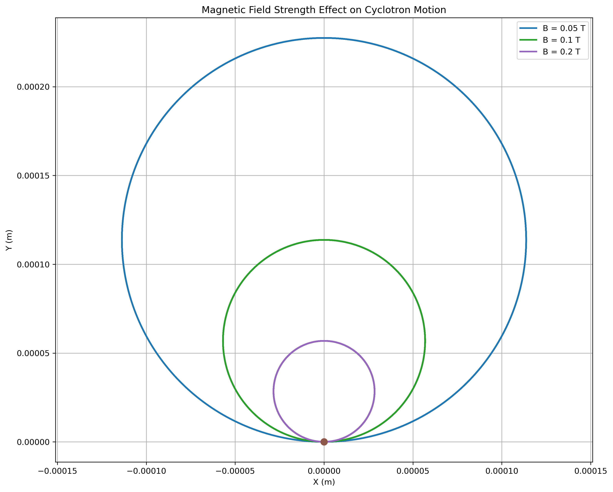

# Problem 1: Simulating the Effects of the Lorentz Force

## Motivation

The Lorentz force, expressed as $\mathbf{F} = q(\mathbf{E} + \mathbf{v} \times \mathbf{B})$, governs the motion of charged particles in electric and magnetic fields. It is foundational in fields like plasma physics, particle accelerators, and astrophysics. By focusing on simulations, we can explore the practical applications and visualize the complex trajectories that arise due to this force.

---

## 1. Theoretical Foundation

### 1.1 The Lorentz Force Law

The motion of a charged particle in electromagnetic fields is governed by the Lorentz force equation:

$$\mathbf{F} = q(\mathbf{E} + \mathbf{v} \times \mathbf{B})$$

where:
- $q$ is the electric charge of the particle
- $\mathbf{E}$ is the electric field vector
- $\mathbf{v}$ is the velocity vector of the particle
- $\mathbf{B}$ is the magnetic field vector
- $\times$ denotes the vector cross product

### 1.2 Equation of Motion

Combining the Lorentz force with Newton's second law:

$$m\frac{d\mathbf{v}}{dt} = q(\mathbf{E} + \mathbf{v} \times \mathbf{B})$$

This yields the acceleration:

$$\frac{d\mathbf{v}}{dt} = \frac{q}{m}(\mathbf{E} + \mathbf{v} \times \mathbf{B})$$

### 1.3 Key Physical Parameters

#### Cyclotron Frequency
For motion in a uniform magnetic field, the cyclotron frequency is:
$$\omega_c = \frac{qB}{m}$$

#### Larmor Radius (Gyroradius)
The radius of circular motion in a magnetic field:
$$r_L = \frac{mv_\perp}{qB}$$

where $v_\perp$ is the velocity component perpendicular to the magnetic field.

#### Cyclotron Period
The time for one complete circular orbit:
$$T_c = \frac{2\pi}{\omega_c} = \frac{2\pi m}{qB}$$

---

## 2. Motion in Different Field Configurations

### 2.1 Motion in Uniform Magnetic Field Only

When $\mathbf{E} = 0$ and $\mathbf{B} = B_0\hat{z}$ (uniform field in z-direction):

**Case 1: Initial velocity perpendicular to B**
- **Motion**: Circular in the xy-plane
- **Radius**: $r = \frac{mv_0}{qB_0}$
- **Angular frequency**: $\omega = \frac{qB_0}{m}$

**Case 2: Initial velocity parallel to B**
- **Motion**: Straight line along the field direction
- **Force**: Zero (no magnetic force on parallel motion)

**Case 3: Initial velocity at arbitrary angle**
- **Motion**: Helical trajectory
- **Parallel component**: Constant velocity $v_\parallel$
- **Perpendicular component**: Circular motion with radius $r_L$

### 2.2 Motion in Combined Electric and Magnetic Fields

When both $\mathbf{E}$ and $\mathbf{B}$ are present:

#### ExB Drift
For crossed uniform fields, particles exhibit drift motion:
$$\mathbf{v}_{\text{drift}} = \frac{\mathbf{E} \times \mathbf{B}}{B^2}$$

This drift is independent of charge and mass.

#### Cyclotron Motion + Drift
- **Guiding center**: Drifts with velocity $\mathbf{v}_{\text{drift}}$
- **Cyclotron motion**: Superimposed circular motion around guiding center

### 2.3 Motion in Non-uniform Fields

#### Magnetic Mirror Effect
In a magnetic bottle configuration:
- **Magnetic moment**: $\mu = \frac{mv_\perp^2}{2B}$ (adiabatic invariant)
- **Mirror condition**: Particles reflect when $\sin^2\theta > B_0/B_{\text{max}}$
- **Pitch angle**: Angle between velocity and magnetic field

---

## 3. Applications and Real-World Systems

### 3.1 Particle Accelerators

#### Cyclotron
- **Principle**: Particles spiral outward in constant magnetic field
- **Resonance condition**: RF frequency = cyclotron frequency
- **Application**: Medical isotope production, ion therapy

#### Synchrotron
- **Principle**: Magnetic field increases to maintain constant radius
- **Application**: High-energy particle physics research

### 3.2 Mass Spectrometry

**Time-of-Flight (TOF) Mass Spectrometer**:
- **Principle**: Different mass-to-charge ratios yield different flight times
- **Separation**: $t = \frac{L}{\sqrt{2qV/m}}$ where $V$ is accelerating voltage

**Magnetic Sector Mass Spectrometer**:
- **Principle**: Different masses follow different radii in magnetic field
- **Radius**: $r = \frac{\sqrt{2mV}}{qB}$

### 3.3 Plasma Confinement

#### Magnetic Confinement Fusion
- **Tokamak**: Toroidal magnetic confinement
- **Stellarator**: Three-dimensional magnetic confinement
- **Principle**: Magnetic field confines hot plasma for fusion reactions

#### Van Allen Radiation Belts
- **Mechanism**: Earth's magnetic field traps charged particles
- **Motion**: Combination of drift, bounce, and cyclotron motion

### 3.4 Electromagnetic Devices

#### Cathode Ray Tube (CRT)
- **Deflection**: Electric and magnetic fields control electron beam
- **Application**: Television displays, oscilloscopes

#### Hall Effect Devices
- **Principle**: Charge separation due to Lorentz force
- **Application**: Current sensors, position sensors

---

## 4. Numerical Methods and Computational Implementation

### 4.1 Runge-Kutta Integration

The fourth-order Runge-Kutta method provides accurate numerical integration:

$$\mathbf{k}_1 = h\mathbf{f}(t_n, \mathbf{y}_n)$$
$$\mathbf{k}_2 = h\mathbf{f}(t_n + h/2, \mathbf{y}_n + \mathbf{k}_1/2)$$
$$\mathbf{k}_3 = h\mathbf{f}(t_n + h/2, \mathbf{y}_n + \mathbf{k}_2/2)$$
$$\mathbf{k}_4 = h\mathbf{f}(t_n + h, \mathbf{y}_n + \mathbf{k}_3)$$
$$\mathbf{y}_{n+1} = \mathbf{y}_n + \frac{1}{6}(\mathbf{k}_1 + 2\mathbf{k}_2 + 2\mathbf{k}_3 + \mathbf{k}_4)$$

where $\mathbf{f}(t, \mathbf{y}) = \frac{q}{m}(\mathbf{E} + \mathbf{v} \times \mathbf{B})$.

### 4.2 Conservation Laws

#### Energy Conservation
In static electric fields, kinetic energy changes:
$$\frac{1}{2}mv^2(t) = \frac{1}{2}mv_0^2 + q\phi(\mathbf{r}_0) - q\phi(\mathbf{r}(t))$$

#### Magnetic Moment Conservation
In slowly varying magnetic fields:
$$\mu = \frac{mv_\perp^2}{2B} = \text{constant}$$

### 4.3 Computational Challenges

- **Stiffness**: Wide range of timescales (cyclotron vs. drift motion)
- **Energy Conservation**: Ensuring numerical stability
- **Field Interpolation**: Handling non-uniform field representations

---

## 5. Simulation Results and Analysis

### 5.1 Uniform Magnetic Field

*2D view: Circular motion of electron in uniform magnetic field*

*3D view: Circular motion showing trajectory in three dimensions*

**Key Observations:**
- Perfect circular trajectory for perpendicular initial velocity
- Radius proportional to initial speed: $r = \frac{mv_0}{qB}$
- Period independent of radius: $T = \frac{2\pi m}{qB}$

### 5.2 Combined Electric and Magnetic Fields

*2D view: ExB drift motion in crossed electric and magnetic fields*

*3D view: ExB drift motion showing cyclotron orbits superimposed on drift*

**Key Features:**
- **Drift velocity**: $\mathbf{v}_d = \frac{\mathbf{E} \times \mathbf{B}}{B^2}$
- **Cyclotron motion**: Superimposed on drift
- **Charge independence**: Both positive and negative charges drift in same direction

### 5.3 Velocity Selector Configuration

*Velocity selector showing different trajectories for particles with different speeds*

**Selection Principle:**
- **Selection condition**: $v = \frac{E}{B}$ for straight-line motion
- **Faster particles**: Curved toward electric field direction
- **Slower particles**: Curved toward magnetic force direction

### 5.4 Helical Motion in Magnetic Field

*3D helical trajectory for particle with velocity components both parallel and perpendicular to magnetic field*

**Helical Characteristics:**
- **Parallel motion**: Constant velocity along magnetic field
- **Perpendicular motion**: Circular motion with Larmor radius
- **Pitch**: Determined by ratio of parallel to perpendicular velocity

### 5.5 Magnetic Bottle Confinement

*Particle motion in magnetic bottle showing mirror effect*

**Physical Phenomena:**
- **Magnetic mirroring**: Particle reflects at high-field regions
- **Pitch angle evolution**: $\sin^2\theta = \frac{B_0}{B}\sin^2\theta_0$
- **Bounce motion**: Oscillation between mirror points

### 5.6 Parameter Sensitivity Analysis

*Comprehensive parameter exploration showing mass effects, field strength effects, velocity selection, and helical motion*

**Mass Dependence:**
- **Larger mass**: Larger Larmor radius, smaller cyclotron frequency
- **Smaller mass**: Tighter orbits, faster motion

**Field Strength Dependence:**
- **Stronger B-field**: Smaller radius, higher frequency
- **Weaker B-field**: Larger radius, lower frequency

*Detailed comparison of electron vs proton trajectories*

*Effect of different magnetic field strengths on trajectory radius*

---

## 6. Advanced Phenomena and Extensions

### 6.1 Relativistic Effects

For high-velocity particles, relativistic corrections become important:
$$\mathbf{F} = \frac{d}{dt}(\gamma m \mathbf{v}) = q(\mathbf{E} + \mathbf{v} \times \mathbf{B})$$

where $\gamma = \frac{1}{\sqrt{1 - v^2/c^2}}$ is the Lorentz factor.

### 6.2 Radiation Reaction

Accelerating charged particles radiate electromagnetic energy:
$$P_{\text{rad}} = \frac{q^2a^2}{6\pi\epsilon_0 c^3}$$

This leads to energy loss and orbit decay in accelerators.

### 6.3 Collective Effects

In plasmas, self-consistent electric and magnetic fields arise from charge and current distributions, leading to complex collective phenomena.

---

## 7. Experimental Validation

### 7.1 Historical Experiments

#### J.J. Thomson's Cathode Ray Experiment (1897)
- **Method**: Crossed electric and magnetic fields
- **Result**: Determination of electron charge-to-mass ratio
- **Significance**: Discovery of the electron

#### Mass Spectrometry Development
- **Wien Filter**: Velocity selector using crossed fields
- **Magnetic Focusing**: Mass separation in magnetic sectors

### 7.2 Modern Applications

#### Particle Physics
- **Cloud Chambers**: Visualization of charged particle tracks
- **Bubble Chambers**: High-energy particle detection
- **Modern Detectors**: Silicon tracking chambers, time projection chambers

#### Space Physics
- **Magnetospheric Missions**: In-situ particle measurements
- **Solar Wind Studies**: Particle velocity distribution measurements

---

## 8. Computational Implementation Details

The comprehensive Python simulation (`lorentz_force.py`) implements:

### 8.1 Core Functions

- **`lorentz_force()`**: Calculates the Lorentz force vector
- **`runge_kutta_step()`**: Fourth-order RK integration step
- **`simulate_particle_motion()`**: Main simulation loop
- **`calculate_larmor_radius()`**: Theoretical radius calculation
- **`calculate_cyclotron_frequency()`**: Theoretical frequency calculation

### 8.2 Visualization Capabilities

- **2D trajectory plots**: xy-plane projections with field indicators
- **3D trajectory plots**: Full three-dimensional motion
- **Animated trajectories**: Time-evolution visualization
- **Parameter exploration**: Multiple trajectories comparison

### 8.3 Physical Scenarios

1. **Uniform magnetic field**: Circular and helical motion
2. **Combined fields**: ExB drift phenomena
3. **Crossed fields**: Velocity selector configuration
4. **Magnetic bottle**: Non-uniform field confinement
5. **Parameter studies**: Mass and field strength effects

---

## 9. Educational Significance

### 9.1 Physics Concepts Demonstrated

- **Vector operations**: Cross products and vector fields
- **Conservation laws**: Energy and magnetic moment conservation
- **Symmetry principles**: Cyclotron motion symmetry
- **Scale separation**: Fast cyclotron vs. slow drift motion

### 9.2 Mathematical Skills

- **Differential equations**: Coupled first-order ODEs
- **Numerical methods**: Runge-Kutta integration
- **Vector calculus**: Field representations and operations
- **Coordinate systems**: Cartesian and cylindrical coordinates

### 9.3 Engineering Applications

- **Device design**: Particle accelerators and spectrometers
- **Optimization**: Field configurations for desired trajectories
- **Control systems**: Magnetic steering and focusing
- **Diagnostics**: Particle beam characterization

---

## 10. Conclusion

This comprehensive analysis of charged particle motion in electromagnetic fields demonstrates the fundamental role of the Lorentz force in modern physics and technology. The simulations provide quantitative insights into:

1. **Fundamental Physics**: The interplay between electric and magnetic forces
2. **Technological Applications**: From CRT displays to fusion reactors
3. **Computational Methods**: Numerical integration of complex dynamical systems
4. **Experimental Techniques**: Particle detection and characterization methods

Understanding these principles is essential for applications in plasma physics, accelerator design, space science, and advanced electromagnetic devices. The computational tools developed here provide a foundation for exploring more complex phenomena such as collective plasma effects, radiation reaction, and relativistic dynamics.

### 10.1 Key Insights

- **Field geometry**: Determines particle trajectory characteristics
- **Scale separation**: Multiple timescales require careful numerical treatment
- **Conservation laws**: Provide checks for numerical accuracy
- **Real-world relevance**: Direct applications in modern technology

### 10.2 Future Extensions

- **Relativistic dynamics**: High-energy particle physics
- **Collective effects**: Many-body interactions in plasmas
- **Stochastic forces**: Collisional and turbulent effects
- **Quantum corrections**: Quantum cyclotron motion

---

## References and Further Reading

1. Jackson, J. D. (1999). *Classical Electrodynamics*. John Wiley & Sons.
2. Griffiths, D. J. (2017). *Introduction to Electrodynamics*. Cambridge University Press.
3. Chen, F. F. (2016). *Introduction to Plasma Physics and Controlled Fusion*. Springer.
4. Wiedemann, H. (2015). *Particle Accelerator Physics*. Springer.
5. Parks, G. K. (2004). *Physics of Space Plasmas*. Westview Press.
6. Roos, C. E., Campanella, V. A., & Walter, R. L. (2002). *Introduction to Modern Physics*. McGraw-Hill.