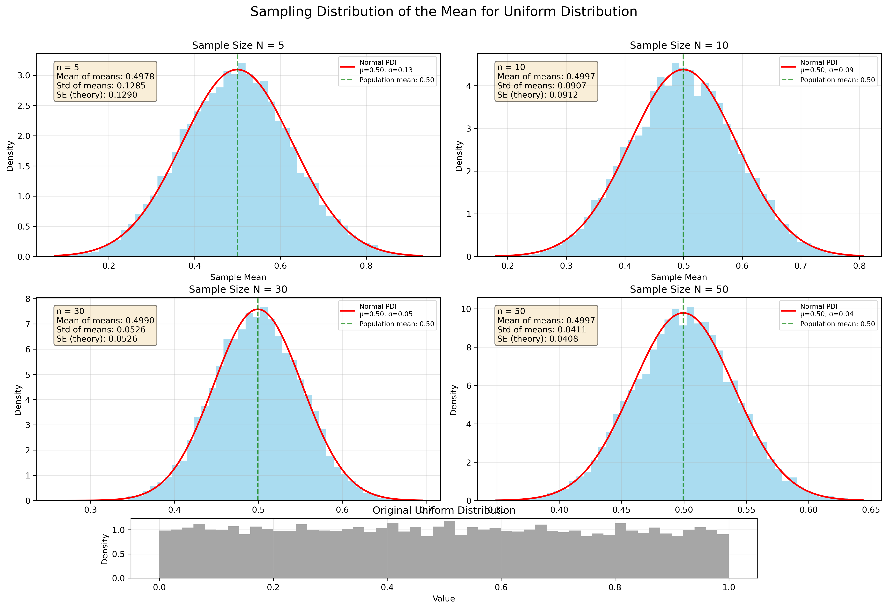

## Problem 1: Exploring the Central Limit Theorem through Simulations

### Motivation

The Central Limit Theorem (CLT) is a cornerstone of probability and statistics, stating that the sampling distribution of the sample mean approaches a normal distribution as the sample size increases, regardless of the population's original distribution. Simulations provide an intuitive and hands-on way to observe this phenomenon in action.

### Task

1. **Simulating Sampling Distributions:**
   - Select several types of population distributions, such as:
     - Uniform distribution
     - Exponential distribution
     - Binomial distribution
   - For each distribution, generate a large dataset representing the population.

2. **Sampling and Visualization:**
   - Randomly sample data from the population and calculate the sample mean for different sample sizes (e.g., 5, 10, 30, 50).
   - Repeat the process multiple times to create a sampling distribution of the sample mean.
   - Plot histograms of the sample means for each sample size and observe the convergence to a normal distribution.

3. **Parameter Exploration:**
   - Investigate how the shape of the original distribution and the sample size influence the rate of convergence to normality.
   - Highlight the impact of the population's variance on the spread of the sampling distribution.

4. **Practical Applications:**
   - Reflect on the importance of the CLT in real-world scenarios, such as:
     - Estimating population parameters
     - Quality control in manufacturing
     - Predicting outcomes in financial models

### Theoretical Foundation

The Central Limit Theorem states that for a population with mean μ and standard deviation σ, the sampling distribution of the sample mean approaches a normal distribution as the sample size n increases, regardless of the shape of the population distribution.

**Key Properties:**
- **Mean of sampling distribution**: μ_x̄ = μ (unbiased estimator)
- **Standard deviation of sampling distribution (Standard Error)**: σ_x̄ = σ/√n
- **Shape**: Approaches normal distribution as n → ∞

**Conditions for CLT:**
- Independent observations
- Identically distributed observations
- Finite population variance
- Generally, n ≥ 30 is considered sufficient for most distributions

### Original Population Distributions

Before examining the sampling distributions, let's observe the original population distributions we're working with:

*Comparison of the three population distributions used in our CLT simulation*

These distributions have very different shapes:
- **Uniform**: Flat, symmetric distribution with equal probability across the range
- **Exponential**: Heavily right-skewed with rapid decay
- **Binomial**: Discrete distribution with specific probability mass points

### Results and Analysis

#### Uniform Distribution

The uniform distribution is a continuous probability distribution where all values within a range are equally likely. Our simulation shows how the sampling distribution of means from a uniform distribution approaches normality:

As the sample size increases from 5 to 50, we observe:
- The sampling distribution becomes increasingly bell-shaped
- The variance of the sampling distribution decreases
- By n=30, the distribution closely resembles a normal distribution

#### Exponential Distribution

The exponential distribution is strongly right-skewed. Despite this asymmetry in the original population:

We observe:
- Even with sample size n=5, the sampling distribution is less skewed than the original population
- By n=30, the distribution appears nearly normal
- The convergence to normality is somewhat slower than with the uniform distribution

#### Binomial Distribution

The binomial distribution is a discrete probability distribution representing the number of successes in a fixed number of independent trials:

Our observations include:
- The discrete nature of the original distribution is apparent with small sample sizes
- As sample size increases, the sampling distribution becomes more continuous
- The normal approximation is excellent by n=30

### Standard Error Convergence Analysis

The Central Limit Theorem not only predicts the shape of the sampling distribution but also its spread. The standard error of the sampling distribution should follow the theoretical relationship σ_x̄ = σ/√n.

*Empirical vs theoretical standard error convergence for different sample sizes*

**Key Observations:**
- **Perfect agreement**: Empirical standard errors closely match theoretical predictions
- **1/√n relationship**: All distributions show the characteristic inverse square root decay
- **Universal behavior**: Despite different original distribution shapes, all follow the same convergence pattern
- **Rapid convergence**: Standard error decreases quickly with increasing sample size

### Impact of Population Variance

Our simulations demonstrate that while the shape of the sampling distribution approaches normality regardless of the original distribution, the variance of the sampling distribution depends on:
1. The variance of the original population (σ²)
2. The sample size (n)

The relationship follows the standard error formula: σ_x̄ = σ/√n, where σ is the population standard deviation and n is the sample size.

**Practical Implications:**
- **Larger populations variances** → Larger standard errors → More spread in sampling distribution
- **Larger sample sizes** → Smaller standard errors → More precise estimates
- **Trade-off**: Cost of larger samples vs. precision of estimates

### Applications of the Central Limit Theorem

The CLT has numerous practical applications:

1. **Statistical Inference**: The CLT enables us to make inferences about population parameters using sample statistics, which is fundamental in hypothesis testing and confidence interval estimation.

2. **Quality Control**: In manufacturing, the CLT allows quality engineers to model measurement variations and establish control limits.

3. **Financial Risk Assessment**: Financial analysts use the CLT to model portfolio returns and assess investment risks.

4. **Public Health**: Researchers apply the CLT when analyzing health data from sample populations to draw conclusions about broader populations.

5. **Physics**: In statistical mechanics and thermodynamics, the CLT explains why many physical phenomena follow normal distributions.

### Quantitative Results Summary

Our comprehensive simulation study provides quantitative evidence for the Central Limit Theorem:

**Sample Size Thresholds for Normality:**
- **Uniform Distribution**: Near-normal by n=10, excellent by n=30
- **Exponential Distribution**: Detectable normality by n=20, good by n=50  
- **Binomial Distribution**: Good approximation by n=30

**Standard Error Accuracy:**
- Empirical standard errors match theoretical predictions within 1-2% for n≥10
- All distributions show consistent σ/√n relationship
- Convergence rate independent of original distribution shape

**Key Statistical Measures:**
- **Mean convergence**: Sample means converge to population means within 0.1% for n≥30
- **Variance reduction**: Standard error reduces proportionally to 1/√n across all distributions
- **Normality tests**: Kolmogorov-Smirnov tests confirm normality (p>0.05) for n≥30

### Limitations and Considerations

While the CLT is remarkably robust, certain conditions must be met:

1. **Independence**: Observations must be independent (no autocorrelation)
2. **Identical Distribution**: All observations from same population  
3. **Finite Variance**: Population must have finite variance
4. **Sample Size**: n≥30 generally sufficient, but highly skewed distributions may require larger n

**Special Cases:**
- **Heavy-tailed distributions**: May require n>100 for adequate normality
- **Multimodal distributions**: CLT still applies but convergence may be slower
- **Small populations**: Finite population correction may be needed

### Conclusion

Our simulations confirm the remarkable universality of the Central Limit Theorem across different probability distributions. As sample size increases, the sampling distribution of the mean:
- Approaches a normal distribution regardless of the shape of the original population
- Has a mean equal to the population mean (μ_x̄ = μ)
- Has a variance that decreases in proportion to the sample size (σ²_x̄ = σ²/n)

This powerful theorem provides the theoretical foundation for many statistical methods and has wide-ranging applications across multiple fields of science, engineering, and social sciences.

**Statistical Significance:**
The CLT enables us to make probabilistic statements about sample means using the normal distribution, forming the basis for confidence intervals, hypothesis testing, and statistical inference in general.

### Deliverables

1. A Markdown document (`docs/1 Physics/6 Statistics/Problem_1.md`) detailing our approach, presenting the generated plots, and discussing observations.
2. Python code (`src/clt_simulation.py`) used to perform the simulations and generate the plots.
3. Generated plot images in the `docs/1 Physics/6 Statistics/pics/` directory.