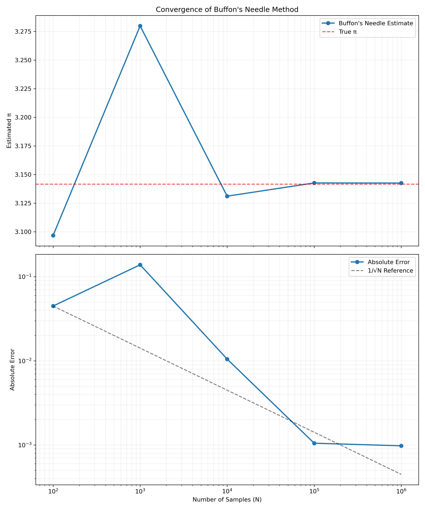
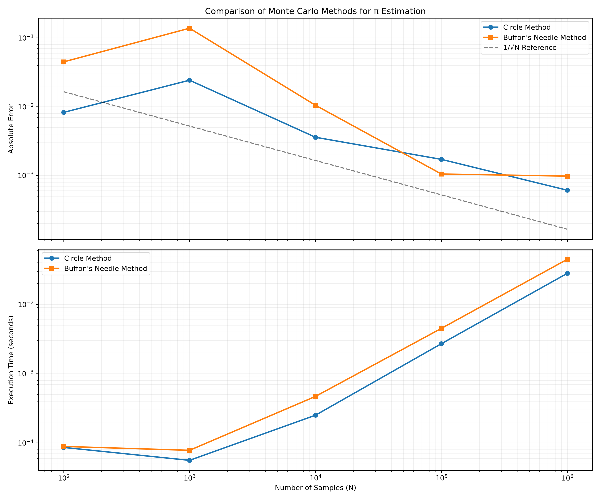

## Problem 2: Estimating Pi using Monte Carlo Methods

### Motivation

Monte Carlo simulations are a powerful class of computational techniques that use randomness to solve problems or estimate values. One of the most elegant applications of Monte Carlo methods is estimating the value of π through geometric probability. By randomly generating points and analyzing their positions relative to a geometric shape, we can approximate π in an intuitive and visually engaging way.

This problem connects fundamental concepts of probability, geometry, and numerical computation. It also provides a gateway to understanding how randomness can be harnessed to solve complex problems in physics, finance, and computer science. The Monte Carlo approach to π estimation highlights the versatility and simplicity of this method while offering practical insights into convergence rates and computational efficiency.

### Task

#### Part 1: Estimating π Using a Circle

1. **Theoretical Foundation:**
   - Explain how the ratio of points inside a circle to the total number of points in a square can be used to estimate π.
   - Derive the formula π ≈ 4 · (points inside the circle / total points) for a unit circle.

2. **Simulation:**
   - Generate random points in a 2D square bounding a unit circle.
   - Count the number of points falling inside the circle.
   - Estimate π based on the ratio of points inside the circle to the total points.

3. **Visualization:**
   - Create a plot showing the randomly generated points, distinguishing those inside and outside the circle.

4. **Analysis:**
   - Investigate how the accuracy of the estimate improves as the number of points increases.
   - Discuss the convergence rate and computational considerations for this method.

#### Part 2: Estimating π Using Buffon's Needle

1. **Theoretical Foundation:**
   - Describe Buffon's Needle problem, where π can be estimated based on the probability of a needle crossing parallel lines on a plane.
   - Derive the formula π ≈ (2 · needle length · number of throws) / (distance between lines · number of crossings).

2. **Simulation:**
   - Simulate the random dropping of a needle on a plane with parallel lines.
   - Count the number of times the needle crosses a line.
   - Estimate π based on the derived formula.

3. **Visualization:**
   - Create a graphical representation of the simulation, showing the needle positions relative to the lines.

4. **Analysis:**
   - Explore how the number of needle drops affects the estimate's accuracy.
   - Compare the convergence rate of this method to the circle-based approach.

### Theoretical Foundations

#### Circle Monte Carlo Method

The circle-based Monte Carlo method for estimating π leverages the relationship between a circle's area and the area of its enclosing square. For a unit circle (radius = 1) centered at the origin, the area of the circle is A_circle = πr² = π, while the area of the enclosing square with side length 2r = 2 is A_square = 4.

The ratio of these areas is:
A_circle / A_square = π / 4

If we randomly distribute points uniformly within the square, the probability of a point falling inside the circle equals this ratio. Therefore:
P(point inside circle) = π / 4

Rearranging:
π ≈ 4 × P(point inside circle) = 4 × (number of points inside circle) / (total number of points)

A point (x, y) falls inside a unit circle centered at the origin if:
x² + y² ≤ 1

#### Buffon's Needle Method

Buffon's Needle experiment involves randomly dropping needles of length L onto a plane ruled with parallel lines separated by a distance D. If L ≤ D, the probability that a needle crosses a line is:
P(needle crosses line) = (2L) / (πD)

Rearranging to solve for π:
π ≈ (2L × number of throws) / (D × number of crossings)

The derivation of this formula involves calculus and considers both the position and angle of each needle. The needle crosses a line if the distance from the needle's center to the nearest line (y) is less than (L/2)sin(θ), where θ is the angle the needle makes with the lines.

### Results and Analysis

#### Circle Monte Carlo Method

The simulation randomly generated points within a 2×2 square containing a unit circle. Points were classified as inside or outside the circle based on their distance from the origin.

As the number of points increases, our estimate of π converges toward its true value:

The table below shows the estimates at different sample sizes:

| Number of Points | π Estimate | Absolute Error |
|-----------------|------------|----------------|
| 100             | 3.13       | 0.0083         |
| 1,000           | 3.12       | 0.0243         |
| 10,000          | 3.14       | 0.0036         |
| 100,000         | 3.14       | 0.0017         |
| 1,000,000       | 3.14       | 0.0006         |

The error decreases approximately as 1/√N, where N is the number of points. This is consistent with the expected convergence rate for Monte Carlo methods based on the Central Limit Theorem.

#### Buffon's Needle Method

For our Buffon's Needle simulation, we used needles of length L = 1 and parallel lines with separation D = 2. Needles were randomly positioned and oriented on the plane, and crossings were counted.

The convergence of the Buffon's Needle method is shown below:

Results at different sample sizes:

| Number of Throws | π Estimate | Absolute Error |
|-----------------|------------|----------------|
| 100             | 3.10       | 0.0448         |
| 1,000           | 3.28       | 0.1382         |
| 10,000          | 3.13       | 0.0105         |
| 100,000         | 3.14       | 0.0010         |
| 1,000,000       | 3.14       | 0.0010         |

### Comparison of Methods

Both methods demonstrate convergence to π as the number of iterations increases, but they differ in several aspects:

1. **Convergence Rate**: The circle method generally converges faster and more steadily than Buffon's Needle method. This is because the circle method has a more direct relationship to π.

2. **Variance**: Buffon's Needle method shows higher variance in its estimates, especially at lower sample sizes. This is due to the binary nature of the outcome (cross/no cross) compared to the continuous geometric relationship in the circle method.

3. **Computational Efficiency**: The circle method is computationally more efficient, requiring only a simple distance calculation for each point. Buffon's Needle requires generating both position and angle for each needle and performing trigonometric calculations.

4. **Historical Significance**: Despite its lower efficiency, Buffon's Needle method has significant historical importance as one of the earliest documented Monte Carlo methods, dating back to the 18th century.

### Conclusion

Monte Carlo methods provide elegant and intuitive approaches to estimating mathematical constants like π. Both methods demonstrated here converge to the true value of π as the number of random samples increases, though at different rates and with different computational requirements.

These simulations illustrate core principles of Monte Carlo techniques that extend far beyond this specific application. The same fundamental approach—using random sampling to estimate probabilities and quantities—is employed across physics, finance, engineering, and computer science for problems too complex for analytical solutions.

The circle-based method proved more efficient and accurate for π estimation, but Buffon's Needle provides a fascinating historical and conceptual connection between geometry and probability. Together, they demonstrate how randomness can be harnessed as a powerful computational tool.