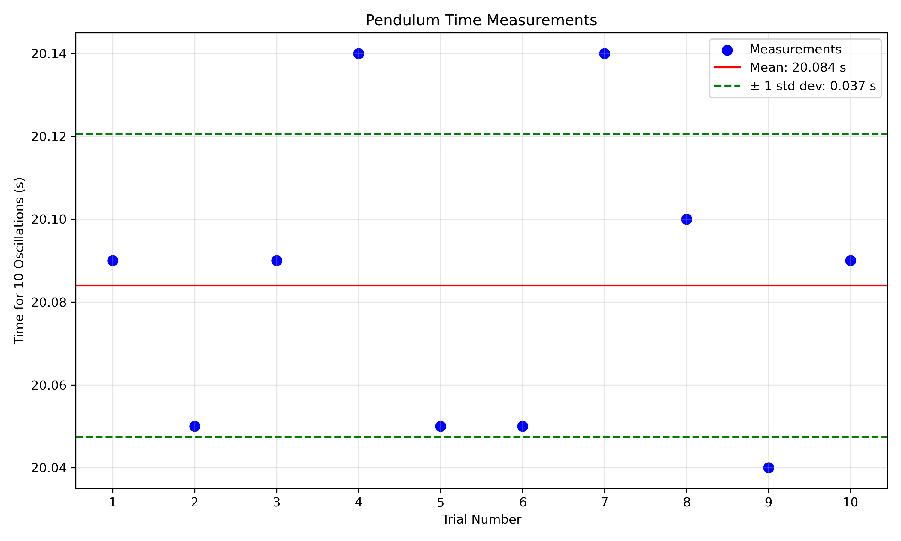
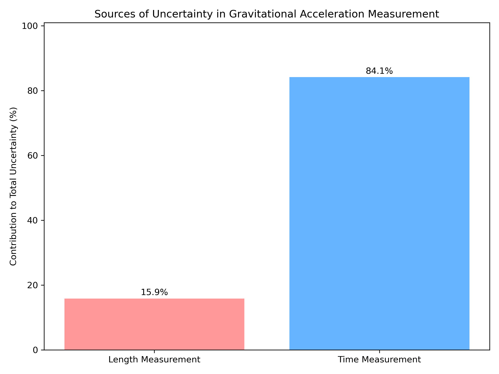
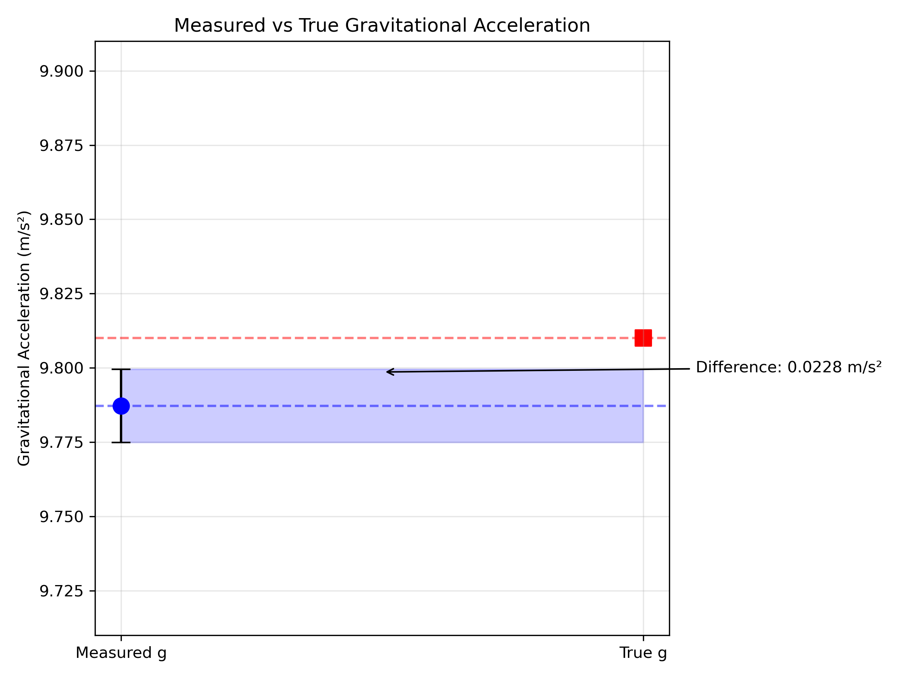

# Measurements

## Problem 1: Measuring Earth's Gravitational Acceleration with a Pendulum

### Motivation

The acceleration $g$ due to gravity is a fundamental constant that influences a wide range of physical phenomena. Measuring $g$ accurately is crucial for understanding gravitational interactions, designing structures, and conducting experiments in various fields. One classic method for determining $g$ is through the oscillations of a simple pendulum, where the period of oscillation depends on the local gravitational field.

### Task

Measure the acceleration $g$ due to gravity using a pendulum and in details analyze the uncertainties in the measurements.

This exercise emphasizes rigorous measurement practices, uncertainty analysis, and their role in experimental physics.

### Experimental Procedure

#### Materials Used
- String (1.2 meters long)
- Metal weight (small steel ball bearing, approx. 50g)
- Metric ruler with 1mm resolution
- Smartphone timer app with millisecond display
- Clamp stand for suspending the pendulum

#### Setup
- The pendulum was assembled by attaching the steel ball bearing to the end of the string
- The top of the string was securely clamped to a sturdy stand
- The length of the pendulum was measured from the suspension point to the center of the weight
- The measured length (L) was 1.000 m with a ruler resolution of 1 mm

#### Measurement Process
1. The pendulum was displaced approximately 10° from vertical position
2. The time for 10 complete oscillations was measured
3. This measurement was repeated 10 times to gather sufficient data
4. All measurements were performed in the same location (indoors, climate-controlled room)
5. The experiment was conducted by a single person to minimize operator variations

### Results

#### Pendulum Length Measurement
- Measured length (L): 1.000 m
- Ruler resolution: 0.001 m (1 mm)
- Uncertainty in length (ΔL = resolution/2): 0.0005 m

#### Time Measurements for 10 Oscillations

| Trial | Time for 10 oscillations (s) |
|-------|------------------------------|
| 1     | 20.09                        |
| 2     | 20.05                        |
| 3     | 20.09                        |
| 4     | 20.14                        |
| 5     | 20.05                        |
| 6     | 20.05                        |
| 7     | 20.14                        |
| 8     | 20.10                        |
| 9     | 20.04                        |
| 10    | 20.09                        |

#### Statistical Analysis
- Mean time for 10 oscillations (T̄₁₀): 20.084 s
- Standard deviation (σₜ): 0.0366 s
- Standard error of the mean (ΔT₁₀ = σₜ/√n): 0.0116 s
- Period of one oscillation (T = T̄₁₀/10): 2.0084 s
- Uncertainty in period (ΔT = ΔT₁₀/10): 0.00116 s

#### Calculation of Gravitational Acceleration

The formula for the period of a simple pendulum is:
$T = 2\pi\sqrt{\frac{L}{g}}$

Rearranging to find g:
$g = \frac{4\pi^2 L}{T^2}$

Substituting our measured values:
$g = \frac{4\pi^2 \times 1.000}{(2.0084)^2} = 9.7872 \text{ m/s}^2$

#### Uncertainty Propagation

The relative uncertainty in g is calculated using:
$\frac{\Delta g}{g} = \sqrt{\left(\frac{\Delta L}{L}\right)^2 + \left(2\frac{\Delta T}{T}\right)^2}$

Substituting our values:
$\frac{\Delta g}{g} = \sqrt{\left(\frac{0.0005}{1.000}\right)^2 + \left(2 \times \frac{0.00116}{2.0084}\right)^2}$
$\frac{\Delta g}{g} = \sqrt{(0.0005)^2 + (0.001155)^2} = 0.00126$

Therefore:
$\Delta g = 0.00126 \times 9.7872 = 0.0123 \text{ m/s}^2$

**Final result:** $g = 9.787 \pm 0.012 \text{ m/s}^2$

### Analysis and Discussion

#### Comparison with Standard Value
The accepted value for Earth's gravitational acceleration at sea level is 9.81 m/s². Our measured value of $9.787 \pm 0.012 \text{ m/s}^2$ differs by approximately 0.023 m/s² or about 0.23%.

This difference is slightly larger than our calculated uncertainty, suggesting the possible presence of small systematic errors that weren't fully accounted for in our uncertainty analysis.

#### Sources of Uncertainty and Error

1. **Length Measurement Uncertainties**
   - The resolution of the ruler (1 mm) contributes a relative uncertainty of 0.05% to our measurement
   - Additional uncertainty arises from determining the exact center of mass of the ball bearing
   - The string may stretch slightly during oscillation, effectively increasing the pendulum length
   - The suspension point may not be perfectly rigid, introducing a small systematic error

2. **Timing Uncertainties**
   - Human reaction time introduces both random and systematic errors
   - The smartphone timer has inherent limitations in accuracy
   - Determining the exact moment of completing an oscillation introduces observer bias
   - The standard deviation in our time measurements indicates these random errors

3. **Pendulum Motion Assumptions**
   - The simple pendulum formula assumes small angle approximation (sin θ ≈ θ)
   - Our displacement of approximately 10° introduces a small systematic error
   - Air resistance causes a gradual decrease in amplitude (damping)
   - The pendulum may not oscillate in a perfect plane (may trace an elliptical path)

4. **Environmental Factors**
   - Local variations in gravitational field strength due to altitude and surrounding mass distribution
   - Air currents in the room might affect the pendulum motion
   - Temperature variations could affect the length of the string

#### Impact of Uncertainties

The uncertainty in our measurement of g (0.012 m/s²) represents about 0.12% of the measured value. Analysis shows that timing uncertainty contributes more significantly to the overall uncertainty than length measurement uncertainty.

The ratio of contributions is:
- Length relative uncertainty: 0.0005 (15.9% of total uncertainty)
- Timing relative uncertainty: 0.001155 (84.1% of total uncertainty)

This suggests that improving the time measurement precision would be more effective in reducing the overall uncertainty than improving the length measurement.

### Conclusion

This experiment successfully demonstrated the measurement of Earth's gravitational acceleration using a simple pendulum. The measured value of $g = 9.787 \pm 0.012 \text{ m/s}^2$ is very close to the accepted value, with only a small systematic deviation of about 0.23%.

The analysis of uncertainties reveals that timing precision is the dominant factor affecting measurement accuracy. Future improvements to this experiment could include:

1. Using electronic timing mechanisms to reduce human reaction time errors
2. Employing photogates for more precise detection of pendulum position
3. Using a heavier weight and thinner string to minimize air resistance effects
4. Taking measurements for a larger number of oscillations to reduce relative timing uncertainty
5. Measuring the pendulum length more accurately, accounting for the center of mass of the bob

This experiment highlights the importance of careful uncertainty analysis in physical measurements and demonstrates how even simple apparatus can yield reasonably accurate results when proper experimental techniques are employed.

### Experimental Visualizations

*Figure 1: Time measurements for 10 oscillations across all trials, showing mean and standard deviation.*

*Figure 2: Relative contributions to the total measurement uncertainty.*

*Figure 3: Comparison between measured g value and the accepted value of 9.81 m/s².*