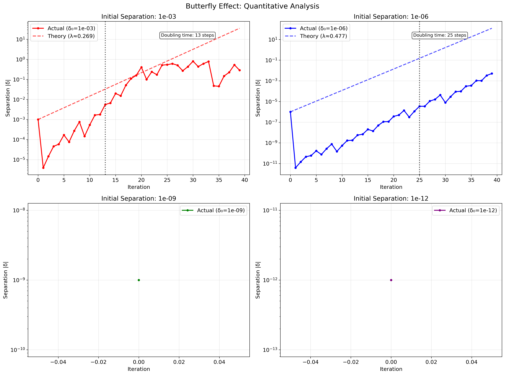
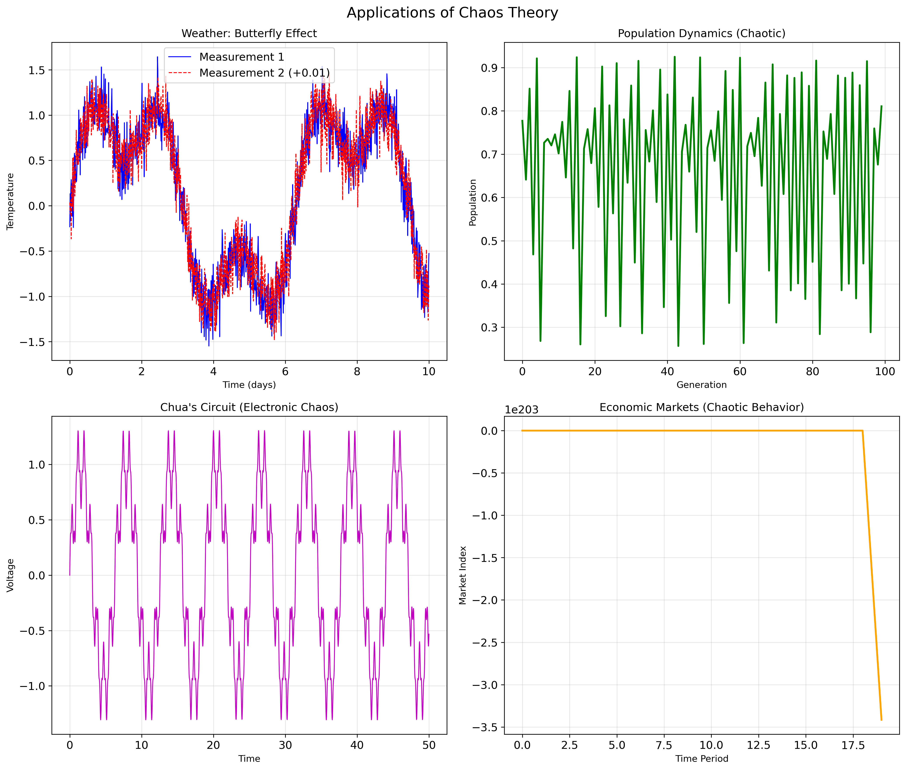

# Deterministic Chaos: From Order to Complexity

---

## 1. The Definition of Deterministic Chaos and Sensitivity to Initial Conditions

### Historical Context: The Birth of Chaos Theory

The story of chaos theory begins in 1961 with meteorologist Edward Lorenz at
MIT. Lorenz was attempting to create a simplified mathematical model of weather
patterns using a computer called the Royal McBee LGP-30. He was studying
atmospheric convection - the process by which warm air rises and cool air sinks,
creating the complex patterns we see in weather systems.

One winter day, Lorenz wanted to examine a particular sequence of weather data
more closely. Instead of starting from the beginning of his simulation, he
decided to restart from the middle by typing in the numbers the computer had
printed out. The computer worked with 6-decimal precision (like 0.506127), but
the printout only showed 3 decimals (0.506). Lorenz thought this tiny difference
of 0.000127 - about one part in 4,000 - would have no significant effect.

What happened next revolutionized science. Instead of closely following the
original trajectory as expected, the weather pattern completely diverged. Within
just a few simulated months, the new weather bore no resemblance to the original
sequence. This tiny rounding error had fundamentally altered the entire future
of his simulated weather system.

This discovery led Lorenz to realize that long-term weather prediction is
fundamentally impossible, no matter how good our computers or measurements
become. He had discovered what we now call **deterministic chaos**.

### What "Deterministic" Really Means

Before we dive into chaos, let's be absolutely clear about what "deterministic"
means:

**Deterministic System**: A system whose future states are completely determined
by its current state and the rules governing its evolution. Given perfect
knowledge of the initial conditions and the governing equations, the future is
completely predictable in principle.

Examples of deterministic systems:

-   A pendulum swinging under gravity (governed by Newton's laws)
-   Planetary motion (governed by gravitational equations)
-   Chemical reactions (governed by rate equations)
-   Population growth (governed by differential equations)

The key insight is that **deterministic does NOT mean predictable**. This seems
contradictory at first, but chaos theory shows us exactly how this apparent
paradox resolves.

### The Formal Mathematical Definition of Chaos

For a dynamical system to be classified as chaotic, it must satisfy three
mathematical conditions:

#### Condition 1: Sensitive Dependence on Initial Conditions

**Mathematical Statement**: For any point x in the system and any neighborhood
around x (no matter how small), there exists at least one other point y in that
neighborhood such that the trajectories starting from x and y eventually
separate by more than some finite amount δ > 0.

**What this means in plain language**: No matter how precisely you measure the
starting conditions, there will always be some nearby starting point that leads
to a completely different future. This means that perfect prediction is
impossible because we can never measure with infinite precision.

**Mathematical Expression**: If two trajectories start with initial separation
δ₀, then after time t, their separation grows as:

$$
|\delta(t)| \approx |\delta_0| e^{\lambda t}
$$

where λ > 0 is called the **Lyapunov exponent** (we'll study this in detail in
section 9).

#### Condition 2: Topological Mixing

**Mathematical Statement**: For any two regions A and B in the phase space, no
matter how they are chosen, there exists some time T such that the evolved
region f^T(A) intersects with region B.

**What this means**: The system is so thoroughly "stirred up" that any region of
space will eventually spread out and overlap with any other region. This is like
mixing cake batter - eventually, any small region of the batter gets spread
throughout the entire bowl.

#### Condition 3: Dense Periodic Orbits

**Mathematical Statement**: For any point x in the chaotic set and any
neighborhood around x, there exists a periodic orbit within that neighborhood.

**What this means**: Periodic behavior (cycles that repeat exactly) exists
everywhere in the chaotic region, but the actual motion of the system never
settles into any of these cycles. It's like having an infinite number of
possible dance steps, but the dancer never repeats exactly the same sequence.

### The Mathematics of Sensitivity to Initial Conditions

Let's work through the mathematics step by step to understand exactly how
sensitivity works.

Consider two trajectories in a chaotic system:

-   Trajectory 1: starts at position x₀
-   Trajectory 2: starts at position x₀ + δ₀, where δ₀ is very small

After time t, the positions are:

-   Trajectory 1: x₁(t)
-   Trajectory 2: x₂(t)

The separation between them is:

$$
\delta(t) = |x_2(t) - x_1(t)|
$$

In a chaotic system, this separation grows exponentially:

$$
\delta(t) = \delta_0 e^{\lambda t}
$$

Let's understand what this exponential growth means with a concrete example:

**Example**: Suppose λ = 0.5 per time unit and δ₀ = 10⁻⁶ (one part per million).

-   After t = 1: δ(1) = 10⁻⁶ × e^(0.5×1) ≈ 1.65 × 10⁻⁶
-   After t = 2: δ(2) = 10⁻⁶ × e^(0.5×2) ≈ 2.72 × 10⁻⁶
-   After t = 10: δ(10) = 10⁻⁶ × e^(0.5×10) ≈ 1.48 × 10⁻⁴
-   After t = 20: δ(20) = 10⁻⁶ × e^(0.5×20) ≈ 2.20 × 10⁻²
-   After t = 30: δ(30) = 10⁻⁶ × e^(0.5×30) ≈ 3.27

Notice that after 30 time units, a microscopic difference of one part per
million has grown to be larger than the typical size of the system itself!

### The Predictability Horizon

The **Lyapunov time** τ_L = 1/λ gives us the fundamental time scale for
predictability. This is the time it takes for an initial uncertainty to grow by
a factor of e ≈ 2.718.

For practical prediction, we usually can tolerate error growth until it reaches
the same size as the natural variations in the system. If the system typically
varies by an amount Δ, and our initial measurement uncertainty is δ₀, then the
prediction horizon T is:

$$
T = \frac{1}{\lambda} \ln\left(\frac{\Delta}{\delta_0}\right)
$$

**Weather Example**:

-   Typical weather variations: Δ ≈ 10°C
-   Measurement precision: δ₀ ≈ 0.1°C
-   Lyapunov exponent: λ ≈ 0.5 day⁻¹

Prediction horizon: T = (1/0.5) × ln(10/0.1) = 2 × ln(100) ≈ 9.2 days

This calculation explains why weather forecasts become unreliable after about a
week, regardless of how powerful our computers become!

### Physical Interpretation and Examples

**Lorenz's Weather Model**: The specific system Lorenz was studying can be
written as three coupled differential equations:

$$
\begin{align}
\frac{dx}{dt} &= \sigma(y - x) \\
\frac{dy}{dt} &= x(\rho - z) - y \\
\frac{dz}{dt} &= xy - \beta z
\end{align}
$$

where:

-   x represents the rate of convective overturning
-   y represents the horizontal temperature difference
-   z represents the vertical temperature difference
-   σ, ρ, β are physical parameters

For the standard values σ = 10, ρ = 28, β = 8/3, this system exhibits chaotic
behavior with a Lyapunov exponent λ ≈ 0.906.

**Double Pendulum**: A pendulum with another pendulum attached to its end
exhibits chaos for moderate energies. The motion looks completely random, even
though it follows Newton's laws exactly. Two identical double pendulums started
with microscopic differences in angle (say, 0.001°) will quickly evolve into
completely different motions.

**Population Dynamics**: Consider a simplified population model where the
population next year depends on this year's population:

$$
P_{n+1} = r \cdot P_n \cdot (1 - P_n)
$$

This innocent-looking equation (the logistic map) can exhibit chaotic behavior
for certain values of the growth rate r, which we'll explore in detail in
section 4.

### Why This Matters: The Philosophical Implications

The discovery of deterministic chaos has profound implications:

1. **Limits of Prediction**: Even in a completely deterministic universe
   governed by precise laws, perfect prediction is impossible due to our
   inability to measure initial conditions with infinite precision.

2. **Emergence of Randomness**: Completely deterministic systems can exhibit
   behavior that is statistically indistinguishable from random processes.

3. **The Role of Information**: Chaos theory shows that the information content
   of a system can grow exponentially over time, meaning that simple initial
   conditions can evolve into arbitrarily complex states.

4. **Reductionism vs. Holism**: Even if we understand all the individual
   components and rules perfectly, we may still be unable to predict the overall
   behavior of complex systems.

Edward Lorenz captured this beautifully in his famous quote: _"Chaos: When the
present determines the future, but the approximate present does not
approximately determine the future."_


_Figure 1: This graph shows how two trajectories starting with a tiny difference
(10⁻⁶) in the logistic map quickly diverge exponentially. The top panel shows
both trajectories (they appear identical at first), while the bottom panel shows
their difference on a logarithmic scale, revealing the exponential growth
characteristic of chaos._

### Quantitative Analysis of the Butterfly Effect

The butterfly effect can be analyzed quantitatively by examining how different
initial measurement precisions affect predictability horizons:



_Figure 2: Quantitative demonstration of the butterfly effect showing how
different initial separations (from 10⁻³ to 10⁻¹²) all eventually lead to
exponential divergence. Each panel shows both actual separation growth and
theoretical exponential fits, demonstrating the universal nature of chaotic
sensitivity. The doubling times indicate how quickly small errors compound._

This analysis reveals several crucial insights:

1. **Universal Exponential Growth**: Regardless of the initial precision
   (whether 1 part in 1000 or 1 part in 1 trillion), all small separations
   eventually grow exponentially at the same rate.

2. **Finite Predictability**: Even with extraordinary measurement precision
   (10⁻¹² accuracy), the prediction horizon is only extended by a factor of
   log(10⁹) ≈ 21 compared to 10⁻³ accuracy.

3. **Practical Implications**: Improving measurement precision by a factor of
   1000 only extends weather prediction by about 3 more days - this explains why
   weather forecasting has fundamental limits regardless of computational power.

---

## 2. Fundamental Differences Between Chaos and Random Processes

One of the most common misconceptions about chaos is that chaotic systems are
random. This confusion is understandable because chaotic behavior often appears
random to casual observation. However, chaos and randomness are fundamentally
different phenomena with distinct mathematical, physical, and philosophical
characteristics.

### The Nature of Randomness

**True Randomness** (also called stochastic behavior) refers to processes where
the outcomes are not determined by any underlying rules or initial conditions.
Instead, each outcome is selected according to some probability distribution,
and knowing the current state provides no deterministic information about future
states.

**Examples of truly random processes**:

-   Quantum mechanical measurements (e.g., the spin of an electron)
-   Radioactive decay (when a particular atom will decay is fundamentally
    unpredictable)
-   Thermal noise in electronic circuits
-   True random number generators based on physical noise

**Mathematical characteristics of random processes**:

-   Outcomes are drawn from probability distributions
-   Past states provide no deterministic information about future states
-   Statistical properties (means, variances) may be predictable, but individual
    outcomes are not
-   No underlying deterministic equations govern the process

### The Nature of Chaos

**Deterministic Chaos** refers to behavior that appears random but is actually
generated by deterministic equations. The apparent randomness emerges from the
sensitive dependence on initial conditions, not from any fundamental
indeterminacy in the underlying process.

**Examples of chaotic processes**:

-   Weather patterns (governed by fluid dynamics equations)
-   Population fluctuations in ecosystems (governed by differential equations)
-   Double pendulum motion (governed by Newton's laws)
-   Electronic circuits (governed by circuit equations)

**Mathematical characteristics of chaotic processes**:

-   Generated by deterministic differential equations or maps
-   Completely reproducible if initial conditions are known exactly
-   Sensitive dependence on initial conditions
-   Bounded behavior (trajectories don't go to infinity)
-   Complex, aperiodic dynamics

### Detailed Comparison: Chaos vs. Randomness

| **Aspect**              | **Chaotic Systems**                                                           | **Random Processes**                                        |
| ----------------------- | ----------------------------------------------------------------------------- | ----------------------------------------------------------- |
| **Mathematical Origin** | Deterministic equations (differential equations, discrete maps)               | Probability distributions, stochastic processes             |
| **Reproducibility**     | Identical initial conditions → identical outcomes                             | No concept of "initial conditions" determining outcomes     |
| **Predictability**      | Short-term: highly predictable<br>Long-term: unpredictable due to sensitivity | Unpredictable at all time scales                            |
| **Information Content** | Contains infinite information (fractal structure)                             | Limited information content per outcome                     |
| **Correlations**        | Long-range correlations possible, complex correlation structure               | Typically uncorrelated (white noise) or simple correlations |
| **Patterns**            | Hidden patterns, attractors, fractal geometry                                 | No underlying geometric structure                           |
| **Periodicity**         | Dense periodic orbits (never exactly repeating)                               | No periodic structure                                       |
| **Phase Space**         | Bounded attractors with fractal structure                                     | No phase space structure                                    |
| **Fourier Spectrum**    | Broadband with structure, often power-law                                     | White noise (flat) or simple colored noise                  |
| **Dimension**           | Finite, often fractal dimension                                               | Infinite dimensional                                        |

### Reproducibility: The Key Distinction

The most fundamental difference between chaos and randomness is
**reproducibility**:

**Chaos Example**: Consider the logistic map x\_{n+1} = 4x_n(1-x_n) with x_0 =
0.5:

-   Run 1: 0.5 → 1.0 → 0.0 → 0.0 → 0.0 → ...
-   Run 2: 0.5 → 1.0 → 0.0 → 0.0 → 0.0 → ... (Identical results every time)

But with x_0 = 0.5000001:

-   Different run: 0.5000001 → 0.9999996 → 0.0000016 → 0.0000064 → ...
    (Completely different sequence, but still deterministic)

**Random Example**: Flipping a fair coin:

-   Run 1: H → T → H → H → T → ...
-   Run 2: T → H → T → T → H → ... (Different results each time, no way to
    reproduce exactly)

### Information Theory Perspective

From an information theory standpoint, chaos and randomness have very different
properties:

**Chaotic Systems**:

-   Contain infinite information due to their fractal structure
-   Information content grows linearly with time at a rate given by the Lyapunov
    exponent
-   Kolmogorov complexity is finite (can be generated by short programs)
-   Past contains all information needed to predict future (in principle)

**Random Systems**:

-   Each outcome contributes a fixed amount of information
-   Information content grows linearly with the number of observations
-   Kolmogorov complexity can be infinite
-   Past provides no deterministic information about future

### Correlation Analysis

**Chaotic Systems** can exhibit complex correlation structures:

**Autocorrelation function**: For a chaotic time series x(t), the
autocorrelation function C(τ) = ⟨x(t)x(t+τ)⟩ often shows:

-   Exponential decay: C(τ) ∝ e^(-τ/τ_c) where τ_c is a correlation time
-   Oscillatory components reflecting underlying periodic orbits
-   Long-range correlations due to the system's deterministic nature

**Power spectrum**: The Fourier transform of a chaotic signal typically shows:

-   Broadband spectrum (appears noisy)
-   Underlying structure with peaks at characteristic frequencies
-   Power-law scaling in some frequency ranges

**Random Systems** typically show:

-   δ-function autocorrelation: C(τ) = σ²δ(τ) for white noise
-   Flat power spectrum for white noise
-   Simple exponential correlations for colored noise

### Practical Distinguishing Methods

#### Method 1: Phase Space Reconstruction

For a chaotic system, plotting delayed coordinates [x(t), x(t+τ), x(t+2τ)]
reveals the underlying attractor structure. Random data shows no such structure.

#### Method 2: Correlation Dimension

Chaotic attractors have finite, often fractal correlation dimension D₂. Random
data has infinite correlation dimension.

#### Method 3: Lyapunov Exponents

Chaotic systems have well-defined, finite Lyapunov exponents. Random systems do
not have meaningful Lyapunov exponents.

#### Method 4: Recurrence Analysis

Chaotic systems show recurrent patterns in phase space. Random systems show no
recurrence beyond statistical coincidence.

### Examples to Illustrate the Differences

#### Example 1: The Digits of π

The decimal expansion of π (3.14159265358979...) appears completely random and
passes most statistical tests for randomness. However, π is generated by a
simple deterministic rule (the definition of the ratio of circumference to
diameter). This is chaos-like behavior: deterministic generation, random
appearance.

#### Example 2: Stock Market Data

Daily stock prices might show:

-   **Chaotic component**: Underlying economic fundamentals following
    deterministic (but complex) economic models
-   **Random component**: Unpredictable external news, investor psychology,
    truly random events

Distinguishing these components is crucial for understanding market behavior.

#### Example 3: Biological Rhythms

Human heartbeat intervals show:

-   **Chaotic behavior**: Complex interactions between nervous system components
    following physiological laws
-   **Random noise**: Thermal fluctuations, measurement noise, external
    disturbances

Healthy hearts show fractal, chaotic variability. Diseased hearts often show too
much regularity (pathological) or too much randomness.

### The Deep Philosophical Question

The distinction between chaos and randomness touches on fundamental questions
about the nature of reality:

**Deterministic Universe**: If the universe is fundamentally deterministic (as
classical physics suggests), then what we call "randomness" might actually be
chaos - complex deterministic behavior that appears random due to our limited
ability to measure and compute.

**Quantum Mechanics**: Quantum mechanics suggests that some processes are
fundamentally random, not just apparently so. This adds another layer to the
chaos vs. randomness discussion.

**Emergence**: Both chaos and randomness can lead to the emergence of
higher-level patterns and structures, but through different mechanisms.

### Practical Implications

Understanding the difference between chaos and randomness has important
practical consequences:

**Prediction**: Chaotic systems may be predictable in the short term and show
statistical patterns in the long term. Random systems are unpredictable at all
scales.

**Control**: Chaotic systems can often be controlled with small perturbations
(chaos control). Random systems require different control strategies.

**Modeling**: Different mathematical tools are needed - differential equations
for chaos, stochastic processes for randomness.

**Data Analysis**: Different statistical methods are appropriate for analyzing
chaotic vs. random data.

The key insight is that apparent randomness doesn't imply fundamental
randomness. Many systems that appear random are actually chaotic - following
deterministic rules but exhibiting complex, unpredictable behavior due to
sensitive dependence on initial conditions.

### Detailed Analysis: Distinguishing Chaos from Randomness

The following comprehensive analysis demonstrates the key differences between
chaotic and random time series through multiple analytical techniques:


_Figure 3: Comprehensive comparison of chaotic (logistic map) and random time
series. Top row shows the raw time series - both appear noisy and unpredictable.
Middle row shows autocorrelation functions - chaos exhibits complex, structured
correlations while randomness shows rapid decay to zero. Bottom row shows power
spectra on log scales - chaos displays broadband structure with underlying
patterns while randomness shows flat white noise characteristics._

This analysis reveals fundamental differences:

1. **Time Series Structure**: While both appear unpredictable, chaotic series
   have underlying deterministic structure
2. **Autocorrelation Patterns**: Chaotic systems show complex correlation
   structures reflecting their deterministic nature
3. **Frequency Content**: Chaotic systems exhibit structured broadband spectra,
   while random processes show featureless noise

### Recurrence Analysis for Pattern Recognition

Another powerful technique for distinguishing chaos from randomness is
recurrence analysis, which reveals hidden patterns in time series:


_Figure 4: Recurrence plots reveal the fundamental differences between various
types of dynamics. Periodic systems show regular diagonal structures, chaotic
systems display complex but organized patterns, sine waves exhibit perfect
regularity, while random noise shows only scattered points with no structure.
The density and organization of recurrence patterns provide quantitative
measures of system complexity._

---

## 3. The Concept of Attractors, Including Strange Attractors (e.g., the Lorenz Attractor)

To understand chaos theory, we must first understand the concept of attractors.
An attractor is like the "destination" that a dynamical system naturally moves
toward, regardless of where it starts. Think of it as the long-term behavior
that the system settles into after initial transients die away.

### What is an Attractor? The Formal Definition

**Mathematical Definition**: An attractor is a set A in phase space such that:

1. A is invariant under the system dynamics (if you start in A, you stay in A)
2. There exists an open neighborhood U of A such that all trajectories starting
   in U approach A as time goes to infinity
3. A is minimal (no proper subset of A satisfies the above properties)

**Physical Interpretation**: An attractor represents the long-term behavior of a
dynamical system. No matter where you start (within some region called the
"basin of attraction"), the system will eventually settle onto the attractor.

**Phase Space**: Before we discuss attractors, let's clarify phase space. For a
system with n variables, phase space is the n-dimensional space where each point
represents a complete state of the system. For example:

-   A pendulum: 2D phase space (position and velocity)
-   Lorenz system: 3D phase space (x, y, z coordinates)
-   N-body problem: 6N-dimensional phase space (3 position + 3 velocity
    coordinates for each body)

### Classification of Attractors

#### Type 1: Point Attractors (Fixed Points)

**Definition**: A point attractor is a single point in phase space that the
system approaches asymptotically.

**Mathematical Condition**: For a point x* to be a stable fixed point:
$$\frac{dx}{dt} = f(x^*) = 0$$ and all eigenvalues of the Jacobian matrix
Df(x\*) have negative real parts.

**Physical Examples**:

-   A damped pendulum settling to rest at the bottom
-   A ball rolling in a bowl coming to rest at the bottom
-   Population settling to carrying capacity in logistic growth

**Example: Damped Harmonic Oscillator**
$$\frac{d^2x}{dt^2} + 2\gamma\frac{dx}{dt} + \omega_0^2 x = 0$$

For γ > 0, all trajectories spiral into the point (x,v) = (0,0).

#### Type 2: Limit Cycles (Periodic Attractors)

**Definition**: A limit cycle is a closed trajectory in phase space that
neighboring trajectories approach asymptotically.

**Mathematical Properties**:

-   Periodic: x(t+T) = x(t) for some period T
-   Isolated: small perturbations decay back to the cycle
-   Attracting: nearby trajectories spiral onto the cycle

**Physical Examples**:

-   Heartbeat (approximately)
-   Planetary orbits (approximately, ignoring perturbations)
-   Electronic oscillators
-   Chemical oscillations (Belousov-Zhabotinsky reaction)

**Example: Van der Pol Oscillator**
$$\frac{d^2x}{dt^2} - \mu(1-x^2)\frac{dx}{dt} + x = 0$$

For μ > 0, this system has a stable limit cycle that all nearby trajectories
approach.

#### Type 3: Torus Attractors (Quasi-periodic)

**Definition**: A torus attractor is a surface (topologically equivalent to a
donut) in phase space where trajectories move quasi-periodically.

**Mathematical Structure**: Motion can be described as:
$$x(t) = A_1\cos(\omega_1 t + \phi_1) + A_2\cos(\omega_2 t + \phi_2) + ...$$

where ω₁/ω₂ is irrational (incommensurate frequencies).

**Physical Examples**:

-   Two coupled oscillators with incommensurate frequencies
-   Motion under multiple periodic forces
-   Some models of neural activity

#### Type 4: Strange Attractors (Chaotic)

**Definition**: A strange attractor is a bounded attracting set with:

-   Fractal geometry (non-integer dimension)
-   Sensitive dependence on initial conditions
-   Aperiodic behavior (never exactly repeats)

This is where chaos lives!

### The Lorenz Attractor: A Detailed Case Study

The Lorenz attractor is perhaps the most famous example of a strange attractor.
It emerged from Edward Lorenz's simplified model of atmospheric convection.

#### Physical Origin: Rayleigh-Bénard Convection

The Lorenz equations originally modeled a simplified version of fluid convection
in a rectangular box heated from below:

**The Physical Setup**:

-   Horizontal layer of fluid heated from below
-   Temperature difference creates buoyancy
-   Above critical temperature difference, convection rolls form
-   Lorenz studied what happens as heating is increased further

**Simplified Fluid Dynamics**: Starting from the Navier-Stokes equations for
fluid flow and heat equation for temperature, Lorenz made several
approximations:

1. Two-dimensional flow (rolls, not turbulence)
2. Fourier expansion with only a few modes
3. Specific boundary conditions

This led to his famous three-dimensional system.

#### The Lorenz Equations: Mathematical Formulation

$$
\begin{align}
\frac{dx}{dt} &= \sigma(y - x) \\
\frac{dy}{dt} &= x(\rho - z) - y \\
\frac{dz}{dt} &= xy - \beta z
\end{align}
$$

**Physical meaning of variables**:

-   x: Proportional to the circulation intensity
-   y: Proportional to the temperature difference between ascending and
    descending fluid
-   z: Proportional to the distortion of the vertical temperature profile from
    linearity

**Physical meaning of parameters**:

-   σ (sigma): Prandtl number = ν/κ (ratio of momentum diffusivity to thermal
    diffusivity)
-   ρ (rho): Rayleigh number (proportional to temperature difference)
-   β (beta): Related to the aspect ratio of the convection rolls

**Standard parameter values**: σ = 10, ρ = 28, β = 8/3

These values were chosen by Lorenz somewhat arbitrarily, but they produce rich
chaotic behavior.

#### Mathematical Analysis of the Lorenz System

**Fixed Points**: Setting the time derivatives to zero:

1. **Origin**: (0, 0, 0) - no convection
2. **Convection points**: (±√(β(ρ-1)), ±√(β(ρ-1)), ρ-1) for ρ > 1

**Linear Stability Analysis**: For the standard parameters, all fixed points are
unstable, which forces the system to exhibit more complex behavior.

**Invariant Properties**:

-   The system is dissipative: volumes in phase space contract
-   The attractor has zero volume but finite surface area
-   The system has a Lyapunov function that shows energy dissipation

#### Properties of the Lorenz Attractor

**Geometric Structure**:

-   Two wing-like lobes connected at the origin
-   Butterfly or figure-8 shape when viewed from certain angles
-   Fractal structure: self-similar at different scales
-   Hausdorff dimension D ≈ 2.06 (between a surface and a volume)

**Dynamic Properties**:

-   Trajectories spiral around one lobe, then unpredictably switch to the other
-   Never exactly repeats (aperiodic)
-   Sensitive dependence: nearby trajectories diverge exponentially
-   Lyapunov exponents: λ₁ ≈ 0.906 (positive, indicating chaos), λ₂ ≈ 0, λ₃ ≈
    -14.6

**Statistical Properties**:

-   Long-term statistics are well-defined and reproducible
-   Probability distribution of visits to each lobe
-   Correlation functions and power spectra

#### How to Visualize the Lorenz Attractor

The most common visualization techniques:

1. **3D Trajectory Plot**: Plot x(t), y(t), z(t) as a curve in 3D space
2. **Projections**: Plot x vs y, x vs z, or y vs z in 2D
3. **Time Series**: Plot x(t), y(t), or z(t) vs time
4. **Poincaré Section**: Plot intersections with a plane (e.g., z = 27)


_Figure 5: The Lorenz attractor shown from multiple perspectives. Top left: 3D
view showing the iconic butterfly shape with trajectories spiraling around two
wing-like lobes. Top right: X-Y projection revealing the fractal structure and
crossing patterns. Bottom left: X-Z projection showing the characteristic
folding. Bottom right: Time series of the X component displaying irregular
switching between positive and negative lobes, demonstrating the unpredictable
nature of the dynamics._

### Phase Space Visualization: Regular vs Chaotic Motion

To truly appreciate the uniqueness of strange attractors, it's essential to
compare them with regular attractors:


_Figure 6: Fundamental difference between regular and chaotic motion in phase
space. Left: Regular motion shows predictable, closed trajectories (limit
cycles) that repeat exactly. Right: Chaotic motion (Lorenz attractor projection)
fills out a complex, fractal structure that never exactly repeats. The contrast
illustrates why chaos represents a fundamentally different type of long-term
behavior._

This comparison reveals why strange attractors are so significant:

1. **Geometric Complexity**: Strange attractors have intricate, fractal geometry
   unlike simple geometric shapes
2. **Trajectory Behavior**: Paths on strange attractors never close or repeat,
   unlike limit cycles
3. **Predictability**: While bounded within the attractor, motion is
   fundamentally unpredictable
4. **Information Content**: Strange attractors contain infinite detail at all
   scales

#### Parameter Dependence: What Happens When We Change σ, ρ, β?

**Varying ρ (Rayleigh number)**:

-   ρ < 1: All trajectories go to origin (no convection)
-   1 < ρ < ~13.9: Stable convection (limit cycle)
-   13.9 < ρ < 24.7: More complex periodic behavior
-   ρ > 24.7: Chaotic behavior (strange attractor)
-   ρ = 28: Standard chaotic regime
-   Very large ρ: Return to simpler behavior

**Varying σ (Prandtl number)**:

-   Small σ: Changes the time scales but maintains chaos
-   Large σ: Can suppress chaos, leading to fixed points

**Varying β**:

-   Changes the shape and dimension of the attractor
-   β = 0: System becomes 2D (no chaos possible)
-   β = 8/3: Standard value giving rich chaotic behavior

### Basin of Attraction

**Definition**: The basin of attraction for an attractor A is the set of all
initial conditions that lead to trajectories ending up on A.

For the Lorenz system:

-   Most initial conditions lead to the strange attractor
-   Only very special initial conditions (measure zero) lead to fixed points
-   The basin has a simple shape (unlike some chaotic systems)

### Other Famous Strange Attractors

#### The Rössler Attractor

$$
\begin{align}
\frac{dx}{dt} &= -y - z \\
\frac{dy}{dt} &= x + ay \\
\frac{dz}{dt} &= b + z(x - c)
\end{align}
$$

Simpler than Lorenz but still chaotic for a = 0.2, b = 0.2, c = 5.7.

#### Chua's Attractor

From Chua's electronic circuit - the first physical realization of chaos in an
electronic circuit.

#### Hénon Attractor

$$
\begin{align}
x_{n+1} &= 1 - ax_n^2 + y_n \\
y_{n+1} &= bx_n
\end{align}
$$

A 2D discrete map showing chaotic behavior for a = 1.4, b = 0.3.

### Fractal Properties of Strange Attractors

**Self-Similarity**: If you zoom into any part of a strange attractor, you see
structure similar to the whole attractor. This property repeats at all scales.

**Non-Integer Dimension**: The Hausdorff dimension D satisfies n-1 < D < n where
n is the dimension of the phase space. For Lorenz: 1 < D ≈ 2.06 < 3.

**Box-Counting Dimension**: Practical method to measure fractal dimension:

1. Cover attractor with boxes of size ε
2. Count N(ε) = number of boxes needed
3. D = -lim[ε→0] ln(N(ε))/ln(ε)

**Correlation Dimension**: Based on correlation integral:
$$C(r) = \lim_{N \to \infty} \frac{1}{N^2} \sum_{i,j} H(r - |x_i - x_j|)$$

where H is the Heaviside function.

### Why Strange Attractors Matter

**Scientific Significance**:

1. **Bridge between order and randomness**: Strange attractors show how
   deterministic systems can produce apparently random behavior
2. **Universal patterns**: Similar mathematical structures appear in many
   different physical systems
3. **Limits of prediction**: Even deterministic systems can be fundamentally
   unpredictable

**Practical Applications**:

1. **Climate modeling**: Understanding natural variability vs. forced change
2. **Biological rhythms**: Heart rate variability, neural dynamics
3. **Engineering**: Avoiding chaos in control systems, or exploiting it for
   mixing
4. **Economics**: Market dynamics and boom-bust cycles


_Figure 3: Comparison between regular and chaotic motion in phase space. Left:
Regular motion showing a simple limit cycle (periodic behavior). Right: Chaotic
motion showing the complex, fractal structure of a strange attractor. The
difference illustrates how phase space visualization reveals the underlying
nature of dynamical behavior._

The concept of attractors, and particularly strange attractors, provides the
mathematical framework for understanding how complex, unpredictable behavior can
emerge from simple deterministic rules. The Lorenz attractor serves as the
archetypal example, showing how a system with just three variables and no random
inputs can generate infinitely complex, never-repeating dynamics that
nonetheless exhibit statistical regularity and reproducible long-term
properties.

---

## 4. The Logistic Map as a Fundamental Model Illustrating Chaos

The logistic map is perhaps the simplest mathematical equation that exhibits the
full complexity of chaotic behavior. Despite its deceptively simple appearance,
this one-dimensional discrete map demonstrates virtually every important concept
in chaos theory: period-doubling routes to chaos, bifurcations, sensitive
dependence on initial conditions, and the transition from order to chaos.

### Historical Background and Biological Motivation

The logistic map emerged from attempts to model population dynamics in ecology.
In 1838, Pierre François Verhulst proposed the logistic equation as a model for
population growth that includes both growth and limiting factors.

**The Biological Setup**: Consider a population of organisms (bacteria, animals,
insects) in an environment with limited resources:

1. **Growth factor**: When population is small, there are plenty of resources,
   so population grows
2. **Limiting factor**: When population is large, resources become scarce,
   leading to competition, starvation, and population decline
3. **Discrete generations**: Many species reproduce in discrete seasons rather
   than continuously

**From Continuous to Discrete**: The continuous logistic equation is:
$$\frac{dP}{dt} = rP\left(1 - \frac{P}{K}\right)$$

where P is population, r is growth rate, and K is carrying capacity.

For discrete generations, we approximate this as:
$$P_{n+1} - P_n = rP_n\left(1 - \frac{P_n}{K}\right)$$

Rearranging:
$P_{n+1} = P_n + rP_n\left(1 - \frac{P_n}{K}\right) = P_n(1 + r - \frac{rP_n}{K})$

**Normalization**: Let $x_n = P_n/K$ (fraction of carrying capacity) and
$R = 1 + r$: $$x_{n+1} = Rx_n(1 - x_n)$$

**Final form**: Setting r' = R for simplicity: $$x_{n+1} = r x_n (1 - x_n)$$

This is the **logistic map**, where:

-   $x_n \in [0,1]$ represents the population as a fraction of carrying capacity
-   $r > 0$ is the growth rate parameter
-   The factor $(1-x_n)$ represents resource limitation

### Mathematical Analysis: Complete Behavior Classification

The behavior of the logistic map depends entirely on the parameter r. Let's
analyze each regime in detail.

#### Regime 1: Extinction (r < 1)

**Mathematical Analysis**: For any initial condition $0 < x_0 < 1$, we have:
$$x_1 = rx_0(1-x_0) < rx_0 < x_0$$

Since each iteration multiplies by a factor less than 1, the population
decreases monotonically: $$\lim_{n \to \infty} x_n = 0$$

**Biological Interpretation**: Growth rate too low to sustain population.

**Fixed Point Analysis**: $x^* = 0$ is the only fixed point, and it's stable.

#### Regime 2: Stable Equilibrium (1 < r < 3)

**Fixed Points**: Setting $x_{n+1} = x_n = x^*$: $$x^* = rx^*(1-x^*)$$
$$x^*(1 - r(1-x^*)) = 0$$

Solutions: $x^* = 0$ (unstable) and $x^* = 1 - 1/r$ (stable)

**Stability Analysis**: For the non-zero fixed point, the derivative is:
$$\frac{d}{dx}[rx(1-x)]_{x=x^*} = r(1-2x^*) = r(1-2(1-1/r)) = 2-r$$

Stability condition: $|2-r| < 1$, which gives $1 < r < 3$.

**Biological Interpretation**: Population reaches stable carrying capacity.

#### Regime 3: Period-2 Oscillation (3 < r < 1+√6 ≈ 3.449)

**Bifurcation at r = 3**: When r crosses 3, the fixed point becomes unstable and
a period-2 cycle appears.

**Period-2 Cycle**: The population alternates between two values:
$$x_1 \to x_2 \to x_1 \to x_2 \to ...$$

**Mathematical Solution**: The 2-cycle satisfies: $$x_2 = f(x_1) = rx_1(1-x_1)$$
$$x_1 = f(x_2) = rx_2(1-x_2)$$

This gives a quartic equation whose solutions can be found analytically.

**Biological Interpretation**: Population oscillates between high and low values
in alternate generations.

#### Regime 4: Period-Doubling Cascade (3.449 < r < 3.569...)

As r increases further, a remarkable sequence of bifurcations occurs:

-   r ≈ 3.449: Period-2 → Period-4
-   r ≈ 3.544: Period-4 → Period-8
-   r ≈ 3.5644: Period-8 → Period-16
-   ...

**Feigenbaum's Discovery**: Mitchell Feigenbaum discovered that the intervals
between successive bifurcations follow a geometric progression:

$$\delta = \lim_{n \to \infty} \frac{r_n - r_{n-1}}{r_{n+1} - r_n} = 4.669201...$$

This is the **Feigenbaum constant**, one of the most important universal
constants in chaos theory.

**Universality**: Remarkably, the same constant appears in many different
systems undergoing period-doubling! This suggests deep mathematical
universality.

**Accumulation Point**: The period-doubling cascade accumulates at:
$$r_\infty = 3.56994567...$$

### Visualizing the Complete Bifurcation Diagram

The complete transition from order to chaos in the logistic map is beautifully
captured in the bifurcation diagram:


_Figure 7: The complete bifurcation diagram of the logistic map showing the
evolution from fixed points to chaos. The vertical axis shows the long-term
population values, while the horizontal axis shows the growth parameter r. Key
features include: the first bifurcation at r=3, the period-doubling cascade
leading to chaos around r=3.57, and the complex mixture of chaotic and periodic
windows for higher r values. The self-similar structure reveals the underlying
mathematical beauty of the route to chaos._

### Period-Doubling Cascade in Detail

To understand how the system transitions through different periodic behaviors,
we can examine specific trajectories:


_Figure 8: Detailed view of the period-doubling route to chaos. Each panel shows
the time evolution for specific r values: fixed point (r=2.8), period-2 cycle
(r=3.2), period-4 cycle (r=3.45), period-8 cycle (r=3.52), and near-chaotic
behavior (r=3.55). Notice how the complexity increases systematically as r
approaches the chaos threshold._

### Detailed Route to Chaos Analysis

A comprehensive view of how periodic behavior gives way to chaos:


_Figure 9: Systematic progression through the period-doubling sequence. The nine
panels show r values from 2.9 to 4.0, capturing the complete transition from
fixed point stability through increasing period-doubling to full chaos. Each
panel displays 100 iterations after transients, clearly showing the
period-doubling bifurcations and the emergence of chaotic dynamics._

#### Regime 5: Chaos (r > 3.569...)

Beyond the accumulation point, the system exhibits chaotic behavior:

**Aperiodic Motion**: The sequence never repeats exactly **Sensitive
Dependence**: Tiny changes in initial conditions lead to dramatically different
trajectories **Bounded Behavior**: Despite chaos, $x_n$ remains in [0,1]

#### Special Case: r = 4 (Fully Chaotic)

The case r = 4 is special because it can be solved analytically!

**Tent Map Connection**: With the substitution $x_n = \sin^2(\pi y_n/2)$, the
logistic map transforms into: $$y_{n+1} = 2y_n \pmod{1}$$

This is the **tent map**, which is equivalent to the binary shift map.

**Exact Solution**: $$x_n = \sin^2\left(2^n \arcsin(\sqrt{x_0})\right)$$

**Statistical Properties**:

-   Invariant density: $\rho(x) = \frac{1}{\pi\sqrt{x(1-x)}}$
-   Lyapunov exponent: $\lambda = \ln 2$
-   Topological entropy: $h = \ln 2$

### The Period-Doubling Route to Chaos: Detailed Analysis

The period-doubling cascade is one of the most studied routes to chaos. Let's
examine it mathematically.

**Bifurcation Theory**: A bifurcation occurs when a small change in parameter
causes a qualitative change in system behavior.

**Period-Doubling Bifurcation**: At r = r_n, a period-2^n cycle loses stability
and gives birth to a stable period-2^(n+1) cycle.

**Feigenbaum Scaling**:

1. **Geometric convergence**: $r_{n+1} - r_n \propto \delta^{-n}$
2. **Self-similarity**: The bifurcation structure repeats at finer scales
3. **Universal ratios**: The same scaling appears in different systems

**Feigenbaum's Functional Equation**: The universal properties arise from the
functional equation: $$g(x) = -\frac{1}{\alpha}g(g(\alpha x))$$

where α ≈ -2.5029 and g describes the limiting function.

### Feigenbaum Universality: Mathematical Beauty

The period-doubling sequence exhibits remarkable mathematical universality that
extends far beyond the logistic map:


_Figure 10: Demonstration of Feigenbaum universality in the logistic map. Top
panel shows the bifurcation points plotted against period on a logarithmic
scale, revealing the geometric progression. Bottom panel shows how the ratios of
successive interval lengths converge to the universal Feigenbaum constant δ ≈
4.669. This universality means the same mathematical structure appears in
completely different physical systems undergoing period-doubling bifurcations._

The convergence to the Feigenbaum constant demonstrates one of the most
beautiful examples of universality in mathematics - the same ratio appears
whether we're studying population dynamics, electronic circuits, fluid
convection, or any other system exhibiting period-doubling bifurcations.

### Lyapunov Exponents for the Logistic Map

The Lyapunov exponent quantifies the rate of divergence of nearby trajectories:

$$\lambda = \lim_{n \to \infty} \frac{1}{n} \sum_{i=0}^{n-1} \ln|f'(x_i)|$$

For the logistic map: $f'(x) = r(1-2x)$

**Calculation**:
$$\lambda = \lim_{n \to \infty} \frac{1}{n} \sum_{i=0}^{n-1} \ln|r(1-2x_i)|$$

**Results**:

-   λ < 0: Regular behavior (fixed points, cycles)
-   λ = 0: Edge of chaos (critical points)
-   λ > 0: Chaotic behavior

For r = 4: λ = ln 2 ≈ 0.693

### Lyapunov Spectrum Analysis

The relationship between parameter values and chaos can be quantified through
the Lyapunov exponent spectrum:


_Figure 11: Lyapunov exponent as a function of the growth parameter r in the
logistic map. The horizontal red line at λ=0 marks the chaos threshold -
positive values indicate chaotic behavior while negative values indicate regular
behavior. The complex structure reveals windows of periodicity (negative λ)
embedded within chaotic regions (positive λ). The largest Lyapunov exponent
quantifies the rate of sensitive dependence on initial conditions._

This spectrum reveals several important features:

1. **Chaos Threshold**: The transition from λ < 0 to λ > 0 marks the onset of
   chaos
2. **Periodic Windows**: Regions where λ becomes negative again, indicating
   return to periodic behavior
3. **Maximum Chaos**: At r = 4, λ reaches its maximum value of ln(2),
   corresponding to fully developed chaos

### Periodic Windows in Chaos

Even in the chaotic regime, there are parameter values where periodic behavior
returns:

**Period-3 Window**: Around r ≈ 3.83, a stable period-3 cycle appears **Period-5
Window**: Around r ≈ 3.738 **Many others**: Following a complex but
well-understood pattern

**Sharkovskii's Theorem**: "Period 3 implies chaos" - if a continuous map has a
period-3 orbit, it must have orbits of all other periods.

### Applications and Extensions

#### Real Population Data

The logistic map has been fitted to real population data:

**Canadian Lynx**: Historical data shows period-doubling-like behavior
**Laboratory Insects**: Controlled experiments demonstrate chaotic population
dynamics **Disease Outbreaks**: Modified logistic models describe epidemic
spreads

#### Numerical Computing

**Round-off Error Effects**: Computer arithmetic with finite precision can
drastically change chaotic trajectories after relatively few iterations.

**Shadowing Theorem**: Despite numerical errors, computed trajectories stay
close to some true trajectory of the system.

#### Generalizations

**Two-Dimensional Maps**: Hénon map, Lozi map **Coupled Maps**: Arrays of
coupled logistic maps **Delay Equations**: $x_{n+1} = f(x_n, x_{n-1}, ...)$

### Why the Logistic Map is Fundamental

The logistic map is considered fundamental to chaos theory for several reasons:

1. **Simplicity**: One-dimensional, quadratic, only one parameter
2. **Completeness**: Exhibits all major routes to chaos
3. **Universality**: Period-doubling sequence appears in many systems
4. **Analytically Tractable**: Many properties can be calculated exactly
5. **Historical Importance**: First system where chaos was systematically
   studied
6. **Educational Value**: Perfect introduction to chaotic dynamics

### Return Map Analysis: Understanding Dynamical Structure

Return maps provide crucial insight into the underlying structure of chaotic
dynamics:


_Figure 21: Return maps (xₙ₊₁ vs xₙ) for the logistic map at different parameter
values. Top left: Period-2 cycle shows two points on the curve. Top right:
Period-4 cycle reveals four points. Bottom left: Chaotic regime fills out the
parabolic curve densely. Bottom right: Fully chaotic case (r=4.0) shows the
complete invariant measure. The diagonal line y=x and the logistic function
y=rx(1-x) provide reference. Return maps reveal how different attractors appear
as geometric objects in phase space._

Return maps demonstrate several key concepts:

1. **Periodic Behavior**: Appears as discrete points on the curve
2. **Period-Doubling**: Creates characteristic paired structures
3. **Chaotic Behavior**: Fills out curves or regions densely
4. **Invariant Measures**: Statistical distributions of chaotic trajectories

### Computational Exploration

Here's how to explore the logistic map numerically:

**Basic Iteration**:

```python
def logistic_map(r, x):
    return r * x * (1 - x)

def iterate_map(r, x0, n_steps):
    trajectory = [x0]
    x = x0
    for i in range(n_steps):
        x = logistic_map(r, x)
        trajectory.append(x)
    return trajectory
```

**Bifurcation Diagram**:

```python
def bifurcation_diagram(r_min, r_max, n_r, n_settle, n_plot):
    r_values = []
    x_values = []

    for r in np.linspace(r_min, r_max, n_r):
        x = 0.5  # Initial condition

        # Let system settle
        for _ in range(n_settle):
            x = logistic_map(r, x)

        # Collect attractor points
        for _ in range(n_plot):
            x = logistic_map(r, x)
            r_values.append(r)
            x_values.append(x)

    return r_values, x_values
```

**Lyapunov Exponent**:

```python
def lyapunov_exponent(r, x0, n_iter):
    x = x0
    lyap_sum = 0

    for _ in range(n_iter):
        x = logistic_map(r, x)
        lyap_sum += np.log(abs(r * (1 - 2*x)))

    return lyap_sum / n_iter
```

The logistic map demonstrates that complexity doesn't require complicated
equations. This simple quadratic map contains virtually all the richness of
chaotic dynamics, making it an invaluable tool for understanding how
deterministic systems can generate apparently random behavior. It serves as a
perfect bridge between the abstract mathematical theory of chaos and its
concrete manifestations in real-world systems.

---

## 5. The "Butterfly Effect" and Its Practical Significance

The "butterfly effect" is perhaps the most famous and widely misunderstood
concept in chaos theory. Far from being just a colorful metaphor, it represents
a profound mathematical and physical principle that has revolutionized our
understanding of prediction, causality, and the nature of complex systems.

### The Origin Story: Lorenz's Accidental Discovery

The butterfly effect was discovered purely by accident in 1961 by Edward Lorenz.
The story begins with Lorenz running weather simulations on his Royal McBee
LGP-30 computer, one of the first computers used for meteorological modeling.

**The Fateful Day**: On a winter morning, Lorenz wanted to examine a particular
weather sequence in more detail. Instead of starting from the beginning of his
simulation, he decided to save time by starting from the middle. He typed in the
numbers from a previous printout as his initial conditions.

**The Computer's Internal Precision**: The computer worked with 6-decimal
precision internally (e.g., 0.506127), but the printout only showed 3 decimals
(0.506) to save space and make the output readable.

**The Shocking Result**: Lorenz expected the new run to reproduce the previous
weather sequence exactly. Instead, the two sequences started out nearly
identical but then began to diverge. At first, the differences were tiny, but
they grew rapidly. Within just a few simulated months, the weather patterns were
completely different - one simulation might show a storm while the other showed
clear skies in the same location and time.

**The Realization**: This tiny difference of 1 part in 1000 (0.000127) had
completely altered the future evolution of his simulated weather system. Lorenz
realized he had discovered something profound: deterministic systems could be
inherently unpredictable due to sensitive dependence on initial conditions.

### The Mathematical Foundation of Sensitivity

Let's understand the mathematics behind sensitive dependence on initial
conditions.

**Basic Setup**: Consider two trajectories in a chaotic system:

-   Trajectory 1: starts at x₀
-   Trajectory 2: starts at x₀ + δ₀, where δ₀ is infinitesimally small

**Linear Approximation**: For small separations, the evolution is approximately
linear: $$\frac{d}{dt}(\delta) = J \cdot \delta$$

where J is the Jacobian matrix of the system.

**Exponential Growth**: The solution gives exponential growth:
$$|\delta(t)| = |\delta_0| \exp(\lambda t)$$

where λ is the largest Lyapunov exponent.

**Practical Implication**: This means:

-   After time t = 1/λ, errors grow by factor e ≈ 2.718
-   After time t = 2/λ, errors grow by factor e² ≈ 7.39
-   After time t = 10/λ, errors grow by factor e¹⁰ ≈ 22,026

**Lorenz System Example**: For the standard Lorenz system (σ=10, ρ=28, β=8/3):

-   Lyapunov exponent: λ ≈ 0.906
-   Lyapunov time: τ = 1/λ ≈ 1.1 time units
-   This means errors double roughly every 0.76 time units

### The Famous Metaphor: From Numbers to Butterflies

In 1972, Lorenz gave a talk titled "Predictability: Does the Flap of a
Butterfly's Wings in Brazil Set Off a Tornado in Texas?" This metaphor captured
the public imagination and gave the phenomenon its popular name.

**What the Metaphor Really Means**: The butterfly effect does NOT mean that a
butterfly's wing flap directly causes a tornado through energy transfer.
Instead, it illustrates how:

1. **Tiny perturbations** (butterfly wing flap) can alter initial conditions
2. **Nonlinear dynamics** amplify these tiny changes
3. **Sensitive dependence** means small changes can have large consequences
4. **Prediction becomes impossible** beyond a certain time horizon

**Energy Considerations**: A butterfly's wing flap involves about 10⁻⁹ joules of
energy, while a tornado involves about 10¹³ joules - a difference of 22 orders
of magnitude! The butterfly doesn't provide the energy for the tornado; it
merely triggers a different trajectory through the space of possible weather
patterns.

### Mathematical Analysis of Error Growth

Let's work through the mathematics with concrete examples:

#### Example 1: Weather Prediction

**Typical Values**:

-   Measurement precision: δ₀ ≈ 0.1°C (temperature)
-   Lyapunov exponent: λ ≈ 0.5 day⁻¹
-   Typical weather variations: Δ ≈ 10°C

**Error Growth Calculation**: Time for error to reach size of natural
variations:
$$t = \frac{1}{\lambda} \ln\left(\frac{\Delta}{\delta_0}\right) = \frac{1}{0.5} \ln\left(\frac{10}{0.1}\right) = 2 \ln(100) ≈ 9.2 \text{ days}$$

**Conclusion**: Weather prediction becomes meaningless after about 9 days,
regardless of computational power!

#### Example 2: Double Pendulum

**Setup**: Two identical double pendulums with initial angle difference of
0.001°

**Calculation**:

-   Initial difference: δ₀ = 0.001° = 1.75 × 10⁻⁵ radians
-   Lyapunov exponent: λ ≈ 2.0 s⁻¹ (for moderate energy)
-   Typical motion scale: Δ ≈ 1 radian

**Time to unpredictability**:
$$t = \frac{1}{2.0} \ln\left(\frac{1}{1.75 \times 10^{-5}}\right) ≈ 5.5 \text{ seconds}$$

After just 5.5 seconds, the motions become completely uncorrelated!

#### Example 3: Solar System Dynamics

Even planetary motion, often thought of as perfectly predictable, exhibits
chaos:

**Lyapunov time for solar system**: ~5 million years **Age of solar system**:
~4.6 billion years ≈ 1000 Lyapunov times

This means we cannot predict the detailed configuration of planets beyond about
5 million years, despite the precision of Newton's laws!

### Practical Implications Across Disciplines

#### Weather Forecasting: The Original Application

**Historical Impact**: Before Lorenz's discovery, meteorologists believed that
better measurements and more powerful computers would eventually allow
indefinite weather prediction.

**Modern Weather Prediction**:

1. **Ensemble Forecasting**: Run multiple simulations with slightly different
   initial conditions
2. **Probability Forecasts**: Instead of "it will rain," say "70% chance of
   rain"
3. **Forecast Horizons**:
    - 1-3 days: Generally reliable
    - 4-7 days: Useful but with increasing uncertainty
    - > 10 days: Climatological averages only

**Economic Impact**: Weather prediction affects agriculture, aviation, shipping,
energy markets, and emergency management. The butterfly effect sets fundamental
limits on these critical decisions.

#### Climate vs Weather

**Key Distinction**: The butterfly effect explains why:

-   **Weather** (specific conditions) is unpredictable beyond ~1 week
-   **Climate** (statistical averages) can be predicted over decades

**Analogy**: You can't predict which individual popcorn kernel will pop next,
but you can predict that most will pop when heated sufficiently.

#### Engineering and Control Systems

**Vibration Control**: In mechanical systems, tiny disturbances can trigger
large oscillations if the system is near a bifurcation point.

**Example: Tacoma Narrows Bridge (1940)**: Small wind-induced oscillations
triggered a catastrophic resonance mode, causing the bridge to collapse. Modern
bridge design accounts for chaos and nonlinear dynamics.

**Robotics**: Robot control systems must be designed to handle sensitive
dependence:

-   **Feedback control**: Correct for small deviations before they grow
-   **Robust control**: Design systems that work despite parameter uncertainties
-   **Adaptive control**: Learn and adjust to changing conditions

#### Financial Markets

**Market Sensitivity**: Financial markets exhibit many characteristics of
chaotic systems:

-   Extreme sensitivity to news and events
-   Nonlinear responses to information
-   Long-range correlations and feedback loops

**Practical Implications**:

-   **Risk Management**: Small changes in market conditions can trigger large
    price movements
-   **Black Swan Events**: Rare but extreme events that were "impossible" to
    predict
-   **Algorithmic Trading**: High-frequency trading can amplify small market
    movements

**1987 Black Monday**: A relatively small trigger (computer program selling) led
to a 22% market crash in one day, demonstrating butterfly effect in financial
systems.

#### Biological and Medical Systems

**Cardiac Dynamics**: The human heart normally exhibits chaotic variability -
this is healthy! Overly regular heartbeats can indicate disease.

**Applications**:

-   **Defibrillation**: Small, well-timed electrical pulses can terminate
    chaotic arrhythmias
-   **Drug Dosing**: Small changes in dosage can have large effects on patient
    response
-   **Ecosystem Management**: Tiny changes in population or environment can
    trigger ecosystem collapse

**Example: Yellowstone Wolves**: Reintroducing wolves in 1995 had cascading
effects throughout the ecosystem, changing plant communities, river courses, and
biodiversity through complex ecological interactions.

#### Traffic Flow

**Traffic Jams**: A single driver braking suddenly can create a traffic jam that
propagates backward for miles and persists for hours.

**Mathematical Model**: Traffic flow exhibits phase transitions:

-   **Free flow**: Cars move smoothly
-   **Congested flow**: Small perturbations create stop-and-go waves
-   **Phantom jams**: Traffic jams with no apparent cause

#### Information Technology

**Network Effects**: In computer networks, small changes in traffic patterns can
lead to:

-   **Cascading failures**: Overload in one node causes failures elsewhere
-   **Internet routing**: Small changes in routing tables can affect global
    connectivity
-   **Social networks**: Small changes in user behavior can lead to viral
    phenomena

### The Measurement Problem

The butterfly effect highlights a fundamental limitation: **we can never measure
initial conditions with infinite precision**.

**Sources of Uncertainty**:

1. **Quantum uncertainty**: Fundamental limits from quantum mechanics
2. **Thermal noise**: Random molecular motion affects all measurements
3. **Instrumental limitations**: Finite precision of measuring devices
4. **Rounding errors**: Computer arithmetic with finite precision

**Example Calculation**: Suppose we could measure positions to the Planck length
(≈10⁻³⁵ m) and the system has λ = 1 s⁻¹:

Time to reach macroscopic scale (1 m):
$$t = \frac{1}{1} \ln\left(\frac{1}{10^{-35}}\right) = \ln(10^{35}) \approx 81 \text{ seconds}$$

Even with impossible precision, we could only predict ~1 minute into the future!

### Philosophical Implications

The butterfly effect raises profound questions about:

#### Determinism vs Predictability

**Classical View**: If the universe is deterministic (following precise laws),
then the future should be predictable given perfect knowledge.

**Chaos Theory Insight**: Deterministic ≠ Predictable. Even in a completely
deterministic universe, prediction may be fundamentally impossible.

#### Free Will and Responsibility

**Question**: If tiny random events can have huge consequences, what does this
mean for human agency and moral responsibility?

**Perspective**: While we can't predict specific outcomes, we can still
influence probabilities and statistical trends.

#### The Nature of Causality

**Traditional Causality**: Large effects require large causes **Chaotic
Causality**: Small causes can have large effects through amplification

This doesn't violate causality but shows that causal chains can be extremely
complex and amplifying.

### Controlling Chaos: Turning Sensitivity into Advantage

Surprisingly, the same sensitivity that makes chaotic systems unpredictable also
makes them controllable with small interventions.

**Chaos Control Principle**: Small, well-timed perturbations can stabilize
chaotic systems onto desired periodic orbits.

**Applications**:

-   **Laser Control**: Stabilizing chaotic laser output
-   **Chemical Reactions**: Controlling reaction dynamics
-   **Mechanical Systems**: Reducing chaotic vibrations
-   **Biological Systems**: Controlling cardiac arrhythmias

### Modern Understanding and Research

**Current Research Directions**:

1. **Predictability Metrics**: How to quantify and extend predictability
   horizons
2. **Ensemble Methods**: Better ways to handle uncertainty
3. **Machine Learning**: Using AI to find patterns in chaotic data
4. **Network Chaos**: Understanding chaos in complex networks
5. **Quantum Chaos**: Chaos in quantum mechanical systems

**Technological Applications**:

-   **Secure Communications**: Using chaos for encryption
-   **Random Number Generation**: Chaotic algorithms for cryptography
-   **Mixing Technology**: Chaotic mixing for industrial processes

The butterfly effect fundamentally changed our understanding of prediction and
causality. It shows that in a nonlinear world, small changes can have profound
consequences, setting fundamental limits on prediction while simultaneously
opening new possibilities for control and understanding. Rather than making
science less powerful, this insight has led to more sophisticated and realistic
approaches to modeling complex systems.

The lesson of the butterfly effect is not that prediction is hopeless, but that
we must be humble about the limits of prediction and clever about working within
those limits. This has led to entirely new approaches in forecasting, control
theory, risk management, and our understanding of complex systems across all
fields of science and engineering.

---

## 6. The Relationship Between Deterministic Chaos and Fractal Geometry

The connection between chaos and fractals represents one of the most beautiful
and profound relationships in mathematics. These two seemingly different
concepts - chaotic dynamics in time and fractal structures in space - are
intimately related through the geometry of strange attractors and the
self-similar patterns that emerge from chaotic processes.

### What are Fractals? Mathematical Foundation

**Formal Definition**: A fractal is a geometric object that exhibits detailed
structure at arbitrarily small scales and has a Hausdorff dimension that is not
an integer.

**Key Properties of Fractals**:

1. **Self-similarity**: The structure looks similar at all scales
2. **Non-integer dimension**: Fractional dimensional measure
3. **Infinite detail**: Zooming in reveals ever more structure
4. **Scale invariance**: Statistical properties unchanged under scaling

### Historical Development: From Pathological to Fundamental

**Mathematical "Monsters"**: In the late 19th and early 20th centuries,
mathematicians discovered strange mathematical objects that seemed pathological:

-   **Cantor Set (1883)**: Georg Cantor created a set with uncountably many
    points but zero total length
-   **Koch Snowflake (1904)**: Helge von Koch constructed a curve with infinite
    length but finite area
-   **Sierpinski Triangle (1915)**: Wacław Sierpiński created a triangle with
    fractional dimension

These objects were considered mathematical curiosities with no physical
relevance.

**Benoit Mandelbrot's Revolution**: In the 1960s-70s, Benoit Mandelbrot realized
that these "pathological" objects actually describe natural phenomena better
than classical geometry:

_"Clouds are not spheres, mountains are not cones, coastlines are not circles,
and bark is not smooth, nor does lightning travel in a straight line."_

### Fractal Dimension: Beyond Integer Dimensions

Classical geometry recognizes only integer dimensions:

-   0D: Points
-   1D: Lines
-   2D: Surfaces
-   3D: Volumes

Fractals have **non-integer dimensions** that measure how the object fills
space.

#### Hausdorff Dimension (Mathematical Definition)

For a set S, the **Hausdorff dimension** D_H is defined as:

$$D_H = \inf\{d : \mathcal{H}^d(S) = 0\} = \sup\{d : \mathcal{H}^d(S) = \infty\}$$

where $\mathcal{H}^d$ is the d-dimensional Hausdorff measure.

**Intuitive Meaning**: The Hausdorff dimension is the critical value where the
d-dimensional "content" of the set transitions from infinite to zero.

#### Box-Counting Dimension (Practical Calculation)

The **box-counting dimension** (or capacity dimension) provides a practical way
to measure fractal dimension:

1. Cover the object with boxes of size ε
2. Count N(ε) = number of boxes needed to cover the object
3. The box-counting dimension is:

$$D_B = \lim_{\varepsilon \to 0} \frac{\log N(\varepsilon)}{-\log \varepsilon}$$

**Example: Cantor Set**

-   For boxes of size ε = 1/3^n, we need N(ε) = 2^n boxes
-   Therefore:
    $D_B = \lim_{n \to \infty} \frac{\log(2^n)}{-\log(1/3^n)} = \frac{n \log 2}{n \log 3} = \frac{\log 2}{\log 3} \approx 0.631$

The Cantor set has dimension between 0 (points) and 1 (line) - it's more than a
collection of points but less than a line!

### Fractal Dimension Demonstration

Understanding fractal dimension becomes clearer through visual construction:


_Figure 12: Construction of the Koch snowflake demonstrating fractal dimension.
Starting from a simple triangle (order 0), each iteration adds smaller
triangular bumps to every edge. As the order increases, the perimeter grows
without bound while the area remains finite. The fractal dimension of
approximately 1.26 quantifies how this curve fills space between one and two
dimensions._

This construction illustrates fundamental fractal properties:

1. **Self-Similarity**: Each smaller scale reproduces the same triangular
   pattern
2. **Infinite Detail**: Zooming in reveals structure at all scales
3. **Paradoxical Properties**: Finite area with infinite perimeter
4. **Non-Integer Dimension**: Measures space-filling complexity between
   traditional dimensions

#### Correlation Dimension (From Data)

For experimental data or numerical simulations, we use the **correlation
dimension**:

$$D_C = \lim_{r \to 0} \frac{\log C(r)}{\log r}$$

where C(r) is the correlation integral:
$$C(r) = \lim_{N \to \infty} \frac{1}{N^2} \sum_{i,j=1}^N H(r - |x_i - x_j|)$$

H is the Heaviside step function, and the sum counts pairs of points within
distance r.

### How Chaos Creates Fractals

#### Strange Attractors as Fractals

**The Connection**: Strange attractors in chaotic systems are fractal objects.
Here's why:

1. **Stretching and Folding**: Chaotic dynamics stretch nearby trajectories
   apart (sensitive dependence) while keeping them bounded (folding back)

2. **Self-Similar Structure**: This stretching and folding creates patterns that
   repeat at different scales

3. **Non-Integer Dimension**: The attractor is more complex than a surface but
   less than a volume

**Mathematical Mechanism**: Consider the **baker's map** as a simplified model:

-   Take a square, stretch it horizontally by factor 2
-   Compress vertically by factor 1/2
-   Cut in half and stack the pieces

This operation creates a fractal structure through iteration.

#### The Lorenz Attractor: Detailed Fractal Analysis

**Geometric Structure**: The Lorenz attractor has a characteristic butterfly
shape with fractal fine structure.

**Hausdorff Dimension**: D_H ≈ 2.06

-   More complex than a 2D surface
-   Less complex than a 3D volume
-   Infinite surface area, zero volume

**Cross-Sections**: If you take a cross-section of the Lorenz attractor (a
Poincaré section), you get a fractal set with dimension ≈ 1.06.

**Self-Similarity**: Zooming into any part of the attractor reveals similar
spiral structures at all scales.

**Box-Counting Analysis**: For the Lorenz attractor with standard parameters:
$$N(\varepsilon) \propto \varepsilon^{-2.06}$$

#### Julia Sets: Fractals from Complex Dynamics

**Mathematical Definition**: For a complex function f(z), the Julia set J is the
boundary between points that remain bounded under iteration and those that
escape to infinity.

**Connection to Chaos**: The Julia set boundary exhibits chaotic behavior - tiny
changes in position lead to dramatically different fates (bounded vs.
unbounded).

**Fractal Properties**:

-   Self-similar at all scales
-   Hausdorff dimension typically between 1 and 2
-   Infinite perimeter, zero area

**Example: Quadratic Julia Sets** For $f(z) = z^2 + c$:

-   c = -0.8 + 0.156i: Connected Julia set with fractal boundary
-   c = 0.3 + 0.5i: Disconnected (Cantor dust) Julia set


_Figure 13: Three different Julia sets showing the infinite complexity of
fractal boundaries. Each set is generated by iterating z → z² + c for different
complex values of c. The intricate, self-similar structure visible at all scales
is characteristic of fractals emerging from chaotic dynamics. The colors
represent iteration count before escape, revealing the fractal boundary between
bounded and unbounded behavior._

### Fractal Generation Through Chaos Games

Another beautiful connection between chaos and fractals emerges through
stochastic iteration processes:


_Figure 14: Fractals generated using chaos game algorithms. Left: Sierpinski
triangle created by randomly jumping halfway to triangle vertices. Center:
Dragon curve generated through complex transformations. Right: Barnsley fern
using probability-weighted transformations. These demonstrate how simple random
rules following deterministic transformations can create complex fractal
structures._

The chaos game reveals how randomness and determinism can collaborate to create
intricate patterns:

1. **Sierpinski Triangle**: Random vertex selection with deterministic halfway
   rule
2. **Dragon Curve**: Complex plane transformations with random selection
3. **Barnsley Fern**: Weighted probability selections mimicking natural growth
   patterns

### Basin of Attraction Fractals

Complex dynamical systems often exhibit fractal boundaries between different
behavioral regimes:


_Figure 15: Basin of attraction for Newton's method applied to z³ - 1 = 0. Each
color represents initial conditions leading to different roots. The fractal
boundary (Julia set) between basins shows where tiny changes in starting
position lead to completely different final destinations. This illustrates how
chaos and fractals emerge naturally from simple mathematical processes._

#### The Mandelbrot Set: Parameter Space Fractals

**Definition**: The Mandelbrot set M is the set of complex parameters c for
which the iteration $z_{n+1} = z_n^2 + c$ (starting from z₀ = 0) remains
bounded.

**Boundary Chaos**: The boundary of the Mandelbrot set exhibits chaotic
behavior - tiny changes in parameter c can drastically change the dynamics.

**Self-Similarity**: The Mandelbrot set contains infinite copies of itself at
different scales and orientations.

**Connection to Bifurcations**: Each point in the Mandelbrot set corresponds to
different bifurcation behavior in the underlying dynamical system.

### Fractal Basin Boundaries

In systems with multiple attractors, the boundaries between different basins of
attraction are often fractal.

**Example: Forced Damped Pendulum**
$$\frac{d^2\theta}{dt^2} + b\frac{d\theta}{dt} + \sin\theta = A\cos(\omega t)$$

For certain parameters, this system has multiple attractors (different
oscillation modes). The boundaries between basins are fractal, meaning:

-   Arbitrarily small changes in initial conditions can lead to different final
    states
-   The boundary has infinite length
-   Prediction becomes impossible near the boundary

**Practical Implication**: In engineering systems with multiple stable states,
fractal basin boundaries can make control extremely difficult.

### Scale Invariance and Power Laws

**Scale Invariance**: Many properties of chaotic systems follow power laws,
indicating fractal scaling:

$$P(s) \propto s^{-\alpha}$$

where P(s) is some property measured at scale s, and α is a scaling exponent.

**Examples in Chaotic Systems**:

1. **Turbulent Flows**: Energy spectrum follows power laws
2. **Earthquake Statistics**: Frequency vs. magnitude (Gutenberg-Richter law)
3. **Financial Markets**: Price fluctuation distributions
4. **Neural Activity**: Brain wave power spectra

### Multifractals: Beyond Simple Fractals

**Definition**: A multifractal is an object where different regions have
different fractal dimensions.

**Characterization**: Instead of a single dimension D, we have a spectrum of
dimensions D(q) called the **multifractal spectrum**.

**Example: Chaotic Attractors**

-   Dense regions: Lower local dimension
-   Sparse regions: Higher local dimension
-   This reflects the non-uniform distribution of trajectory visits

**Practical Application**: Multifractal analysis can distinguish different types
of chaos and characterize the complexity of time series data.

### Iterated Function Systems (IFS)

**Mathematical Framework**: Fractals can be generated by iterating a set of
contractive mappings:

$$S = \bigcup_{i=1}^N w_i(S)$$

where each $w_i$ is a contraction mapping.

**Example: Sierpinski Triangle** Three mappings, each scaling by 1/2:

-   $w_1(x,y) = (x/2, y/2)$
-   $w_2(x,y) = (x/2 + 1/2, y/2)$
-   $w_3(x,y) = (x/2 + 1/4, y/2 + \sqrt{3}/4)$

**Connection to Chaos**: The attractor of an IFS is the fractal, and the
dynamics on this attractor can be chaotic.

### Fractal Time Series from Chaotic Systems

**1/f Noise**: Many chaotic systems produce time series with power spectra
following: $$S(f) \propto f^{-\beta}$$

This indicates long-range correlations and fractal temporal structure.

**Examples**:

-   Lorenz system: β ≈ 1-2
-   Logistic map: β depends on parameter r
-   Real data: Climate records, financial data, biological signals

**Detrended Fluctuation Analysis**: Method to measure fractal scaling in time
series:

1. Integrate the signal
2. Divide into segments and detrend
3. Calculate fluctuation function F(n)
4. Scaling exponent α from F(n) ∝ n^α

### Applications of Chaos-Fractal Connection

#### Computer Graphics and Art

**Fractal Art**: Chaotic dynamics create aesthetically pleasing fractal patterns

-   Mandelbrot set visualizations
-   Julia set art
-   Chaotic attractor renderings

**Natural Textures**: Fractals model natural phenomena:

-   Coastlines (D ≈ 1.2-1.3)
-   Mountains (D ≈ 2.2-2.9)
-   Clouds (D ≈ 2.3-2.8)
-   Trees and plants (various D)

#### Signal Processing

**Fractal Antennas**: Antennas with fractal geometry have:

-   Multi-band operation
-   Compact size
-   Efficient radiation patterns

**Image Compression**: Fractal-based compression exploits self-similarity:

-   High compression ratios
-   Resolution independence
-   Good for natural images

#### Medical Applications

**Physiological Signals**:

-   **Heart Rate Variability**: Healthy hearts show fractal fluctuations (D ≈
    1.1-1.2)
-   **Brain Waves**: EEG signals have fractal properties
-   **Lung Structure**: Bronchial tree has fractal branching (D ≈ 2.97)

**Disease Diagnosis**: Changes in fractal properties can indicate pathology:

-   Loss of fractality in heart disease
-   Altered brain fractal dimensions in disorders
-   Cancer tissue has different fractal properties

#### Financial Markets

**Price Fluctuations**: Market data shows fractal properties:

-   Non-Gaussian distributions
-   Long-range correlations
-   Scale-invariant volatility

**Risk Analysis**: Fractal models better capture:

-   Extreme events (fat tails)
-   Volatility clustering
-   Market crashes

### Mathematical Tools for Chaos-Fractal Analysis

#### Phase Space Reconstruction

From a scalar time series x(t), reconstruct the attractor using delay
coordinates:
$$\mathbf{y}(t) = [x(t), x(t+\tau), x(t+2\tau), ..., x(t+(m-1)\tau)]$$

**Parameters**:

-   τ: Delay time (chosen using autocorrelation or mutual information)
-   m: Embedding dimension (chosen using false nearest neighbors)

#### Recurrence Plots

**Definition**: Plot showing when trajectories return close to previous states:
$$R_{i,j} = H(\varepsilon - |\mathbf{x}_i - \mathbf{x}_j|)$$

**Fractal Patterns**: Chaotic systems show characteristic fractal patterns in
recurrence plots.

#### Surrogate Data Tests

**Purpose**: Distinguish chaos from noise by comparing with surrogate data that
preserves linear properties but destroys nonlinear structure.

**Method**:

1. Generate surrogates (phase randomization, etc.)
2. Calculate fractal measures for original and surrogates
3. Significant differences indicate deterministic chaos

### Theoretical Connections

#### Universality in Chaos and Fractals

**Feigenbaum Universality**: The period-doubling route to chaos creates fractal
structure in parameter space with universal scaling.

**Critical Phenomena**: At the transition to chaos, systems exhibit:

-   Scale invariance
-   Power-law correlations
-   Fractal geometry
-   Universal exponents

#### Information Theory

**Fractal Information**: Fractals contain infinite information due to their
structure at all scales.

**Chaotic Information Production**: Chaotic systems produce information at a
rate given by the Kolmogorov-Sinai entropy:
$$h = \sum_{\lambda_i > 0} \lambda_i$$

where the sum is over positive Lyapunov exponents.

#### Renormalization Group Theory

**Scale Transformation**: Renormalization group methods reveal how fractal
properties emerge from iterative processes.

**Fixed Points**: Fractal dimensions often correspond to fixed points of
renormalization transformations.

### Computational Methods

#### Fractal Dimension Estimation

**Algorithm for Box-Counting**:

```python
def box_counting_dimension(data, min_box_size, max_box_size, num_sizes):
    box_sizes = np.logspace(np.log10(min_box_size),
                           np.log10(max_box_size), num_sizes)
    box_counts = []

    for box_size in box_sizes:
        # Grid the data space
        grid_size = int(1.0 / box_size)
        boxes = set()

        for point in data:
            # Find which box each point falls into
            box_coords = tuple(int(coord / box_size) for coord in point)
            boxes.add(box_coords)

        box_counts.append(len(boxes))

    # Fit power law: log(N) = -D * log(ε) + const
    log_sizes = np.log(box_sizes)
    log_counts = np.log(box_counts)
    dimension = -np.polyfit(log_sizes, log_counts, 1)[0]

    return dimension
```

#### Generating Fractals from Chaos

**Strange Attractor Generation**:

```python
def lorenz_attractor_fractal(dt=0.01, num_points=100000):
    # Lorenz system parameters
    sigma, rho, beta = 10.0, 28.0, 8.0/3.0

    # Initial conditions
    x, y, z = 1.0, 1.0, 1.0
    points = []

    for _ in range(num_points):
        # Lorenz equations
        dx = sigma * (y - x) * dt
        dy = (x * (rho - z) - y) * dt
        dz = (x * y - beta * z) * dt

        x += dx
        y += dy
        z += dz

        points.append([x, y, z])

    return np.array(points)
```

### The Deep Connection: Why Chaos Produces Fractals

The fundamental reason chaos and fractals are connected lies in the nature of
nonlinear dynamics:

1. **Stretching**: Sensitive dependence stretches nearby points apart
2. **Folding**: Bounded dynamics folds the stretched space back
3. **Iteration**: Repeated stretching and folding creates self-similar structure
4. **Scale Invariance**: The same process operates at all scales

This **stretch-and-fold** mechanism is the universal recipe for creating
fractals from chaotic dynamics.

**Philosophical Insight**: Fractals show us that the classical distinction
between regular and irregular, simple and complex, breaks down. A simple
deterministic rule can generate infinite complexity, and this complexity has a
deep geometric structure that appears random yet follows precise mathematical
laws.

The relationship between chaos and fractals represents one of the most profound
insights of modern mathematics: that complexity and simplicity, randomness and
order, are not opposites but different aspects of the same underlying
mathematical reality. This connection has revolutionized our understanding of
everything from the structure of coastlines to the dynamics of financial
markets, showing that the irregular patterns we see in nature are not random
accidents but the inevitable consequence of nonlinear dynamics operating across
multiple scales.

---

## 7. Examples of Chaotic Systems in Nature and Technology

Chaos is not just a mathematical curiosity - it's ubiquitous in the natural
world and increasingly important in technology. From the weather patterns that
affect our daily lives to the neural dynamics that govern our thoughts, chaotic
behavior appears wherever nonlinear feedback and sensitive dependence create
complex dynamics.

### Atmospheric and Climate Systems

#### Weather Dynamics: The Original Chaotic System

**The Atmosphere as a Chaotic System**: Earth's atmosphere is perhaps the most
studied example of a chaotic system. The fundamental equations governing
atmospheric motion are the **Navier-Stokes equations** coupled with
thermodynamics:

**Momentum Equation**:
$$\frac{D\mathbf{v}}{Dt} = -\frac{1}{\rho}\nabla p - 2\boldsymbol{\Omega} \times \mathbf{v} + \mathbf{g} + \mathbf{F}$$

**Continuity Equation**:
$$\frac{\partial \rho}{\partial t} + \nabla \cdot (\rho \mathbf{v}) = 0$$

**Thermodynamic Equation**:
$$\frac{DT}{Dt} = \frac{1}{\rho c_p}\left(\frac{Dp}{Dt} + Q\right)$$

where:

-   **v**: velocity field
-   **ρ**: density
-   **p**: pressure
-   **T**: temperature
-   **Ω**: Earth's rotation vector
-   **g**: gravitational acceleration
-   **F**: friction forces
-   **Q**: heating/cooling sources

**Why Weather is Chaotic**:

1. **Nonlinearity**: The advection terms (v·∇v) make the equations nonlinear
2. **Multiple Scales**: Interactions from molecular to planetary scales
3. **Feedback Loops**: Temperature affects pressure affects wind affects
   temperature
4. **Boundary Conditions**: Complex topography and varying surface properties

**Practical Consequences**:

-   **Predictability Limit**: ~7-10 days for detailed forecasts
-   **Lyapunov Time**: ~2 days (error doubling time)
-   **Ensemble Forecasting**: Multiple simulations with slightly different
    initial conditions

**Example: Hurricane Formation** A hurricane represents a classic example of
sensitive dependence:

-   Tiny atmospheric disturbances over Africa
-   Amplification over warm Atlantic waters
-   Nonlinear growth through eye-wall dynamics
-   Small changes determine landfall location

**The 1987 UK Storm**: Michael Fish famously said "don't worry, there won't be a
hurricane" hours before the worst storm in 300 years. The storm formed through
chaotic amplification of a small weather system.

#### El Niño Southern Oscillation (ENSO)

**The System**: ENSO represents coupled ocean-atmosphere dynamics in the
Pacific.

**Normal Conditions**:

-   Trade winds blow west across Pacific
-   Warm water accumulates in western Pacific
-   Cold water upwells along South American coast

**El Niño Conditions**:

-   Trade winds weaken or reverse
-   Warm water flows eastward
-   Changes global weather patterns

**Chaotic Dynamics**:

-   **Delayed Oscillator Model**: τ ∂T/∂t = -T + f(T(t-τ))
-   **Sensitive Dependence**: Small changes in ocean temperature create large
    climate effects
-   **Irregular Periodicity**: ENSO events occur every 2-7 years with varying
    intensity

**Global Impacts**:

-   Droughts in Australia and Southeast Asia
-   Floods in South America
-   Changes in Atlantic hurricane activity
-   Agricultural impacts worldwide

#### Climate Change vs. Natural Variability

**The Challenge**: Distinguishing forced climate change from natural chaotic
variability.

**Chaotic Natural Variability**:

-   Atlantic Multidecadal Oscillation (AMO)
-   Pacific Decadal Oscillation (PDO)
-   Arctic Oscillation (AO)

**Forced Changes**:

-   Greenhouse gas increases
-   Solar variability
-   Volcanic eruptions

**Detection Methods**:

-   **Signal-to-noise ratio**: Forced signal must exceed natural variability
-   **Fingerprint analysis**: Spatial patterns distinguish causes
-   **Ensemble modeling**: Multiple climate model runs

### Real-World Chaos: Data from Nature and Technology

Chaotic behavior manifests across diverse fields, each exhibiting the hallmarks
of deterministic chaos:


_Figure 16: Examples of chaotic dynamics in real-world systems. Top left:
Simulated chaotic heart rhythm showing irregular but bounded oscillations. Top
right: Chaotic stock market returns exhibiting the unpredictable fluctuations
characteristic of financial markets. Bottom left: Predator-prey population
dynamics displaying chaotic oscillations between species. Bottom right: Chaotic
laser intensity fluctuations in nonlinear optical systems. Each example
demonstrates how chaos emerges naturally in complex systems._

These examples illustrate how chaos appears across scales from molecular to
global:

1. **Physiological Chaos**: Heart rhythms, neural activity, and hormone
   regulation
2. **Economic Chaos**: Market fluctuations, boom-bust cycles, and economic
   instability
3. **Ecological Chaos**: Population dynamics, species interactions, and
   ecosystem stability
4. **Technological Chaos**: Laser dynamics, electronic circuits, and mechanical
   vibrations

### Biological Systems

#### Population Dynamics: From Simple Growth to Chaos

**Single Species Models**:

The **logistic equation** in continuous time:
$$\frac{dN}{dt} = rN\left(1 - \frac{N}{K}\right)$$

gives stable population equilibrium, but the discrete version can be chaotic.

**Discrete Logistic Model**: $$N_{t+1} = rN_t\left(1 - \frac{N_t}{K}\right)$$

**Real Example: Flour Beetle Experiments**

-   Laboratory populations of Tribolium (flour beetles)
-   Controlled food supply and environment
-   Observed period-doubling cascades and chaos
-   Parameter r depends on food quality and quantity

**Results**:

-   Low food: r < 3, stable population
-   Medium food: 3 < r < 3.57, oscillations
-   High food: r > 3.57, chaotic fluctuations

#### Predator-Prey Dynamics

**Lotka-Volterra Model**:

$$
\begin{align}
\frac{dx}{dt} &= ax - bxy \\
\frac{dy}{dt} &= -cy + dxy
\end{align}
$$

where x = prey, y = predator.

**Limitations**: This model gives neutral cycles, not chaos.

**Realistic Extensions**: Including carrying capacity, alternative prey, spatial
effects:

**Rosenzweig-MacArthur Model**:

$$
\begin{align}
\frac{dx}{dt} &= rx\left(1-\frac{x}{K}\right) - \frac{axy}{1+ahx} \\
\frac{dy}{dt} &= \frac{eaxy}{1+ahx} - my
\end{align}
$$

This model can exhibit chaos for certain parameter ranges.

**Real Example: Canadian Lynx and Snowshoe Hare**

-   Hudson Bay Company fur trading records (1845-1935)
-   ~10-year population cycles
-   Some evidence of period-doubling and chaotic episodes
-   Climate variations affect the dynamics

#### Cardiac Dynamics and Arrhythmias

**Normal Heart Rhythm**: The healthy heart shows complex, chaotic variability in
beat-to-beat intervals.

**Heart Rate Variability (HRV)**:

-   **Healthy**: Fractal scaling, D ≈ 1.1-1.2
-   **Disease**: Loss of complexity, more regular rhythms
-   **Age**: Decreasing complexity with aging

**Arrhythmia Dynamics**:

**Atrial Fibrillation**: Chaotic electrical activity in heart's upper chambers

-   Multiple reentrant waves
-   Unpredictable rhythm
-   Can be modeled as spatial-temporal chaos

**Ventricular Fibrillation**: Life-threatening chaotic activity

-   Completely irregular ventricular contractions
-   No effective pumping
-   Requires immediate defibrillation

**Mathematical Models**:

**FitzHugh-Nagumo Model** for neural/cardiac excitation:

$$
\begin{align}
\frac{dv}{dt} &= v - \frac{v^3}{3} - w + I \\
\frac{dw}{dt} &= \epsilon(v + a - bw)
\end{align}
$$

**Applications**:

-   **Chaos Control**: Small electrical pulses can terminate arrhythmias
-   **Pacemaker Design**: Understanding natural rhythm variability
-   **Risk Assessment**: HRV analysis predicts cardiac events

#### Neural Dynamics and Brain Activity

**Individual Neurons**: Single neurons can exhibit chaotic firing patterns.

**Hodgkin-Huxley Model**:

$$
\begin{align}
C\frac{dV}{dt} &= I - g_{Na}m^3h(V-E_{Na}) - g_K n^4(V-E_K) - g_L(V-E_L) \\
\frac{dm}{dt} &= \alpha_m(1-m) - \beta_m m \\
\frac{dh}{dt} &= \alpha_h(1-h) - \beta_h h \\
\frac{dn}{dt} &= \alpha_n(1-n) - \beta_n n
\end{align}
$$

For certain parameter ranges, this model produces chaotic spikes.

**Neural Networks**: Collections of neurons show rich chaotic dynamics.

**Brain Waves (EEG)**:

-   **Normal**: Complex, fractal patterns
-   **Epilepsy**: Synchronized, regular activity (loss of chaos)
-   **Anesthesia**: Simplified dynamics
-   **Sleep stages**: Different chaotic signatures

**Applications**:

-   **Seizure Prediction**: Changes in chaos precede epileptic seizures
-   **Brain-Computer Interfaces**: Exploiting chaotic neural dynamics
-   **Cognitive Studies**: Chaos supports flexible information processing

### Astronomical and Planetary Systems

#### Solar System Chaos

**Three-Body Problem**: Even simple gravitational systems can be chaotic.

**Example: Hyperion (Saturn's Moon)**

-   Tumbling chaotically due to gravitational torques
-   No stable rotation period
-   Lyapunov time ~30 days

**Asteroid Dynamics**:

-   **Kirkwood Gaps**: Chaotic zones in asteroid belt
-   **Resonances**: 3:1, 2:1 resonances with Jupiter create chaos
-   **Asteroid Removal**: Chaotic trajectories lead to ejection

**Planetary Motion**:

-   **Long-term Instability**: Solar system is chaotic on ~5 million year
    timescales
-   **Mercury's Orbit**: Most chaotic due to general relativistic effects
-   **Planet Formation**: Chaotic dynamics in protoplanetary disks

#### Stellar Variability

**Variable Stars**: Many stars show chaotic brightness variations.

**Example: R Coronae Borealis Stars**

-   Unpredictable dimming events
-   Helium burning creates instabilities
-   Chaotic carbon formation

**Solar Activity**:

-   **Sunspot Cycles**: 11-year cycle with chaotic variations
-   **Solar Flares**: Triggered by magnetic field chaos
-   **Space Weather**: Chaotic solar wind affects Earth

### Geological and Seismic Systems

#### Earthquake Dynamics

**Fault Systems**: Networks of geological faults exhibit chaotic behavior.

**Simple Earthquake Model**: Spring-slider model
$$m\frac{d^2x}{dt^2} = F - kx - f(\dot{x})$$

where f(ẋ) is velocity-dependent friction.

**Real Earthquake Statistics**:

-   **Gutenberg-Richter Law**: $\log N = a - bM$ (power law distribution)
-   **Omori's Law**: Aftershock frequency decays as t^(-p)
-   **Fractal Fault Networks**: Fault systems have fractal geometry

**Chaotic Properties**:

-   **Sensitive Dependence**: Small stress changes trigger large earthquakes
-   **Irregular Timing**: No reliable earthquake prediction
-   **Clustering**: Earthquakes occur in chaotic sequences

**Example: Southern California**

-   San Andreas Fault system
-   Complex network of interacting faults
-   Chaotic stress transfer between segments

### Applications Across Scientific Disciplines

The universality of chaos is demonstrated by its appearance across diverse
fields:



_Figure 17: Applications of chaos theory across multiple scientific domains. Top
left: Weather chaos showing the butterfly effect in atmospheric dynamics with
sensitive dependence on initial conditions. Top right: Population dynamics
exhibiting chaotic oscillations in ecological systems. Bottom left: Electronic
chaos in Chua's circuit demonstrating chaotic behavior in engineered systems.
Bottom right: Economic chaos showing irregular market fluctuations. These
examples illustrate the interdisciplinary nature of chaos theory._

This broad applicability demonstrates why chaos theory represents a fundamental
paradigm shift in understanding complex systems across all scientific
disciplines.

#### Landslides and Avalanches

**Self-Organized Criticality**: Sandpile model shows chaotic avalanche dynamics.

**Forest Fires**: Similar dynamics to avalanches

-   **Drossel-Schwabl Model**: Cellular automaton with chaotic fire patterns
-   **Real Fires**: Power-law size distributions, fractal burn patterns

### Technological Systems

#### Electronic Circuits

**Chua's Circuit**: The simplest electronic circuit exhibiting chaos.

**Circuit Equations**:

$$
\begin{align}
C_1\frac{dv_1}{dt} &= \frac{1}{R}(v_2 - v_1) - g(v_1) \\
C_2\frac{dv_2}{dt} &= \frac{1}{R}(v_1 - v_2) + i_L \\
L\frac{di_L}{dt} &= -v_2
\end{align}
$$

where g(v₁) is a piecewise-linear nonlinearity.

**Applications**:

-   **Secure Communications**: Chaos-based encryption
-   **Random Number Generation**: Hardware chaos generators
-   **Signal Processing**: Chaotic oscillators for wideband signals

**Laser Dynamics**: Semiconductor lasers can exhibit chaos.

**Rate Equations**:

$$
\begin{align}
\frac{dN}{dt} &= \frac{I}{e} - \frac{N}{\tau_N} - G(N-N_0)P \\
\frac{dP}{dt} &= \Gamma G(N-N_0)P - \frac{P}{\tau_P}
\end{align}
$$

**Chaotic Applications**:

-   **Optical Communications**: Chaos synchronization
-   **Sensing**: Chaotic lidar systems
-   **Computing**: Reservoir computing with chaotic lasers

#### Traffic Flow Dynamics

**Macroscopic Models**: Traffic flow as fluid dynamics
$$\frac{\partial \rho}{\partial t} + \frac{\partial}{\partial x}[\rho v(\rho)] = 0$$

**Microscopic Models**: Individual vehicle dynamics
$$\frac{dv_i}{dt} = a\left[1 - \left(\frac{v_i}{v_0}\right)^4 - \left(\frac{s^*}{s_i}\right)^2\right]$$

**Chaotic Traffic Phenomena**:

-   **Phantom Jams**: Traffic jams with no visible cause
-   **Stop-and-Go Waves**: Propagating congestion patterns
-   **Capacity Drops**: Sudden traffic flow reductions

**Example: Highway Traffic**

-   Small perturbation (one car braking)
-   Amplification through car-following dynamics
-   Backward-propagating traffic wave
-   Can persist for hours

#### Power Grid Dynamics

**Swing Equations**: Generator dynamics in power grids
$$\frac{d^2\delta_i}{dt^2} = \frac{P_{mi} - P_{ei}}{M_i} - \frac{D_i}{M_i}\frac{d\delta_i}{dt}$$

**Chaotic Instabilities**:

-   **Voltage Collapse**: Sudden loss of voltage stability
-   **Frequency Oscillations**: Inter-area oscillations
-   **Blackout Cascades**: Small failures trigger large blackouts

**Example: 2003 Northeast Blackout**

-   Started with tree contact in Ohio
-   Cascaded through control system failures
-   55 million people lost power
-   Classic example of chaos in complex networks

### Industrial and Manufacturing Systems

#### Chemical Reactions

**Belousov-Zhabotinsky Reaction**: Oscillating chemical reaction showing chaos.

**Reaction Mechanism**: Complex network of chemical reactions

-   **Spatial Patterns**: Spiral waves, target patterns
-   **Temporal Chaos**: Irregular oscillations
-   **Chemical Waves**: Propagating reaction fronts

**Applications**:

-   **Process Control**: Understanding reactor instabilities
-   **Pattern Formation**: Self-organizing chemical systems
-   **Computing**: Chemical computers using reaction dynamics

#### Fluid Mixing

**Chaotic Advection**: Laminar flows can create chaotic particle trajectories.

**Example: Journal Bearing Flow**

-   Simple circular flow between cylinders
-   Tracers exhibit chaotic mixing
-   Applications in microfluidics

**Industrial Applications**:

-   **Chemical Processing**: Improved mixing efficiency
-   **Food Processing**: Dough mixing, emulsification
-   **Materials Science**: Polymer blending

### Economic and Financial Systems

#### Stock Market Dynamics

**Efficient Market Hypothesis**: Markets are random walks.

**Chaos Perspective**: Markets may be chaotic, not random.

**Evidence for Chaos**:

-   **Nonlinear correlations**: Higher-order statistical dependencies
-   **Volatility clustering**: Periods of high/low volatility
-   **Fat tails**: Extreme events more frequent than Gaussian

**Example: 1987 Black Monday**

-   Started with minor selling pressure
-   Amplified by computer trading programs
-   22% market drop in one day
-   Characteristic of chaotic amplification

#### Economic Models

**Kaldor-Kalecki Model**: Business cycle dynamics

$$
\begin{align}
\dot{Y} &= \alpha[I(Y,K) - S(Y,K)] \\
\dot{K} &= I(Y,K) - \delta K
\end{align}
$$

Can exhibit chaotic business cycles for certain parameter values.

**Real Estate Bubbles**:

-   Nonlinear feedback between prices and demand
-   Chaotic boom-bust cycles
-   Sensitive dependence on policy changes

### Environmental Systems

#### Ecosystem Dynamics

**Food Webs**: Complex networks of species interactions.

**Chaos in Ecosystems**:

-   **Competitive Exclusion**: Chaotic coexistence of competing species
-   **Spatial Patterns**: Chaotic spatial distributions
-   **Invasive Species**: Chaotic population dynamics after introduction

**Example: Yellowstone Ecosystem**

-   Wolf reintroduction (1995) triggered chaotic changes
-   Trophic cascades affected vegetation, rivers, wildlife
-   Small change (wolves) → large ecosystem transformation

#### Climate Ecosystems

**Vegetation-Climate Feedback**:

-   Vegetation affects local climate
-   Climate affects vegetation growth
-   Nonlinear feedback can create chaotic dynamics

**Example: Amazon Rainforest**

-   Deforestation affects rainfall patterns
-   Reduced rainfall affects forest survival
-   Potential chaotic transition to savanna state


_Figure 7: Four examples of chaotic systems across different domains. Top left:
Weather showing butterfly effect. Top right: Population dynamics showing chaotic
fluctuations. Bottom left: Electronic circuit (Chua's circuit) showing chaotic
voltage. Bottom right: Economic market showing chaotic price dynamics. Each
demonstrates how chaos appears in different contexts but with similar
mathematical underlying structure._

### Universal Patterns Across Chaotic Systems

Despite their diversity, chaotic systems share common features:

#### Mathematical Universality

1. **Nonlinear Dynamics**: All chaotic systems involve nonlinear equations
2. **Sensitive Dependence**: Exponential divergence of nearby trajectories
3. **Bounded Behavior**: Trajectories remain in finite phase space regions
4. **Aperiodic Motion**: Never exactly repeating behavior

#### Statistical Properties

1. **Power Laws**: Many chaotic systems exhibit power-law distributions
2. **Long-Range Correlations**: Memory effects across multiple time scales
3. **Intermittency**: Periods of regular behavior interrupted by chaos
4. **Multifractal Scaling**: Complex scaling properties

#### Control and Prediction

1. **Limited Predictability**: Finite prediction horizons
2. **Statistical Predictability**: Long-term statistical properties
3. **Control Possibilities**: Small perturbations can control chaos
4. **Synchronization**: Chaotic systems can synchronize

### Implications for Understanding Complex Systems

The ubiquity of chaos in nature and technology teaches us:

1. **Complexity from Simplicity**: Simple rules can generate complex behavior
2. **Limits of Prediction**: Some systems are fundamentally unpredictable
3. **Importance of Nonlinearity**: Small causes can have large effects
4. **Need for New Tools**: Traditional linear methods are inadequate
5. **Statistical Thinking**: Focus on probabilities rather than exact
   predictions

The recognition that chaos is everywhere has transformed our approach to
modeling, prediction, and control across virtually every field of science and
engineering. Rather than seeking perfect prediction, we now focus on
understanding the statistical properties, identifying the boundaries of
predictability, and developing robust strategies that work despite uncertainty.

This paradigm shift from prediction to adaptation, from control to influence,
from certainty to probability, represents one of the most important conceptual
advances of the 20th century and continues to shape how we understand and
interact with complex systems in the 21st century.

---

## 8. The Role of Bifurcation Theory in the Transition from Order to Chaos

Bifurcation theory provides the mathematical framework for understanding how
systems transition from simple, predictable behavior to complex, chaotic
dynamics. It answers the fundamental question: "How does chaos arise?" The
answer lies in understanding how small changes in system parameters can trigger
qualitative changes in behavior.

### What is a Bifurcation? Mathematical Foundation

**Formal Definition**: A bifurcation occurs at a parameter value where the
qualitative behavior of a dynamical system changes. Mathematically, this happens
when the stability of fixed points or periodic orbits changes, leading to the
creation, destruction, or change in stability of attractors.

**Mathematical Condition**: For a system ẋ = f(x,μ) where μ is a parameter, a
bifurcation occurs at μ = μc if:

1. The system has a fixed point x* where f(x*,μc) = 0
2. The Jacobian matrix J = ∂f/∂x has at least one eigenvalue with zero real part
   at (x\*,μc)
3. The system behavior changes qualitatively as μ passes through μc

**Why Bifurcations Matter**: Bifurcations are the "organizing centers" of
dynamical systems. They explain:

-   How steady states become unstable
-   How oscillations emerge from equilibrium
-   How regular patterns transition to chaos
-   How multiple stable states can coexist

### Classification of Bifurcations

Bifurcations are classified into two main categories based on their mathematical
structure and physical manifestation.

#### Local Bifurcations: Changes at Fixed Points

Local bifurcations involve changes in the stability of individual fixed points
or periodic orbits.

##### 1. Saddle-Node Bifurcation

**Mathematical Description**: Two fixed points (one stable, one unstable)
collide and annihilate each other.

**Normal Form**: ẋ = μ - x²

**Analysis**:

-   For μ > 0: Two fixed points at x = ±√μ
-   For μ = 0: One fixed point at x = 0 (marginal stability)
-   For μ < 0: No fixed points

**Physical Example: Population Growth** Consider population model: Ṅ = rN -
N²/K - h

where h is harvesting rate.

-   Low harvesting (h < r²K/4): Two equilibria (one stable, one unstable)
-   Critical harvesting (h = r²K/4): Saddle-node bifurcation
-   High harvesting (h > r²K/4): Population extinction (no equilibria)

**Real Application**: Fisheries management - overharvesting can lead to
population collapse through saddle-node bifurcation.

##### 2. Transcritical Bifurcation

**Mathematical Description**: Two fixed points exchange stability as they pass
through each other.

**Normal Form**: ẋ = μx - x²

**Analysis**:

-   Always two fixed points: x = 0 and x = μ
-   For μ < 0: x = 0 stable, x = μ unstable
-   For μ > 0: x = 0 unstable, x = μ stable

**Physical Example**: Laser Threshold In laser physics: Ṅ = GNP - N/τN (photon
number)

-   Below threshold (G < 1/τN): Only spontaneous emission
-   Above threshold (G > 1/τN): Stimulated emission dominates

##### 3. Pitchfork Bifurcation

**Mathematical Description**: A stable fixed point becomes unstable while giving
birth to two new stable fixed points (supercritical) or absorbing two unstable
fixed points (subcritical).

**Supercritical Normal Form**: ẋ = μx - x³

**Analysis**:

-   For μ < 0: One stable fixed point at x = 0
-   For μ = 0: Bifurcation point
-   For μ > 0: Three fixed points: x = 0 (unstable), x = ±√μ (stable)

**Physical Example**: Buckling Beam A compressed beam under increasing load:

-   Low load: Straight beam (stable)
-   Critical load: Pitchfork bifurcation
-   High load: Bent beam (two stable configurations)

### Poincaré Sections: Visualizing Bifurcations in Continuous Systems

For continuous-time systems, Poincaré sections provide powerful insight into
bifurcation behavior:


_Figure 18: Poincaré sections of the Duffing oscillator showing the transition
through different bifurcations. Left: Regular motion appears as isolated points.
Center: Period-doubling bifurcation creates paired points. Right: Chaotic motion
fills out complex fractal structures. These sections effectively reduce the
dimensionality while preserving the essential dynamics, revealing the underlying
attractors and bifurcation structures._

Poincaré sections reveal the geometric structure underlying different types of
motion:

1. **Fixed Points**: Periodic motion appears as discrete points
2. **Period-Doubling**: Bifurcations create multiple points
3. **Chaos**: Strange attractors appear as fractal point clouds
4. **Mixed Dynamics**: Coexistence of regular and chaotic regions

**Subcritical Pitchfork**: Can lead to sudden jumps and hysteresis.

##### 4. Hopf Bifurcation

**Mathematical Description**: A fixed point loses stability and gives birth to a
periodic orbit (limit cycle).

**Supercritical Normal Form** (in complex form): ż = (μ + iω)z - z|z|²

**Analysis**:

-   For μ < 0: Stable fixed point at origin
-   For μ = 0: Hopf bifurcation
-   For μ > 0: Unstable fixed point, stable limit cycle with radius √μ

**Physical Example**: Predator-Prey Dynamics

$$
\begin{align}
\frac{dx}{dt} &= x(a - by) \\
\frac{dy}{dt} &= y(-c + dx)
\end{align}
$$

Adding realistic effects (carrying capacity, handling time) can create Hopf
bifurcations leading to population oscillations.

**Real Application**: Heart Arrhythmia - transition from regular beating to
oscillatory patterns.

#### Global Bifurcations: Changes in Entire Trajectories

Global bifurcations involve changes that cannot be analyzed by looking only at
fixed points.

##### 1. Homoclinic Bifurcation

**Description**: A trajectory connecting a saddle point to itself (homoclinic
orbit) appears or disappears.

**Consequences**:

-   Can create or destroy periodic orbits
-   Often precedes transition to chaos
-   Associated with "horseshoe" dynamics

**Example**: Duffing Oscillator ẍ + δẋ + x³ = F cos(ωt)

Homoclinic bifurcations create complex webs of periodic and chaotic behavior.

##### 2. Heteroclinic Bifurcation

**Description**: A trajectory connecting different saddle points appears or
disappears.

**Example**: Lorenz System The Lorenz equations exhibit heteroclinic
bifurcations that affect the structure of the strange attractor.

##### 3. Crisis

**Description**: A chaotic attractor suddenly changes size or disappears when it
collides with an unstable periodic orbit.

**Types**:

-   **Boundary Crisis**: Attractor disappears
-   **Interior Crisis**: Attractor suddenly expands
-   **Attractor Merging Crisis**: Two attractors merge

### The Period-Doubling Route to Chaos: Detailed Analysis

The period-doubling cascade represents the most studied and understood route to
chaos. It demonstrates how regular periodic behavior gradually becomes chaotic
through an infinite sequence of bifurcations.

#### Mathematical Framework

**Discrete Maps**: Consider the logistic map xn+1 = rxn(1-xn)

**Period-1 Solution**: Fixed point x\* = 1 - 1/r

-   Stable for 1 < r < 3
-   Loses stability at r = 3 (first bifurcation)

**Period-2 Solution**: For 3 < r < 1+√6 ≈ 3.449

-   Population alternates between two values
-   x₁ → x₂ → x₁ → x₂ → ...

**Mathematical Analysis**: The period-2 solution satisfies: x₂ = f(x₁) and x₁ =
f(x₂), where f is the logistic map.

This gives the equation: x = f(f(x)) = f²(x)

The period-2 points are solutions of f²(x) = x that are not solutions of f(x) =
x.

#### Feigenbaum's Universal Theory

**The Discovery**: Mitchell Feigenbaum discovered that the period-doubling
sequence follows universal scaling laws.

**Feigenbaum Constants**:

1. **δ ≈ 4.669201609...**: Rate of convergence of bifurcation points
2. **α ≈ 2.502907875...**: Scaling of attractor width

**Mathematical Definition**:
$$\delta = \lim_{n \to \infty} \frac{r_n - r_{n-1}}{r_{n+1} - r_n}$$

where rn is the parameter value of the nth bifurcation.

**Universality**: These constants appear in all systems undergoing
period-doubling, regardless of the specific equations!

**Functional Equation**: The universal behavior arises from the functional
equation: g(x) = -1/α · g(g(αx))

where g is the limiting rescaled function.

**Physical Interpretation**:

-   **δ**: Controls how quickly the bifurcation points accumulate
-   **α**: Controls how the spatial structure scales
-   **Universality**: Same mathematical structure appears in different physical
    systems

#### Experimental Verification

**Electronic Circuits**: Period-doubling observed in:

-   Driven nonlinear oscillators
-   Chua's circuit variants
-   Josephson junction circuits

**Fluid Dynamics**: Rayleigh-Bénard convection

-   Heating fluid from below
-   Temperature difference controls bifurcation parameter
-   Period-doubling route to turbulence

**Chemical Reactions**: Belousov-Zhabotinsky reaction

-   Concentration ratios control dynamics
-   Period-doubling in temporal oscillations

**Population Biology**: Laboratory insect populations

-   Food supply controls growth rate
-   Observed period-doubling in population cycles

### Other Routes to Chaos

While period-doubling is the most famous route to chaos, several other scenarios
exist.

#### Quasiperiodic Route (Ruelle-Takens-Newhouse)

**Scenario**:

1. Fixed point → Limit cycle (Hopf bifurcation)
2. Limit cycle → Torus (second Hopf bifurcation)
3. Torus → Chaos (torus breakdown)

**Mathematical Description**: Motion on torus with two frequencies ω₁, ω₂

-   If ω₁/ω₂ is rational: Periodic motion
-   If ω₁/ω₂ is irrational: Quasiperiodic motion
-   Perturbations can destroy torus → chaos

**Physical Example**: Driven oscillators ẍ + 2γẋ + ω₀²x + βx³ = A₁cos(ω₁t) +
A₂cos(ω₂t)

**Circle Map**: Simplified model of torus dynamics θn+1 = θn + Ω +
(K/2π)sin(2πθn) (mod 1)

-   K < 1: Quasiperiodic motion
-   K > 1: Chaotic motion

#### Intermittency Route

**Characteristics**:

-   Long periods of nearly periodic behavior
-   Interrupted by random chaotic bursts
-   Burst frequency increases as parameter changes

**Type I Intermittency**: Associated with saddle-node bifurcation

-   Near bifurcation point, trajectories spend long times near ghost of fixed
    point
-   Occasionally escape in chaotic bursts

**Mathematical Model**: Near saddle-node bifurcation xn+1 = xn + ε + xn² + ηn

where ε measures distance from bifurcation, ηn is noise.

**Physical Examples**:

-   Plasma turbulence
-   Laser dynamics
-   Chemical oscillators

**Scaling Laws**: Average laminar length scales as ε^(-1/2)

#### Crisis-Induced Chaos

**Mechanism**: Chaotic attractors can suddenly appear, disappear, or change size
when they collide with unstable periodic orbits.

**Boundary Crisis**:

-   Chaotic attractor collides with basin boundary
-   Attractor suddenly disappears
-   System jumps to different attractor or infinity

**Interior Crisis**:

-   Two pieces of chaotic attractor collide
-   Suddenly expanded chaotic behavior
-   "Explosive" increase in attractor size

### Bifurcations in Continuous Systems

#### Hopf Bifurcation in Detail

**Linear Analysis**: Near Hopf bifurcation, eigenvalues are λ = μ ± iω

**Criticality**:

-   **Supercritical**: Stable limit cycle emerges (soft transition)
-   **Subcritical**: Unstable limit cycle exists before bifurcation (hard
    transition)

**Amplitude Equation**: Near Hopf bifurcation, dynamics governed by: dA/dt =
μA - σ|A|²A

where A is complex amplitude, σ determines criticality.

**Physical Applications**:

-   **Fluid Convection**: Onset of oscillatory convection
-   **Chemical Reactions**: Transition to temporal oscillations
-   **Biological Rhythms**: Emergence of circadian cycles
-   **Economic Models**: Business cycle oscillations

#### Hopf Bifurcation in Predator-Prey Systems

**Rosenzweig-MacArthur Model**:

$$
\begin{align}
\frac{dx}{dt} &= rx\left(1-\frac{x}{K}\right) - \frac{axy}{1+ahx} \\
\frac{dy}{dt} &= \frac{eaxy}{1+ahx} - my
\end{align}
$$

**Bifurcation Analysis**:

-   Vary carrying capacity K
-   Fixed point becomes unstable via Hopf bifurcation
-   Predator-prey oscillations emerge
-   Further parameter changes can lead to chaos

### Codimension-2 Bifurcations

When two parameters are varied simultaneously, more complex bifurcations can
occur.

#### Bogdanov-Takens Bifurcation

**Conditions**: Two eigenvalues simultaneously pass through zero.

**Normal Form**:

$$
\begin{align}
\dot{x} &= y \\
\dot{y} &= \beta_1 + \beta_2 x + x^2 + xy
\end{align}
$$

**Bifurcation Diagram**: Complex structure with:

-   Saddle-node bifurcation curves
-   Hopf bifurcation curves
-   Homoclinic bifurcation curves

#### Cusp Bifurcation

**Normal Form**: ẋ = μ₁ + μ₂x + x³

**Structure**:

-   Region with one fixed point
-   Region with three fixed points
-   Separating curves are saddle-node bifurcations

### Practical Applications of Bifurcation Theory

#### Engineering Design

**Avoiding Unwanted Bifurcations**:

-   **Structural Engineering**: Prevent buckling (pitchfork bifurcations)
-   **Aerospace**: Avoid flutter (Hopf bifurcations)
-   **Control Systems**: Maintain stability margins

**Example: Aircraft Flutter** Wing-aileron system can undergo Hopf bifurcation:

-   Below critical speed: Stable flight
-   Above critical speed: Oscillatory instability (flutter)
-   Design goal: Keep operating speed below bifurcation

#### Biological Applications

**Disease Dynamics**: Epidemiological models often exhibit bifurcations

-   **Transcritical Bifurcation**: Disease threshold
-   **Hopf Bifurcation**: Epidemic oscillations
-   **Saddle-Node**: Disease elimination/emergence

**SIR Model with Seasonality**:

$$
\begin{align}
\frac{dS}{dt} &= \mu N - \beta(t) SI - \mu S \\
\frac{dI}{dt} &= \beta(t) SI - \gamma I - \mu I \\
\frac{dR}{dt} &= \gamma I - \mu R
\end{align}
$$

where β(t) = β₀(1 + β₁cos(2πt)) represents seasonal variation.

Bifurcation analysis reveals conditions for:

-   Disease persistence vs. extinction
-   Periodic vs. chaotic epidemics

#### Economic Models

**Business Cycles**: Economic models often show bifurcations leading to cyclic
behavior.

**Kaldor Model**:

$$
\begin{align}
\dot{Y} &= \alpha[I(Y,K) - S(Y,K)] \\
\dot{K} &= I(Y,K) - \delta K
\end{align}
$$

Bifurcation analysis explains:

-   Transition from steady growth to business cycles
-   Parameter regions with chaotic economic fluctuations

#### Climate Science

**Tipping Points**: Climate bifurcations represent dangerous transitions.

**Ice-Albedo Feedback Model**: $$\frac{dT}{dt} = S(1-\alpha(T)) - \sigma T^4$$

where α(T) is temperature-dependent albedo.

**Bifurcations**:

-   **Saddle-node**: Abrupt climate transitions
-   **Hysteresis**: Irreversible climate change
-   **Tipping cascades**: One transition triggers others

**Examples**:

-   Arctic sea ice collapse
-   Amazon rainforest dieback
-   Atlantic circulation shutdown

### Computational Bifurcation Analysis

#### Continuation Methods

**Goal**: Trace bifurcation curves in parameter space.

**Pseudo-arclength Continuation**:

1. Start from known solution
2. Predict next solution using tangent
3. Correct using Newton iterations
4. Detect bifurcations automatically

**Software Tools**:

-   **AUTO**: Classical bifurcation software
-   **MATCONT**: MATLAB-based tool
-   **PyDSTool**: Python-based package

#### Bifurcation Detection

**Numerical Indicators**:

-   **Eigenvalue crossing**: Real part changes sign
-   **Determinant sign change**: Fold bifurcations
-   **Complex eigenvalue crossing**: Hopf bifurcations

**Test Functions**: Mathematical conditions that become zero at bifurcations.

### Modern Developments in Bifurcation Theory

#### Network Bifurcations

**Coupled Systems**: Networks of interacting units can exhibit collective
bifurcations.

**Synchronization Bifurcations**:

-   Transition to synchronized state
-   Cluster synchronization
-   Chimera states (coexisting synchrony and asynchrony)

#### Noise-Induced Bifurcations

**Stochastic Bifurcations**: Random perturbations can change bifurcation
structure.

**P-bifurcations**: Changes in probability distributions **D-bifurcations**:
Changes in dynamical behavior

#### Spatial Bifurcations

**Pattern Formation**: Bifurcations in spatially extended systems.

**Turing Bifurcation**: Homogeneous state becomes unstable to spatial patterns.

**Example**: Reaction-diffusion systems
$$\frac{\partial u}{\partial t} = f(u,v) + D_u \nabla^2 u$$
$$\frac{\partial v}{\partial t} = g(u,v) + D_v \nabla^2 v$$

Bifurcation analysis predicts:

-   Stripe patterns
-   Spot patterns
-   Spiral waves
-   Spatial chaos

### The Deeper Meaning of Bifurcations

Bifurcation theory reveals that complex behavior often emerges at critical
transitions. These insights have profound implications:

#### Predictability and Control

**Early Warning Signals**: Systems near bifurcations show characteristic
signatures:

-   Critical slowing down
-   Increased variance
-   Spatial correlation changes

**Applications**:

-   **Ecology**: Ecosystem collapse prediction
-   **Medicine**: Disease outbreak prediction
-   **Finance**: Market crash prediction
-   **Climate**: Tipping point detection

#### Design Principles

**Robustness**: Systems should be designed away from bifurcations to ensure
stable operation.

**Sensitivity**: Near bifurcations, small changes have large effects - useful
for control.

**Multiple Stable States**: Bifurcations create alternative stable states,
enabling:

-   **Memory**: Hysteretic systems remember past inputs
-   **Switching**: Controlled transitions between states
-   **Computation**: Bistable elements for information processing

#### Fundamental Insights

Bifurcation theory shows us that:

1. **Complexity Emerges at Transitions**: The most interesting behavior occurs
   at bifurcation points
2. **Universal Patterns**: Different systems share common bifurcation structures
3. **Order and Chaos Coexist**: Bifurcations organize the transition between
   regular and chaotic behavior
4. **Small Changes Matter**: Near bifurcations, tiny parameter changes trigger
   qualitative changes

The study of bifurcations has transformed our understanding of how complex
systems work, providing both the mathematical tools to analyze transitions and
the conceptual framework to understand how order and chaos emerge in the natural
world. This knowledge is essential for designing stable engineered systems,
predicting critical transitions in natural systems, and understanding the
fundamental principles that govern complex dynamics across all fields of science
and technology.

---

## 9. Lyapunov Exponents as a Quantitative Measure of Chaos

Lyapunov exponents provide the most fundamental quantitative measure of chaos in
dynamical systems. Named after Russian mathematician Aleksandr Lyapunov, these
numbers measure the average exponential rate at which nearby trajectories in
phase space diverge or converge. They transform the qualitative concept of
"sensitive dependence on initial conditions" into precise, computable quantities
that can distinguish chaotic from non-chaotic behavior.

### Mathematical Foundation and Definition

#### The Basic Concept

**Physical Motivation**: Imagine two trajectories starting infinitesimally close
to each other in phase space. In a chaotic system, these trajectories will
separate exponentially over time. The Lyapunov exponent quantifies this rate of
separation.

**Mathematical Setup**: Consider a dynamical system in n-dimensional phase
space: $$\frac{d\mathbf{x}}{dt} = \mathbf{f}(\mathbf{x})$$

where **x** ∈ ℝⁿ is the state vector.

**Linearized Dynamics**: For two nearby trajectories **x**(t) and **x**(t) +
**δ**(t), the separation vector **δ**(t) evolves according to:
$$\frac{d\boldsymbol{\delta}}{dt} = \mathbf{J}(\mathbf{x}(t)) \boldsymbol{\delta}$$

where **J** is the Jacobian matrix: J_ij = ∂f_i/∂x_j

**Exponential Growth**: The solution to this linear equation gives:
$$\boldsymbol{\delta}(t) = \mathbf{M}(t) \boldsymbol{\delta}(0)$$

where **M**(t) is the fundamental matrix solution.

#### Formal Definition of Lyapunov Exponents

**The Lyapunov Exponent**: For a given initial direction **δ**(0), the Lyapunov
exponent λ is defined as:

$$\lambda = \lim_{t \to \infty} \frac{1}{t} \ln\left(\frac{|\boldsymbol{\delta}(t)|}{|\boldsymbol{\delta}(0)|}\right)$$

This limit, when it exists, gives the average exponential growth rate of
perturbations in the direction **δ**(0).

**The Lyapunov Spectrum**: For an n-dimensional system, there are n Lyapunov
exponents λ₁ ≥ λ₂ ≥ ... ≥ λₙ, corresponding to the growth rates along n
orthogonal directions in phase space.

**Mathematical Construction**: The Lyapunov exponents are given by:
$$\lambda_i = \lim_{t \to \infty} \frac{1}{t} \ln \sigma_i(\mathbf{M}(t))$$

where σᵢ are the singular values of the fundamental matrix **M**(t), ordered
from largest to smallest.

#### Physical Interpretation

**λᵢ > 0**: Exponential divergence (sensitive directions, causing chaos) **λᵢ =
0**: Constant separation (marginal directions, often along flow) **λᵢ < 0**:
Exponential convergence (stable directions, causing attraction)

**System Classification**:

-   **All λᵢ < 0**: Fixed point attractor
-   **One λᵢ = 0, others < 0**: Limit cycle
-   **Two λᵢ = 0, others < 0**: Torus (quasiperiodic)
-   **At least one λᵢ > 0**: Chaos
-   **Multiple λᵢ > 0**: Hyperchaos

### Detailed Calculation Methods

#### Method 1: Direct Definition (Rarely Used)

**Algorithm**:

1. Choose initial condition **x**₀ and small perturbation **δ**₀
2. Integrate both **x**(t) and **x**(t) + **δ**(t) for time T
3. Calculate λ = (1/T) ln(|**δ**(T)|/|**δ**₀|)
4. Take limit as T → ∞

**Problems**:

-   Perturbation grows exponentially, causing numerical overflow
-   Requires infinite precision arithmetic
-   Computationally unstable

#### Method 2: Gram-Schmidt Renormalization

**The Gold Standard Algorithm**:

```python
def lyapunov_exponents_gs(system, initial_state, params, dt, total_time):
    n = len(initial_state)
    # Initialize state and tangent vectors
    state = np.array(initial_state)
    tangent_vectors = np.eye(n)

    lyap_sums = np.zeros(n)
    num_steps = int(total_time / dt)

    for step in range(num_steps):
        # Integrate main system
        state = runge_kutta_4(system, state, dt, params)

        # Integrate tangent vectors
        for i in range(n):
            tangent_vectors[i] = runge_kutta_4(
                tangent_system, tangent_vectors[i], dt, (state, params)
            )

        # Gram-Schmidt orthogonalization and renormalization
        norms = []
        for i in range(n):
            # Orthogonalize against previous vectors
            for j in range(i):
                tangent_vectors[i] -= (
                    np.dot(tangent_vectors[i], tangent_vectors[j]) *
                    tangent_vectors[j]
                )

            # Compute norm and normalize
            norm = np.linalg.norm(tangent_vectors[i])
            norms.append(norm)
            tangent_vectors[i] /= norm

        # Accumulate Lyapunov exponents
        for i in range(n):
            lyap_sums[i] += np.log(norms[i])

    # Return average exponential growth rates
    return lyap_sums / total_time
```

**Key Steps**:

1. **Parallel Integration**: Integrate both main system and linearized system
2. **Orthogonalization**: Use Gram-Schmidt to maintain orthogonal directions
3. **Renormalization**: Prevent numerical overflow by periodically renormalizing
4. **Accumulation**: Sum logarithms of stretching factors

#### Method 3: For Discrete Maps

**Simplified for Maps**: For discrete maps xₙ₊₁ = **f**(**xₙ**), the calculation
is simpler:

$$\lambda_i = \lim_{N \to \infty} \frac{1}{N} \sum_{n=0}^{N-1} \ln \sigma_i(\mathbf{J}(\mathbf{x}_n))$$

where **J**(**xₙ**) is the Jacobian evaluated along the trajectory.

**Example: Logistic Map**: For xₙ₊₁ = rxₙ(1-xₙ):
$$\lambda = \lim_{N \to \infty} \frac{1}{N} \sum_{n=0}^{N-1} \ln|r(1-2x_n)|$$

### Lyapunov Exponents for Specific Systems

#### The Lorenz System

**Standard Parameters**: σ = 10, ρ = 28, β = 8/3

**Lyapunov Spectrum**:

-   λ₁ ≈ +0.906 (exponential divergence)
-   λ₂ ≈ 0.000 (neutral direction along flow)
-   λ₃ ≈ -14.572 (strong convergence)

**Physical Meaning**:

-   **Positive exponent**: Creates sensitive dependence (chaos)
-   **Zero exponent**: Motion along trajectory (volume preservation along flow)
-   **Negative exponent**: Dissipation (volume contraction in phase space)

**Sum Rule**: λ₁ + λ₂ + λ₃ = -σ - 1 - β ≈ -13.67 < 0 This confirms the system is
dissipative (volumes contract on average).

#### The Logistic Map

**Parameter Dependence**: The Lyapunov exponent varies dramatically with r:

**Exact Results**:

-   r = 2: λ = ln(2) ≈ 0.693 (but trivial dynamics: all points → 0)
-   r = 4: λ = ln(2) ≈ 0.693 (fully chaotic)

**Numerical Results**:

-   r = 3.5: λ ≈ 0.494 (weakly chaotic)
-   r = 3.8: λ ≈ 0.494 (strongly chaotic)
-   r = 1 + √8 ≈ 3.828: λ = 0 (edge of chaos)

**Periodic Windows**: In periodic windows, λ < 0, confirming non-chaotic
behavior.


_Figure 8: Lyapunov exponent as a function of the parameter r for the logistic
map. The red line at λ = 0 separates chaotic (λ > 0) from non-chaotic (λ < 0)
behavior. The complex structure shows periodic windows (λ < 0) embedded within
chaotic regions (λ > 0), demonstrating the intricate relationship between
parameters and dynamical behavior._

#### Coupled Oscillators

**Example: Two Coupled Logistic Maps**:

$$
\begin{align}
x_{n+1} &= (1-\epsilon) r x_n (1-x_n) + \epsilon r y_n (1-y_n) \\
y_{n+1} &= (1-\epsilon) r y_n (1-y_n) + \epsilon r x_n (1-x_n)
\end{align}
$$

**Lyapunov Analysis**:

-   Weak coupling (ε small): Two positive exponents (hyperchaos)
-   Strong coupling (ε large): Synchronization, one zero exponent
-   Critical coupling: Transition between regimes

### Applications in System Classification

#### Distinguishing Dynamical Regimes

**Fixed Points**: All λᵢ < 0

-   Example: Damped pendulum at rest
-   All perturbations decay exponentially

**Periodic Orbits**: One λᵢ = 0, others < 0

-   Example: Limit cycle oscillator
-   Perturbations along orbit are neutral, others decay

**Quasiperiodic Motion**: Two λᵢ = 0, others < 0

-   Example: Motion on torus with incommensurate frequencies
-   Two neutral directions (along torus), others decay

**Chaos**: At least one λᵢ > 0

-   Example: Strange attractors
-   Exponential divergence in at least one direction

**Hyperchaos**: Multiple λᵢ > 0

-   Example: High-dimensional chaotic systems
-   Multiple directions of exponential divergence

#### Information Theory Connection

**Kolmogorov-Sinai Entropy**: The rate of information production in a chaotic
system: $$h_{KS} = \sum_{\lambda_i > 0} \lambda_i$$

**Physical Meaning**:

-   Measures how quickly information about initial conditions is lost
-   Positive Lyapunov exponents create new information
-   Rate measured in bits per unit time

**Example: Lorenz System**: h_KS = λ₁ ≈ 0.906 bits per time unit

This means the system "forgets" initial conditions at rate ~0.9 bits per unit
time.

### Practical Computation and Numerical Issues

#### Numerical Challenges

**Overflow Problems**: Exponential growth can cause numerical overflow
**Solution**: Periodic renormalization in Gram-Schmidt algorithm

**Finite-Time Effects**: Lyapunov exponents are asymptotic quantities
**Solution**: Long integration times, convergence testing

**Roundoff Errors**: Finite precision arithmetic affects results **Solution**:
Double precision, careful algorithm implementation

#### Convergence Analysis

**Convergence Test**: Monitor running average:
$$\lambda_N = \frac{1}{N} \sum_{n=0}^{N-1} \ln|\sigma_n|$$

**Typical Convergence**: Logarithmic convergence to asymptotic value

**Example Code for Convergence**:

```python
def check_convergence(lyap_sequence, tolerance=1e-4, window=1000):
    """Check if Lyapunov exponent has converged"""
    if len(lyap_sequence) < window:
        return False

    recent_values = lyap_sequence[-window:]
    mean_recent = np.mean(recent_values)
    std_recent = np.std(recent_values)

    return std_recent < tolerance * abs(mean_recent)
```

#### Parameter Dependence

**Bifurcation Diagrams**: Plot λ₁ vs. system parameter

-   Helps identify chaotic vs. non-chaotic regimes
-   Shows parameter ranges for control applications

**Sensitivity Analysis**: How Lyapunov exponents change with parameters

-   Important for system design
-   Critical for chaos control strategies

### Advanced Topics and Generalizations

#### Local Lyapunov Exponents

**Definition**: Finite-time Lyapunov exponents:
$$\lambda_T = \frac{1}{T} \ln\left(\frac{|\boldsymbol{\delta}(T)|}{|\boldsymbol{\delta}(0)|}\right)$$

**Applications**:

-   **Weather Prediction**: Local predictability varies
-   **Turbulence**: Intermittent chaos
-   **Biology**: Time-varying physiological states

#### Conditional Lyapunov Exponents

**Synchronized Systems**: For coupled chaotic systems
$$\lambda_\perp = \lim_{t \to \infty} \frac{1}{t} \ln\left(\frac{|\boldsymbol{\delta}_\perp(t)|}{|\boldsymbol{\delta}_\perp(0)|}\right)$$

where **δ**⊥ is perturbation transverse to synchronization manifold.

**Synchronization Condition**: λ⊥ < 0 for stable synchronization

#### Lyapunov Dimension

**Kaplan-Yorke Conjecture**: Information dimension equals Lyapunov dimension:
$$D_L = j + \frac{\sum_{i=1}^j \lambda_i}{|\lambda_{j+1}|}$$

where j is largest integer such that $\sum_{i=1}^j \lambda_i \geq 0$.

**Example: Lorenz System**: D_L = 1 + λ₁/|λ₃| = 1 + 0.906/14.572 ≈ 2.062

This agrees well with numerically computed fractal dimension!

### Experimental Determination

#### From Time Series Data

**Challenge**: Real experimental data is usually scalar time series, not full
phase space trajectory.

**Phase Space Reconstruction**: Use delay coordinates:
$$\mathbf{y}(t) = [x(t), x(t+\tau), x(t+2\tau), ..., x(t+(m-1)\tau)]$$

**Parameters**:

-   **τ**: Delay time (from autocorrelation or mutual information)
-   **m**: Embedding dimension (from false nearest neighbors)

**Wolf Algorithm**: Practical method for experimental data

1. Find nearest neighbors in reconstructed phase space
2. Track separation of neighboring trajectories
3. Replace neighbors when separation becomes too large
4. Calculate average exponential growth rate

#### Challenges in Real Data

**Noise**: Experimental noise can mask chaotic dynamics **Solution**: Filtering,
noise reduction techniques

**Non-stationarity**: Real systems often have time-varying parameters
**Solution**: Windowed analysis, adaptive methods

**Limited Data**: Accurate Lyapunov exponents require long time series
**Solution**: Ensemble methods, bootstrap techniques

### Applications Across Disciplines

#### Medical Applications

**Heart Rate Variability**:

-   **Healthy Hearts**: Positive Lyapunov exponent (chaos is healthy!)
-   **Disease**: Reduced complexity, more regular rhythms
-   **Clinical Tool**: Lyapunov exponents as diagnostic markers

**EEG Analysis**:

-   **Normal Brain**: Complex chaotic activity
-   **Epilepsy**: Reduced Lyapunov exponents before seizures
-   **Anesthesia**: Systematic reduction in complexity

#### Financial Markets

**Stock Price Analysis**:

-   **Efficient Market**: λ ≈ 0 (random walk)
-   **Real Markets**: Often λ > 0 (weakly chaotic)
-   **Crisis Periods**: Changes in Lyapunov exponents

**Risk Management**: Lyapunov time sets fundamental prediction horizon

#### Climate Science

**Weather Prediction**: Lyapunov exponents set fundamental limits

-   **Global Models**: λ₁ ≈ 0.5 day⁻¹
-   **Predictability**: ~5-10 days maximum

**Climate Variability**: Distinguishing forced vs. natural variability

-   **ENSO**: Chaotic but with characteristic Lyapunov time
-   **Ice Ages**: Long-term predictability despite weather chaos

#### Engineering Control

**Chaos Control**: Use Lyapunov exponents to design control strategies

-   **Target**: Make largest Lyapunov exponent negative
-   **Method**: Small perturbations at right times

**Secure Communications**: Exploit positive Lyapunov exponents

-   **Chaos Encryption**: Sensitive dependence provides security
-   **Synchronization**: Conditional Lyapunov exponents for decryption

### Modern Developments

#### Machine Learning Applications

**Neural Networks**: Studying Lyapunov exponents in artificial neural networks

-   **Edge of Chaos**: Optimal computation at λ ≈ 0
-   **Deep Learning**: Lyapunov analysis of training dynamics

**Time Series Prediction**: Using Lyapunov exponents to assess predictability

-   **Adaptive Methods**: Adjust prediction horizon based on local Lyapunov
    exponents
-   **Ensemble Methods**: Multiple models based on Lyapunov analysis

#### Network Dynamics

**Complex Networks**: Lyapunov exponents for networked systems

-   **Synchronization**: Master stability function approach
-   **Epidemics**: Spreading dynamics on networks
-   **Brain Networks**: Criticality and information processing

#### Quantum Chaos

**Quantum Lyapunov Exponents**: Extension to quantum systems

-   **Semiclassical Limit**: Connection to classical chaos
-   **Quantum Information**: Scrambling and entanglement growth

### Fundamental Insights

Lyapunov exponents reveal deep truths about dynamical systems:

#### The Mathematics of Unpredictability

**Quantifying Chaos**: Lyapunov exponents provide the most fundamental measure
of chaos, transforming qualitative descriptions into precise numbers.

**Universal Language**: The same mathematical framework applies across all
chaotic systems, from weather to heartbeats to stock markets.

#### Practical Implications

**Prediction Limits**: Lyapunov exponents set fundamental bounds on
predictability, regardless of computational power or measurement precision.

**Control Possibilities**: The same sensitivity that makes prediction impossible
also makes control possible with small perturbations.

#### Philosophical Implications

**Determinism vs. Predictability**: Lyapunov exponents show mathematically why
deterministic systems can be fundamentally unpredictable.

**Information and Complexity**: They connect dynamics to information theory,
showing how chaotic systems create information over time.

**Order and Disorder**: Lyapunov exponents reveal that chaos and order are not
opposites but different aspects of the same mathematical framework.

The study of Lyapunov exponents has transformed our understanding of dynamical
systems, providing both the mathematical tools to quantify chaos and the
conceptual framework to understand the deep connections between dynamics,
information, and complexity. They represent one of the most successful examples
of how abstract mathematical concepts can have profound practical applications
across diverse fields of science and engineering.

---

## 10. The Main Areas of Application for Chaos Theory

Chaos theory has evolved from a mathematical curiosity to an essential framework
for understanding complex systems across virtually every field of human
knowledge. Its applications span from the microscopic quantum realm to cosmic
scales, from biological processes to engineered systems, from economic markets
to social dynamics. This section explores the breadth and depth of chaos theory
applications, demonstrating how the fundamental principles of nonlinear dynamics
have revolutionized our approach to complex problems.

### Scientific Applications

#### Meteorology and Atmospheric Sciences

**Weather Prediction: The Foundation of Chaos Applications**

Modern weather forecasting represents the most mature application of chaos
theory, building directly on Lorenz's original work.

**Ensemble Forecasting**: Instead of single deterministic predictions, modern
weather services run multiple simulations:

-   **ECMWF Ensemble**: 51 forecast members with perturbed initial conditions
-   **GFS Ensemble**: NOAA's global ensemble prediction system
-   **Statistical Processing**: Probability forecasts derived from ensemble
    spread

**Mathematical Framework**: The primitive equations of atmospheric motion:
$$\frac{D\mathbf{v}}{Dt} = -\frac{1}{\rho}\nabla p - 2\boldsymbol{\Omega} \times \mathbf{v} + \mathbf{g} + \mathbf{F}$$

**Predictability Research**:

-   **Lyapunov Analysis**: Atmospheric Lyapunov time ~2 days
-   **Error Growth Models**: Exponential growth in forecast uncertainty
-   **Skillful Prediction**: 7-10 days for synoptic features, 2-3 days for
    mesoscale

**Chaos Control in Weather Modification**:

-   **Cloud Seeding**: Small perturbations to trigger precipitation
-   **Hurricane Modification**: Theoretical proposals using chaos sensitivity
-   **Ethical Considerations**: Butterfly effect implications for weather
    modification

**Climate Prediction vs. Weather Prediction**:

-   **Weather**: Initial value problem (chaotic, limited predictability)
-   **Climate**: Boundary value problem (statistical predictability)
-   **Forced vs. Free Variability**: Distinguishing human influence from natural
    chaos

**Real Example: European Windstorm Prediction** The 1987 Great Storm that
Michael Fish famously "didn't predict" would now be handled differently:

-   Ensemble forecasts would show uncertainty
-   Probability-based warnings (e.g., "40% chance of damaging winds")
-   Continuous updates as chaos unfolds

#### Climate Science and Earth System Dynamics

**Natural Climate Variability**: Many climate phenomena exhibit chaotic
behavior:

**El Niño Southern Oscillation (ENSO)**:

-   **Delayed Oscillator Model**: τ∂T/∂t = -T + f(T(t-τ))
-   **Chaotic Dynamics**: Irregular 2-7 year cycles
-   **Global Impacts**: Worldwide climate teleconnections
-   **Prediction**: Skillful forecasts out to ~6-12 months

**Atlantic Multidecadal Oscillation (AMO)**:

-   **Observational Record**: ~70-year oscillations in sea surface temperature
-   **Possible Chaos**: Debate over deterministic vs. stochastic nature
-   **Societal Impacts**: Hurricane activity, European summer climate

**Abrupt Climate Change**:

-   **Dansgaard-Oeschger Events**: Rapid climate transitions in ice core records
-   **Mathematical Models**: Nonlinear systems with multiple stable states
-   **Tipping Points**: Bifurcations leading to irreversible changes

**Modern Applications**:

-   **Climate Model Ensembles**: Multiple models and initial conditions
-   **Tipping Point Detection**: Early warning systems for climate transitions
-   **Geoengineering**: Using chaos sensitivity for climate intervention

#### Biological and Medical Sciences

**Cardiovascular Dynamics**

**Heart Rate Variability (HRV)**:

-   **Healthy Hearts**: Chaotic, fractal variability
-   **Disease States**: Loss of complexity, more regular rhythms
-   **Clinical Applications**: HRV as prognostic indicator

**Mathematical Models**:

-   **Phase Response Curves**: How heartbeat timing responds to perturbations
-   **Coupled Oscillator Models**: Sinoatrial and atrioventricular nodes
-   **Chaos Control**: Defibrillation as chaos control technique

**Cardiac Arrhythmias**:

-   **Atrial Fibrillation**: Spatial-temporal chaos in cardiac tissue
-   **Reentrant Waves**: Spiral waves creating chaotic activity
-   **Ablation Therapy**: Eliminating chaos through targeted tissue destruction

**Real Application**: Implantable cardioverter-defibrillators (ICDs) use chaos
control principles to terminate life-threatening arrhythmias.

### Chaos Control: Taming Complex Dynamics

One of the most practical applications of chaos theory is the ability to control
chaotic systems with small, well-timed perturbations:


_Figure 19: Demonstration of chaos control using feedback stabilization. The
four panels show how increasing control strength progressively stabilizes a
chaotic logistic map: no control results in chaotic fluctuations, weak control
reduces variability, moderate control creates near-periodic behavior, and strong
control achieves complete stabilization to a target value. The variance
measurements quantify the dramatic reduction in system unpredictability through
minimal intervention._

The power of chaos control lies in the sensitive dependence that makes chaotic
systems appear unpredictable - the same sensitivity allows small controls to
have large effects.

### Chaos Synchronization: Coordinating Complex Systems

Chaotic systems can be synchronized, leading to applications in secure
communications and biological coordination:


_Figure 20: Synchronization of two chaotic Lorenz systems. Initially independent
(left panel), the systems diverge chaotically. When coupling is introduced
(green line), exponential synchronization occurs (right panel). The phase space
plots show the transition from independent trajectories to synchronized motion
along the diagonal. This principle underlies secure communication schemes and
understanding of biological coordination._

**Neuroscience and Brain Dynamics**

**Neural Chaos**:

-   **Single Neurons**: Hodgkin-Huxley model exhibits chaotic firing
-   **Neural Networks**: Complex synchronization patterns
-   **Brain Waves**: EEG signals show chaotic, fractal properties

**Epilepsy Research**:

-   **Seizure Prediction**: Changes in chaos precede epileptic seizures
-   **Lyapunov Analysis**: Reduced complexity before seizure onset
-   **Deep Brain Stimulation**: Chaos control for seizure prevention

**Cognitive Function**:

-   **Edge of Chaos**: Optimal computation near chaotic transition
-   **Memory Formation**: Chaos in hippocampal dynamics
-   **Attention and Awareness**: Chaotic dynamics support flexible cognition

**Clinical Applications**:

-   **Anesthesia Monitoring**: Chaos analysis of EEG during surgery
-   **Psychiatric Disorders**: Altered brain dynamics in mental illness
-   **Brain-Computer Interfaces**: Exploiting chaotic neural signals

**Population Biology and Ecology**

**Population Dynamics**:

-   **Laboratory Studies**: Flour beetle populations showing period-doubling
-   **Field Studies**: Lynx-hare cycles in Canadian wilderness
-   **Marine Ecosystems**: Chaotic fish population fluctuations

**Ecosystem Management**:

-   **Harvesting Models**: Optimal strategies accounting for chaos
-   **Conservation Biology**: Minimum viable populations in chaotic environments
-   **Invasion Biology**: Chaotic spread of invasive species

**Disease Dynamics**:

-   **Epidemic Models**: SEIR models with chaotic behavior
-   **Childhood Diseases**: Measles, whooping cough showing chaotic patterns
-   **Vector-Borne Diseases**: Malaria, dengue with complex dynamics

**Real Example**: Yellowstone Wolf Reintroduction

-   Small intervention (releasing 31 wolves in 1995)
-   Cascading effects throughout ecosystem
-   Vegetation recovery, river channel changes
-   Demonstrates chaos sensitivity in ecological systems

#### Physics and Chemistry

**Fluid Dynamics and Turbulence**:

-   **Rayleigh-Bénard Convection**: Route to chaos in heated fluids
-   **Taylor-Couette Flow**: Chaos in rotating cylinders
-   **Atmospheric Turbulence**: Applications to aircraft safety

**Chemical Reactions**:

-   **Belousov-Zhabotinsky Reaction**: Oscillating chemical reactions
-   **Autocatalytic Systems**: Chemical chaos and pattern formation
-   **Industrial Applications**: Optimizing reactor design

**Laser Physics**:

-   **Semiconductor Lasers**: Chaotic intensity fluctuations
-   **Laser Synchronization**: Applications to secure communications
-   **Optical Chaos**: Applications in sensing and computing

**Plasma Physics**:

-   **Fusion Confinement**: Controlling chaotic instabilities
-   **Space Plasmas**: Understanding aurora and solar wind
-   **Industrial Plasmas**: Semiconductor manufacturing applications

### Engineering Applications

#### Control Systems and Robotics

**Chaos Control Theory**:

**OGY Method (Ott-Grebogi-Yorke)**:

-   Stabilize chaotic systems using small perturbations
-   Target unstable periodic orbits within chaotic attractor
-   Applications: Laser stabilization, cardiac pacemakers

**Delayed Feedback Control**:

-   Use time-delayed feedback to suppress chaos
-   Applications: Semiconductor lasers, mechanical systems

**Adaptive Control**:

-   Real-time adjustment to changing chaotic dynamics
-   Applications: Robot control, aircraft autopilots

**Real Applications**:

-   **Spacecraft Attitude Control**: Using chaos for fuel-efficient maneuvers
-   **Robot Walking**: Exploiting chaotic dynamics for efficient locomotion
-   **Flexible Structures**: Controlling chaotic vibrations in bridges,
    buildings

**Signal Processing and Communications**

**Chaos-Based Encryption**:

-   **Symmetric Encryption**: Using chaotic maps for key generation
-   **Stream Ciphers**: Chaotic sequences for encoding
-   **Security Analysis**: Sensitivity to initial conditions provides security

**Chaotic Synchronization**:

-   **Master-Slave Configuration**: Two chaotic systems synchronizing
-   **Secure Communications**: Information hidden in chaotic carrier
-   **Practical Implementation**: Electronic circuits, optical systems

**Random Number Generation**:

-   **Hardware Generators**: Physical chaotic systems
-   **Pseudorandom Sequences**: Deterministic chaos appearing random
-   **Cryptographic Applications**: Keys for secure communications

**Real Example**: Chaos-based encryption systems have been implemented in:

-   Military communications
-   Internet security protocols
-   RFID authentication

**Mechanical Engineering**

**Vibration Control**:

-   **Machine Tools**: Eliminating chatter through chaos control
-   **Civil Structures**: Preventing chaotic response to wind/earthquakes
-   **Aerospace**: Flutter suppression in aircraft wings

**Manufacturing Processes**:

-   **Cutting Dynamics**: Chaotic behavior in machining
-   **Granular Materials**: Chaotic mixing for improved processing
-   **Quality Control**: Using chaos analysis for defect detection

**Energy Systems**:

-   **Power Electronics**: Avoiding chaotic instabilities in converters
-   **Wind Turbines**: Chaotic wind effects on power generation
-   **Energy Harvesting**: Exploiting chaos for power extraction

#### Electronic and Optical Systems

**Circuit Design**:

-   **Chua's Circuit**: Canonical chaotic circuit for research
-   **Chaos Generators**: Electronic systems producing chaotic signals
-   **Noise Applications**: Chaotic noise for improved system performance

**Semiconductor Devices**:

-   **Laser Diodes**: Controlling chaotic emission
-   **Power Converters**: Avoiding chaotic switching behavior
-   **Memory Devices**: Using chaos for information storage

**Optical Applications**:

-   **Chaotic Lidar**: Using chaos for improved sensing
-   **Optical Computing**: Chaotic dynamics for computation
-   **Nonlinear Optics**: Chaos in fiber optic systems

### Technological Innovations

#### Computing and Information Processing

**Reservoir Computing**:

-   **Concept**: Use chaotic dynamics as computational substrate
-   **Echo State Networks**: Recurrent neural networks with chaotic dynamics
-   **Liquid State Machines**: Spiking neural networks with complex dynamics
-   **Applications**: Time series prediction, speech recognition

**Chaotic Neural Networks**:

-   **Hopfield Networks**: Adding chaos to improve optimization
-   **Associative Memory**: Using chaos for pattern storage
-   **Learning Algorithms**: Chaos-enhanced training methods

**Parallel Processing**:

-   **Chaotic Routing**: Using chaos for network routing algorithms
-   **Load Balancing**: Chaotic algorithms for distributed computing
-   **Optimization**: Chaotic search algorithms

**Quantum Chaos**:

-   **Quantum Computing**: Chaos in quantum information processing
-   **Quantum Control**: Using classical chaos insights
-   **Decoherence**: Chaos-induced quantum decoherence

**Real Example**: IBM has investigated chaotic dynamics in quantum computers
for:

-   Error correction strategies
-   Quantum algorithm development
-   Understanding quantum-classical boundaries

#### Sensing and Measurement

**Chaotic Sensors**:

-   **Sensitive Detection**: Using chaos for ultra-sensitive measurements
-   **Chemical Sensors**: Chaotic dynamics for improved selectivity
-   **Biological Sensors**: Exploiting nonlinear biological responses

**Radar and Sonar**:

-   **Chaotic Waveforms**: Improved resolution and stealth
-   **Target Detection**: Using chaotic signal processing
-   **Anti-Jamming**: Chaos for secure radar systems

**Medical Imaging**:

-   **Ultrasound**: Chaotic microbubbles for contrast enhancement
-   **MRI**: Chaotic sequences for faster imaging
-   **Diagnostic Systems**: Chaos analysis of physiological signals

#### Manufacturing and Materials

**Mixing and Processing**:

-   **Chaotic Advection**: Improved mixing in laminar flows
-   **Microfluidics**: Lab-on-chip devices using chaotic mixing
-   **Polymer Processing**: Chaotic mixing for composite materials

**Materials Science**:

-   **Crystal Growth**: Controlling chaos in crystallization
-   **Thin Films**: Chaotic deposition processes
-   **Nanostructures**: Self-assembly through chaotic dynamics

**Quality Control**:

-   **Process Monitoring**: Chaos analysis for defect detection
-   **Predictive Maintenance**: Using chaos indicators
-   **Statistical Process Control**: Nonlinear methods

### Economic and Financial Applications

#### Financial Market Analysis

**Market Dynamics**:

-   **Price Movements**: Evidence for low-dimensional chaos
-   **Volatility Clustering**: Chaotic models of risk
-   **Crash Prediction**: Using chaos indicators for early warning

**Mathematical Models**:

-   **ARCH/GARCH**: Autoregressive models with chaotic behavior
-   **Agent-Based Models**: Complex interactions leading to chaos
-   **Behavioral Finance**: Psychological factors creating nonlinear dynamics

**Risk Management**:

-   **Value at Risk**: Chaotic models for extreme events
-   **Portfolio Optimization**: Accounting for chaotic correlations
-   **Stress Testing**: Using chaos for scenario generation

**Real Applications**:

-   **High-Frequency Trading**: Exploiting short-term chaotic patterns
-   **Derivatives Pricing**: Models incorporating chaotic volatility
-   **Central Banking**: Using chaos theory for monetary policy

#### Economic Modeling

**Business Cycles**:

-   **Kaldor-Kalecki Model**: Investment-savings dynamics
-   **Real Business Cycle**: Technology shocks and chaotic growth
-   **New Keynesian Models**: Price stickiness and chaotic fluctuations

**Regional Economics**:

-   **Urban Growth**: Chaotic city development patterns
-   **Trade Networks**: Complex dynamics in global trade
-   **Development Economics**: Poverty traps as multiple equilibria

**Policy Applications**:

-   **Fiscal Policy**: Nonlinear effects of government spending
-   **Monetary Policy**: Interest rate effects on chaotic markets
-   **Regulatory Policy**: Unintended consequences through chaos

### Social and Behavioral Sciences

#### Social Dynamics

**Population Studies**:

-   **Demographic Transitions**: Nonlinear population dynamics
-   **Migration Patterns**: Chaotic movement between regions
-   **Urban Planning**: Complex city growth dynamics

**Social Networks**:

-   **Information Spread**: Viral dynamics on networks
-   **Opinion Formation**: Chaotic consensus and polarization
-   **Social Media**: Complex dynamics of online communities

**Conflict and Cooperation**:

-   **Game Theory**: Chaotic dynamics in repeated games
-   **War and Peace**: Complex dynamics of international relations
-   **Collective Behavior**: Crowds and mob dynamics

#### Psychology and Cognitive Science

**Individual Behavior**:

-   **Decision Making**: Chaotic models of choice
-   **Learning Dynamics**: Nonlinear skill acquisition
-   **Personality**: Complex traits emerging from simple rules

**Group Dynamics**:

-   **Team Performance**: Nonlinear group interactions
-   **Organizational Behavior**: Chaos in management systems
-   **Cultural Evolution**: Complex cultural transmission

**Clinical Applications**:

-   **Therapy Dynamics**: Nonlinear change processes
-   **Addiction**: Chaotic patterns in substance abuse
-   **Mental Health**: Complex dynamics of psychiatric disorders

### Environmental and Earth Sciences

#### Environmental Monitoring

**Pollution Dynamics**:

-   **Atmospheric Dispersion**: Chaotic transport of pollutants
-   **Water Quality**: Nonlinear contamination spread
-   **Ecosystem Health**: Chaos indicators for environmental status

**Climate Change**:

-   **Tipping Points**: Bifurcations in climate system
-   **Extreme Events**: Chaotic weather and climate extremes
-   **Adaptation Strategies**: Planning for chaotic climate futures

**Natural Hazards**:

-   **Earthquake Prediction**: Chaotic fault dynamics
-   **Flood Forecasting**: Nonlinear hydrological models
-   **Wildfire Spread**: Chaotic fire dynamics

#### Resource Management

**Water Resources**:

-   **River Flow**: Chaotic dynamics in watershed systems
-   **Groundwater**: Complex aquifer dynamics
-   **Water Supply**: Managing chaotic demand and supply

**Energy Resources**:

-   **Wind Power**: Chaotic wind patterns affecting generation
-   **Solar Energy**: Complex atmospheric effects on solar radiation
-   **Grid Management**: Chaotic dynamics in power networks

**Biological Resources**:

-   **Fisheries**: Chaotic stock dynamics and optimal harvesting
-   **Forestry**: Complex forest ecosystem management
-   **Agriculture**: Chaotic pest and crop dynamics

### Future Directions and Emerging Applications

#### Artificial Intelligence and Machine Learning

**Deep Learning**:

-   **Training Dynamics**: Chaotic behavior in neural network training
-   **Network Architecture**: Using chaos principles for design
-   **Generative Models**: Chaotic dynamics for content generation

**Reinforcement Learning**:

-   **Exploration Strategies**: Using chaos for exploration
-   **Multi-Agent Systems**: Chaotic interactions between agents
-   **Robotics**: Chaotic control for autonomous systems

#### Biotechnology and Medicine

**Synthetic Biology**:

-   **Gene Networks**: Designing chaotic genetic circuits
-   **Cellular Dynamics**: Engineering chaos in synthetic cells
-   **Biocomputing**: Using biological chaos for computation

**Personalized Medicine**:

-   **Disease Dynamics**: Individual chaotic patterns
-   **Drug Delivery**: Chaos-based targeting systems
-   **Precision Therapy**: Tailored treatments based on chaos analysis

#### Space and Aerospace

**Mission Design**:

-   **Trajectory Optimization**: Using chaotic dynamics for fuel efficiency
-   **Formation Flying**: Chaotic coordination of spacecraft
-   **Planetary Protection**: Understanding chaotic orbital dynamics

**Astrobiology**:

-   **Planetary Habitability**: Chaotic climate dynamics
-   **Life Detection**: Chaos signatures of biological activity
-   **Ecosystem Evolution**: Complex dynamics on other worlds

### Cross-Cutting Themes and Universal Principles

#### Complexity and Emergence

**Common Patterns**:

1. **Nonlinear Feedback**: Found in all chaotic applications
2. **Sensitive Dependence**: Universal feature across domains
3. **Scale Invariance**: Fractal patterns in many systems
4. **Self-Organization**: Spontaneous pattern formation

#### Methodological Advances

**Data Analysis**:

-   **Time Series Analysis**: Advanced methods for experimental data
-   **Network Analysis**: Complex systems as networks
-   **Machine Learning**: AI for chaos detection and prediction

**Modeling Approaches**:

-   **Agent-Based Models**: Bottom-up approach to complex systems
-   **Hybrid Models**: Combining deterministic and stochastic elements
-   **Multiscale Models**: Connecting dynamics across scales

#### Societal Impact

**Policy Implications**:

-   **Uncertainty**: Acknowledging limits of prediction
-   **Resilience**: Designing robust systems
-   **Adaptation**: Flexible responses to chaotic change

**Educational Impact**:

-   **Scientific Literacy**: Understanding complex systems
-   **Critical Thinking**: Recognizing nonlinear causation
-   **Systems Thinking**: Holistic approach to problems

### Conclusion: The Universal Language of Complexity

Chaos theory has evolved from a mathematical curiosity to a fundamental
framework for understanding complexity across all domains of human knowledge.
Its applications demonstrate several universal principles:

1. **Ubiquity of Nonlinearity**: Complex behavior emerges naturally in nonlinear
   systems
2. **Limits of Prediction**: Fundamental bounds on predictability in complex
   systems
3. **Sensitivity and Control**: The same sensitivity that limits prediction
   enables control
4. **Pattern and Randomness**: Deterministic systems can appear random while
   maintaining hidden order
5. **Scale-Free Phenomena**: Similar patterns appear across vastly different
   scales and systems

The future of chaos theory applications lies not just in new domains, but in:

-   **Integration**: Combining chaos theory with other frameworks (network
    theory, information theory, machine learning)
-   **Synthesis**: Understanding how chaotic dynamics operate across multiple
    scales and systems
-   **Application**: Using chaos principles to design better technologies,
    policies, and interventions

As we face increasingly complex global challenges - from climate change to
financial stability, from disease outbreaks to technological disruption - chaos
theory provides essential insights into the nature of complexity itself. It
teaches us that in a nonlinear world, small actions can have large consequences,
prediction has fundamental limits, but understanding the underlying dynamics can
still guide us toward more effective strategies for managing and thriving in
complex systems.

The lesson of chaos theory is not that the world is unpredictable and
uncontrollable, but that prediction and control require new approaches suited to
the nonlinear, interconnected, and fundamentally complex nature of the systems
we live in and depend on. This understanding has already transformed science and
engineering, and continues to reshape how we approach the complex challenges of
the 21st century.
